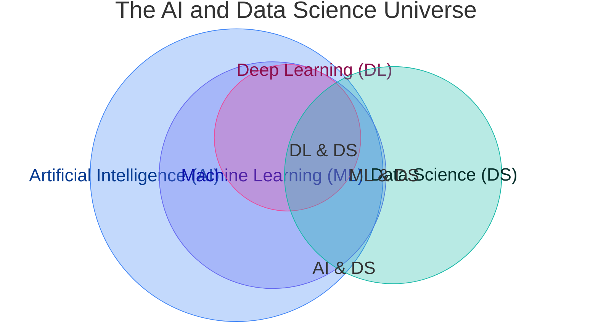
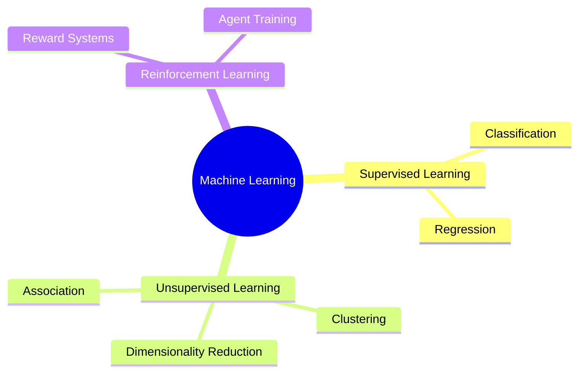
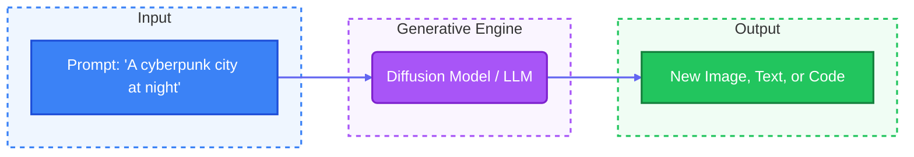

# 🤖 01. Introduction to the AI Ecosystem

> **Prerequisites**: None | **Difficulty**: ⭐☆☆☆☆ Beginner

Welcome to the **AI Ecosystem**. Before writing any code, building data pipelines, or solving mathematical equations, it is paramount to understand the landscape of Artificial Intelligence. This guide breaks down high-level concepts, clarifies industry buzzwords, and illustrates how these domains interlock to form the modern AI industry.

---

## 📋 Table of Contents
1. [The Big Picture](#1-the-big-picture)
2. [Artificial Intelligence (AI)](#2-artificial-intelligence-ai)
3. [Machine Learning (ML)](#3-machine-learning-ml)
4. [Deep Learning (DL)](#4-deep-learning-dl)
5. [Data Science (DS)](#5-data-science-ds)
6. [Computer Vision (CV) & NLP](#6-computer-vision-cv--nlp)
7. [Generative AI & LLMs](#7-generative-ai--llms)
8. [MLOps & Production](#8-mlops--production)
9. [Industry Roles](#9-industry-roles)

---

## 1. The Big Picture

It is incredibly common for beginners and even industry professionals to interchangeably use terms like AI, ML, DL, and Data Science. Let's establish a precise visual taxonomy.

*   **AI** is the overarching goal: creating machines capable of intelligent behavior.
*   **ML** is the method: a subset of AI achieving intelligence by learning patterns from data.
*   **DL** is the specialized tool: a subset of ML utilizing multi-layered (deep) neural networks.
*   **DS** is the interdisciplinary field: extracting insights, encompassing ML, but also involving heavy statistics, domain expertise, and data visualization.

---

## 2. Artificial Intelligence (AI)

**Definition**: The theory, development, and application of computer systems capable of performing tasks that historically required human cognitive function.

### The Three Stages of AI

1.  **Artificial Narrow Intelligence (ANI / Weak AI)**: 
    *   Designed for a single, highly specific task. 
    *   *Examples*: Chess bots, recommendation engines (Netflix/Spotify), facial recognition, autonomous driving. 
    *   *Current Status*: **We are fully here.** All modern AI is Narrow AI.
2.  **Artificial General Intelligence (AGI / Strong AI)**: 
    *   AI with human-level cognitive function, capable of learning and applying knowledge across entirely different domains.
    *   *Current Status*: **Does not exist yet**, though models like GPT-4 show early sparks of generalized reasoning.
3.  **Artificial Super Intelligence (ASI)**: 
    *   An intellect vastly smarter than the brightest human minds in every field, from scientific creativity to social skills.
    *   *Current Status*: **Theoretical.**

> [!NOTE]
> **Not all AI is Machine Learning!**
> A pathfinding algorithm (like A* used in GPS routing) or a rule-based expert system (using thousands of IF/THEN statements) is considered AI, but it is *not* Machine Learning because it does not learn from data.

---

## 3. Machine Learning (ML)

**Definition**: A subset of AI that provides systems the ability to automatically learn, adapt, and improve from experience without being explicitly programmed.

Instead of writing logical rules, you provide the ML algorithm with **Data** and the **Answers**, and it discovers the **Rules**.

### The Three Pillars of ML

1.  **Supervised Learning**: 
    *   Learning with **labeled data**. You know the "ground truth."
    *   *Example*: Predicting a house's price (label) based on its square footage and location (features).
2.  **Unsupervised Learning**: 
    *   Learning with **unlabeled data**. The algorithm finds hidden structures.
    *   *Example*: Grouping customers into distinct segments based on purchasing behavior without knowing the segments beforehand.
3.  **Reinforcement Learning (RL)**: 
    *   Learning through **trial and error** using a reward system. An "agent" takes actions in an "environment" to maximize a reward.
    *   *Example*: Training a robotic arm to grasp objects, or DeepMind's AlphaGo.

---

## 4. Deep Learning (DL)

**Definition**: A highly specialized subset of ML based on Artificial Neural Networks with multiple layers (hence "deep").

Deep Learning takes inspiration from the biological structure of the human brain (neurons and synapses). It requires vast amounts of data and massive computational power (GPUs) but achieves state-of-the-art (SOTA) results in complex, unstructured tasks.

*   **The Feature Engineering Shift**: In classical ML, humans must manually extract features (e.g., writing code to detect edges or corners in an image). In Deep Learning, the network automatically learns hierarchical feature representations directly from raw data.

---

## 5. Data Science (DS)

**Definition**: An interdisciplinary scientific field that uses methods, processes, algorithms, and systems to extract actionable knowledge and insights from structured, semi-structured, and unstructured data.

A Data Scientist utilizes Machine Learning as a tool, but their role is vastly broader:

1.  **Data Engineering**: Sourcing, moving, and cleaning messy real-world data.
2.  **Exploratory Data Analysis (EDA)**: Utilizing heavy statistics to find patterns, anomalies, and correlations.
3.  **Business Intelligence & Visualization**: Translating mathematical findings into dashboards (Tableau, PowerBI) and narratives that business stakeholders can act upon.

---

## 6. Computer Vision (CV) & NLP

These are the two largest application domains that primarily utilize Deep Learning today.

### Computer Vision (CV)
Teaching machines to interpret, understand, and extract information from the visual world (images and videos).
*   **Core Tasks**: Image Classification, Object Detection (finding bounding boxes), Semantic Segmentation (pixel-level classification).
*   **Key Architectures**: Convolutional Neural Networks (CNNs), Vision Transformers (ViTs).

### Natural Language Processing (NLP)
Teaching machines to process, understand, interpret, and generate human language.
*   **Core Tasks**: Sentiment Analysis, Machine Translation, Named Entity Recognition, Text Summarization.
*   **Key Architectures**: Recurrent Neural Networks (RNNs), LSTMs, Transformers.

---

## 7. Generative AI & LLMs

**Definition**: A paradigm-shifting branch of AI focused on generating *net-new* content (text, images, audio, code, video, 3D models) rather than simply classifying or predicting existing data.

*   **Large Language Models (LLMs)**: Massive transformer-based models trained on terabytes of text (e.g., GPT-4, Llama 3, Claude). At their core, they predict the next token (word) in a sequence, but at scale, they demonstrate emergent reasoning, logic, and conversational capabilities.
*   **Diffusion Models**: Architectures that learn to generate ultra-realistic images by systematically reversing a noise-addition process (e.g., Midjourney, Stable Diffusion, DALL-E 3).

---

## 8. MLOps & Production

**Definition**: Machine Learning Operations (MLOps) is the set of engineering practices aimed at reliably and efficiently deploying, maintaining, and scaling ML models in production environments.

> [!WARNING]
> Building an accurate ML model in a Jupyter Notebook is only **10%** of the work. The remaining **90%** is MLOps.

*   **Versioning**: Treating data and models exactly like code (using tools like DVC or MLflow).
*   **Deployment & Serving**: Packaging models into microservices (Docker, FastAPI) and hosting them on cloud infrastructure (AWS, GCP, Azure).
*   **Monitoring**: Continuously tracking model performance to detect **Data Drift** (when real-world data changes, rendering the model inaccurate) and triggering automated retraining pipelines.

---

## 9. Industry Roles

Understanding the ecosystem helps clarify industry job titles:

| Role | Primary Focus | Key Tools |
| :--- | :--- | :--- |
| **Data Analyst** | Past insights, dashboards, SQL querying. | SQL, Excel, Tableau, Pandas |
| **Data Scientist** | Statistical modeling, predictive ML, business insights. | Scikit-Learn, Statsmodels, Jupyter |
| **Data Engineer** | Building ETL pipelines, databases, big data infrastructure. | Spark, Airflow, SQL, Kafka |
| **ML Engineer** | Scaling models, MLOps, deployment, model optimization. | Docker, Kubernetes, PyTorch, MLflow |
| **AI Researcher** | Designing new neural network architectures and math. | PyTorch, ArXiv, LaTeX, JAX |

---

## 🎯 Summary Checklist

- [ ] I can articulate the distinct differences between AI, ML, DL, and DS.
- [ ] I understand the core difference between Supervised and Unsupervised Learning.
- [ ] I recognize that Data Science involves much more than just training models (EDA, Cleaning, BI).
- [ ] I know what CV and NLP stand for and their primary tasks.
- [ ] I grasp the concept of Generative AI and how LLMs function at a high level.
- [ ] I understand why MLOps is critical for taking a notebook experiment to a production server.
- [ ] I can distinguish between the daily tasks of a Data Scientist vs. a Data Engineer.

Next up, we will dive into **[02-Computer-Fundamentals.md](./02-Computer-Fundamentals.md)** to understand the hardware that powers these AI systems!

---

[Back to Index](./README.md) | [Next: 02. Computer & Hardware Fundamentals for AI →](02-Computer-Fundamentals.md)
