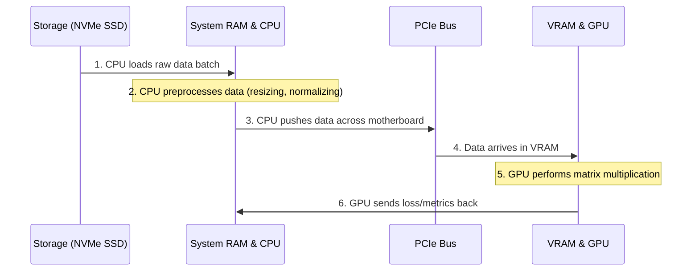

# 💻 02. Computer & Hardware Fundamentals for AI

> **Prerequisites**: None | **Difficulty**: ⭐☆☆☆☆ Beginner

Before writing code or training massive Machine Learning models, you must intimately understand the hardware that executes them. Modern AI is incredibly computationally expensive. Understanding the intricate dance between the CPU, GPU, memory hierarchies, and filesystems will save you from out-of-memory errors, bottlenecked pipelines, and slow training loops.

---

## 📋 Table of Contents
1. [The Computational Brains: CPU vs GPU](#1-the-computational-brains-cpu-vs-gpu)
2. [Deep Dive: Why GPUs for AI?](#2-deep-dive-why-gpus-for-ai)
3. [The Memory Hierarchy: RAM & VRAM](#3-the-memory-hierarchy-ram--vram)
4. [Storage Architectures: SSDs vs HDDs](#4-storage-architectures-ssds-vs-hdds)
5. [The Data Transfer Bottleneck](#5-the-data-transfer-bottleneck)
6. [Operating Systems (OS) in AI](#6-operating-systems-os-in-ai)
7. [Filesystems and Paths](#7-filesystems-and-paths)
8. [Networking & API Basics](#8-networking--api-basics)

---

## 1. The Computational Brains: CPU vs GPU

### The CPU (Central Processing Unit)
The CPU is the general-purpose "manager" of your computer. It is optimized for **latency** (how quickly it can finish a single, complex instruction).

*   **Architecture**: CPUs have a small number of extremely fast, highly complex cores (e.g., 4, 8, 16, or 64 cores).
*   **Role in ML**: The CPU handles the overarching logic. It loads data from the hard drive, preprocesses it (e.g., resizing images, parsing text), and feeds it to the GPU.
*   **Analogy**: A CPU is like a team of 8 elite mathematicians. They can solve incredibly complex calculus proofs, but they work sequentially.

### The GPU (Graphics Processing Unit)
The GPU is a specialized processor optimized for **throughput** (how many simple instructions it can process simultaneously). Originally designed to render millions of independent pixels for video games, researchers realized this exact architecture is perfect for Neural Networks.

*   **Architecture**: GPUs have thousands of smaller, simpler cores (e.g., an NVIDIA RTX 4090 has over 16,000 CUDA cores).
*   **Role in ML**: Deep Learning relies almost entirely on matrix multiplication and vector calculus. The GPU executes these mathematically simple operations across massive datasets simultaneously.
*   **Analogy**: A GPU is like an army of 16,000 elementary school students. They only know how to do basic addition and multiplication, but they can all solve a problem at the exact same time.

---

## 2. Deep Dive: Why GPUs for AI?

Let's visualize the architectural difference.

```mermaid
flowchart TD
    subgraph "CPU (Low Latency, High Complexity)"
        direction TB
        subgraph Core 1
            ALU1[ALU]
            Ctrl1[Control]
        end
        subgraph Core 2
            ALU2[ALU]
            Ctrl2[Control]
        end
        Cache[Large L3 Cache]
        Core 1 --> Cache
        Core 2 --> Cache
    end
    
    subgraph "GPU (High Throughput, Low Complexity)"
        direction TB
        Ctrl[Shared Control]
        subgraph Core Array
            A1[ALU] --- A2[ALU] --- A3[ALU] --- A4[ALU]
            A5[ALU] --- A6[ALU] --- A7[ALU] --- A8[ALU]
        end
        Ctrl --> Core Array
        Mem[Small Cache / High Bandwidth Memory]
        Core Array --> Mem
    end
    
    style "CPU (Low Latency, High Complexity)" fill:#f9d0c4,stroke:#333,stroke-width:2px
    style "GPU (High Throughput, Low Complexity)" fill:#d4f1f9,stroke:#333,stroke-width:2px
```

*   **Parallelism**: If you need to multiply a vector of 10,000 numbers by a matrix, a CPU might do it in chunks of 8. A GPU will do all 10,000 operations in a single clock cycle.

---

## 3. The Memory Hierarchy: RAM & VRAM

Memory is short-term, blazing-fast storage where data is kept while being actively processed. It is **volatile** (data is lost when power is turned off).

### RAM (System Memory)
*   **Used By**: The CPU.
*   **Function**: When you load a dataset using Pandas, or load an image library, that data sits in RAM. 
*   **Capacity**: Typically 16GB to 128GB on local machines, up to Terabytes on servers.
*   **Common Error**: `MemoryError` in Python means you tried to load a dataset larger than your available RAM.

### VRAM (Video RAM)
*   **Used By**: The GPU.
*   **Function**: VRAM is physically soldered onto the GPU circuit board. It holds the Neural Network's "weights" (the learned parameters) and the "batches" of data currently being trained on.
*   **Capacity**: Typically 8GB to 24GB on consumer cards, 40GB to 80GB on enterprise cards (like the NVIDIA A100/H100).
*   **Common Error**: `CUDA Out of Memory (OOM)`. This is the most common error in Deep Learning. It means your model, or your batch size, is too large to fit on the GPU.

---

## 4. Storage Architectures: SSDs vs HDDs

Storage is long-term, non-volatile memory. It holds your OS, your raw datasets, and your saved `.pt` or `.h5` model files.

1.  **HDD (Hard Disk Drive)**: Spinning magnetic platters. Very cheap per Terabyte, but exceptionally slow. **Never train ML models directly from an HDD.**
2.  **SATA SSD (Solid State Drive)**: Flash memory. Much faster than HDDs. Good for basic data science.
3.  **NVMe M.2 SSD**: The fastest consumer storage available. They plug directly into the motherboard via the PCIe lanes. 

> [!TIP]
> **Storage Matters in Computer Vision**: If you are training an image classifier on 1,000,000 images, your GPU will process them in milliseconds. If those images are on an HDD, your GPU will sit idle at 5% utilization while it waits for the HDD to physically spin and find the next image. This is called an **I/O Bottleneck**. Use NVMe SSDs.

---

## 5. The Data Transfer Bottleneck

A critical concept for AI engineers is understanding how data flows through a system. Operations are only as fast as their slowest link.



The transfer across the **PCIe Bus** (the physical slot the GPU plugs into) is relatively slow. In optimized ML pipelines, we use techniques like asynchronous data loading (DataLoaders with multiple workers) so that while the GPU is processing Batch 1, the CPU is simultaneously transferring Batch 2.

---

## 6. Operating Systems (OS) in AI

*   **Linux (Ubuntu/Debian)**: The undisputed king of AI. 99% of cloud servers (AWS EC2, GCP), supercomputers, and production ML deployments run on Linux. If you want a career in AI, **you must learn the Linux command line.**
*   **Windows**: Usable for local development and learning. Windows Subsystem for Linux (WSL2) allows you to run a native Linux environment inside Windows, bridging the gap nicely.
*   **macOS**: Excellent for data science and programming. Modern Apple Silicon (M-series chips) feature "Unified Memory," meaning the CPU and GPU share the exact same pool of RAM, bypassing the PCIe bottleneck entirely. Great for local LLM inference.

---

## 7. Filesystems and Paths

A fundamental cause of bugs for beginners is incorrectly telling Python where data is located.

*   **Absolute Path**: The hardcoded, full address starting from the root of the filesystem.
    *   *Windows*: `C:\Users\Name\Projects\ML\dataset.csv`
    *   *Linux/Mac*: `/home/name/projects/ml/dataset.csv`
*   **Relative Path**: The address relative to where your Python script is currently executing.
    *   `dataset.csv` (Look in the exact same folder)
    *   `data/dataset.csv` (Look in a subfolder named 'data')
    *   `../dataset.csv` (Move up one parent directory, then look)

> [!IMPORTANT]
> **Best Practice**: Use Python's `pathlib` or `os.path` modules. Hardcoding a Windows path with `\` will cause your code to instantly crash when a colleague runs it on their Mac or when deployed to a Linux server.

---

## 8. Networking & API Basics

Modern AI relies heavily on the cloud. You will download pre-trained weights from Hugging Face or query APIs like OpenAI.

*   **IP Address**: The numerical label assigned to a device on a network. 
    *   `127.0.0.1` (or `localhost`) always refers to the machine you are currently typing on.
*   **Ports**: Virtual doors into a computer. An IP address gets you to the building; the port gets you to the specific room.
    *   `Port 80`: Standard HTTP (Web traffic).
    *   `Port 443`: Secure HTTPS.
    *   `Port 8000`: Often used for FastAPI model deployments.
    *   `Port 8888`: Default port for Jupyter Notebooks.
*   **API (Application Programming Interface)**: A set of protocols allowing two applications to talk. When your code uses an LLM via the internet, it sends an HTTP request containing a JSON payload to a server, which processes it on massive GPUs, and returns the generated text.

---

## 🎯 Summary Checklist

- [ ] I can articulate why GPUs are superior to CPUs for Deep Learning (Parallelism vs Latency).
- [ ] I understand the critical difference between RAM (CPU) and VRAM (GPU).
- [ ] I know that `CUDA OOM` means my GPU ran out of VRAM.
- [ ] I understand why an NVMe SSD is crucial to prevent I/O bottlenecks during training.
- [ ] I can write file paths that are cross-platform compatible.
- [ ] I understand what an IP address, `localhost`, and network ports are.

Next up, we will translate this hardware knowledge into logic by covering **[03-Programming-Fundamentals.md](./03-Programming-Fundamentals.md)**!
