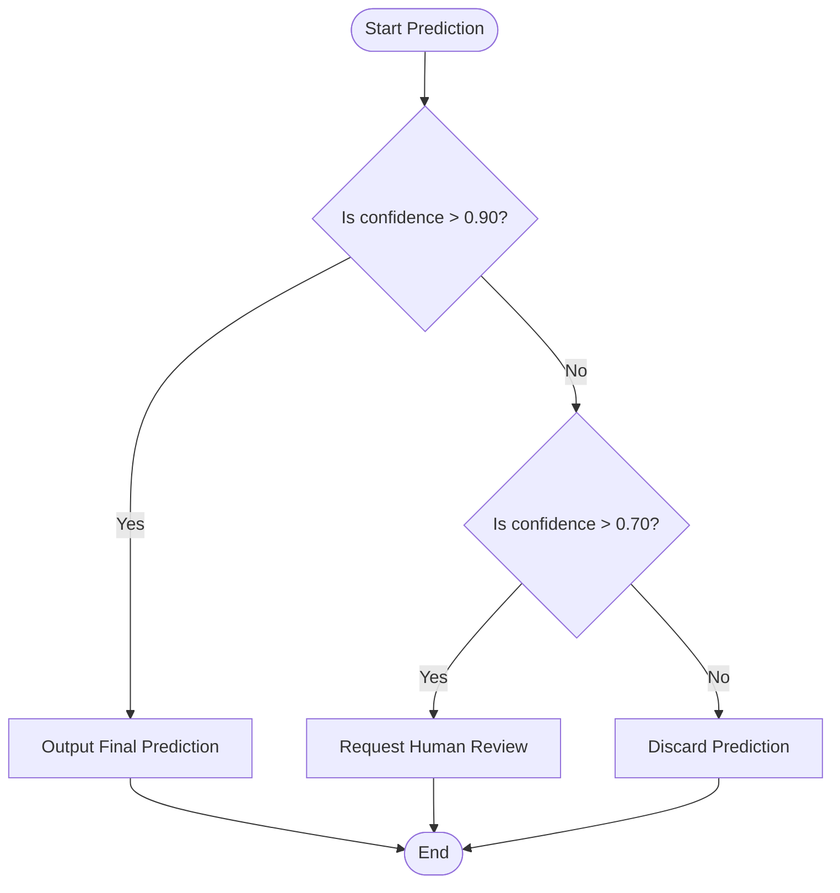

# ⌨️ 03. Programming Fundamentals

> **Prerequisites**: None | **Difficulty**: ⭐☆☆☆☆ Beginner

Before we dive specifically into Python for Machine Learning (covered in Module 05), we must establish the universal concepts of programming. Whether you use Python, C++, Java, or Rust, these fundamental building blocks remain exactly the same.

If you already have programming experience, this will serve as a quick refresher with an AI-focused lens.

---

## 📋 Table of Contents
1. [Variables & Data Types](#1-variables--data-types)
2. [Operators](#2-operators)
3. [Control Flow (Conditions)](#3-control-flow-conditions)
4. [Loops (Iteration)](#4-loops-iteration)
5. [Functions (Modularity)](#5-functions-modularity)
6. [Object-Oriented Programming (OOP)](#6-object-oriented-programming-oop)
7. [Beginner Exercises](#7-beginner-exercises)

---

## 1. Variables & Data Types

A **variable** is simply a named container that stores data in your computer's RAM. The **Data Type** dictates what kind of data it is and what operations can be performed on it.

### Core Data Types

*   **Integer (`int`)**: Whole numbers. Used for counting things (e.g., number of epochs to train a model).
*   **Floating-Point (`float`)**: Decimal numbers. **Crucial in ML**, as neural network weights, probabilities, and loss values are almost always floats.
*   **String (`str`)**: Text data enclosed in quotes. Used in NLP (Natural Language Processing).
*   **Boolean (`bool`)**: `True` or `False`. Used for logical branching.

```python
# Variable assignment in Python
epochs_to_train = 100          # Integer
learning_rate = 0.001          # Float
model_architecture = "ResNet"  # String
is_model_converged = False     # Boolean

# You can check types using type()
print(type(learning_rate))     # Output: <class 'float'>
```

---

## 2. Operators

Operators allow you to manipulate variables.

*   **Arithmetic**: `+` (add), `-` (subtract), `*` (multiply), `/` (divide), `**` (exponent/power), `%` (modulo/remainder).
*   **Comparison**: Evaluate to a Boolean (`True`/`False`). `==` (equal to), `!=` (not equal), `>` (greater), `<` (less).
*   **Logical**: Combine conditions. `and`, `or`, `not`.

```python
x = 10
y = 3

print(x ** y)   # 1000 (10 to the power of 3)
print(x % y)    # 1 (Remainder of 10 / 3)

# Logical Check (Very common in data filtering)
age = 25
income = 50000
is_target_demographic = (age > 18) and (income > 40000)
print(is_target_demographic) # True
```

---

## 3. Control Flow (Conditions)

Control flow dictates the path your program takes based on dynamic conditions. 



Here is the code representation of the flowchart above using `if`, `elif` (else if), and `else`:

```python
prediction_confidence = 0.85

if prediction_confidence > 0.90:
    print("High confidence: Output prediction.")
elif prediction_confidence > 0.70:
    print("Medium confidence: Request human review.")
else:
    print("Low confidence: Discard prediction.")
```

---

## 4. Loops (Iteration)

Loops allow you to run the exact same block of code multiple times without rewriting it. This is essential for traversing large datasets or running training loops.

### The `for` loop
Iterates over a known sequence (like a list, a string, or a range of numbers).

```python
# A conceptual Machine Learning training loop
epochs = 5
for epoch in range(epochs): # range(5) generates numbers 0, 1, 2, 3, 4
    print(f"Training epoch {epoch + 1}/{epochs}...")
    # Math happens here...
```

### The `while` loop
Executes continuously *as long as* a specific condition remains true.

```python
# A conceptual Early Stopping mechanism
loss = 1.0
while loss > 0.1:
    print(f"Current loss: {loss:.2f}. Updating weights...")
    loss -= 0.25  # Simulate the AI learning and loss decreasing
    
print("Loss minimized. Training complete.")
```

> [!WARNING]
> **Infinite Loops**: If the condition in a `while` loop never becomes False (e.g., if you forgot to decrease the `loss` variable), the loop will run forever until your computer crashes.

---

## 5. Functions (Modularity)

Functions are reusable blocks of code that perform a specific task. They take inputs (**arguments**), process them, and return an output. They are the foundation of clean, modular code.

```python
def calculate_accuracy(correct_predictions: int, total_predictions: int) -> float:
    """
    Calculates the accuracy percentage.
    (This text is a 'docstring' explaining the function).
    """
    if total_predictions == 0:
        return 0.0
    
    accuracy = (correct_predictions / total_predictions) * 100
    return accuracy

# Calling the function with arguments
acc = calculate_accuracy(correct_predictions=850, total_predictions=1000)
print(f"Model Accuracy: {acc}%")
```

---

## 6. Object-Oriented Programming (OOP)

OOP is a programming paradigm based on "objects". An object is a custom data structure that bundles data (**Attributes**) and behavior (**Methods**) together. 

Major ML libraries like PyTorch and Scikit-Learn rely *heavily* on OOP.

*   **Class**: The blueprint or template.
*   **Object (Instance)**: A specific realization created from the blueprint.
*   **Attributes**: Variables that belong to the object.
*   **Methods**: Functions that belong to the object.

```python
class NeuralNetwork:
    # 1. The __init__ method is called automatically when an object is created.
    # It initializes the object's attributes.
    def __init__(self, architecture_name):
        self.architecture = architecture_name  # Attribute
        self.is_trained = False              # Attribute
        print(f"Initialized {self.architecture} network.")

    # 2. Methods define the behavior of the object.
    def train(self, dataset):
        print(f"Training {self.architecture} on dataset...")
        self.is_trained = True

    def predict(self, input_image):
        if not self.is_trained:
            return "Error: You must train the model first!"
        return "Prediction: It's a Cat!"

# 3. Creating an instance (object) of the class
my_vision_model = NeuralNetwork(architecture_name="ResNet-50")

# 4. Accessing methods
print(my_vision_model.predict("image.jpg")) # Will error because it's not trained
my_vision_model.train("Cat Dataset")        # Train it
print(my_vision_model.predict("image.jpg")) # Will output prediction
```

---

## 7. Beginner Exercises

Test your understanding before moving forward to Python specific libraries. Create a `.py` file and try to solve these:

1.  **FizzBuzz**: Write a `for` loop that prints numbers from 1 to 20. 
    *   If a number is divisible by 3, print `"Fizz"`. 
    *   If divisible by 5, print `"Buzz"`. 
    *   If divisible by both 3 and 5, print `"FizzBuzz"`. 
    *   Otherwise, print the number.
2.  **Function implementation**: Write a function `fahrenheit_to_celsius(f)` that takes a temperature in Fahrenheit and returns it in Celsius. Formula: `(F - 32) * 5/9`.
3.  **Basic Class**: Create a `Rectangle` class. Its `__init__` should take `width` and `height`. It should have an `area()` method that returns the total area (`width * height`).

---

## 🎯 Summary Checklist

- [ ] I understand variables and core data types (int, float, str, bool).
- [ ] I can write `if/elif/else` statements for branching logic.
- [ ] I understand the difference between `for` loops and `while` loops.
- [ ] I can define a function, pass it arguments, and return a value.
- [ ] I understand the high-level concept of Classes, Objects, Attributes, and Methods (OOP).

Next up, we will set up your professional **[04-Development-Environment-Setup.md](./04-Development-Environment-Setup.md)**!

---

[← 02. Computer & Hardware Fundamentals for AI](02-Computer-Fundamentals.md) | [Back to Index](./README.md) | [Next: 04. Development Environment Setup →](04-Development-Environment-Setup.md)
