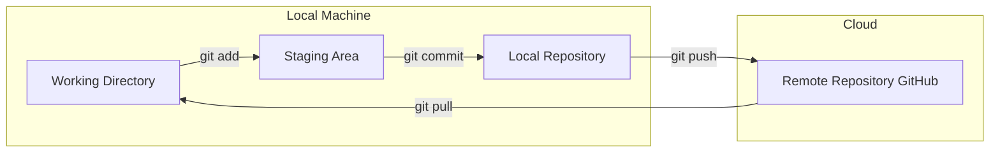
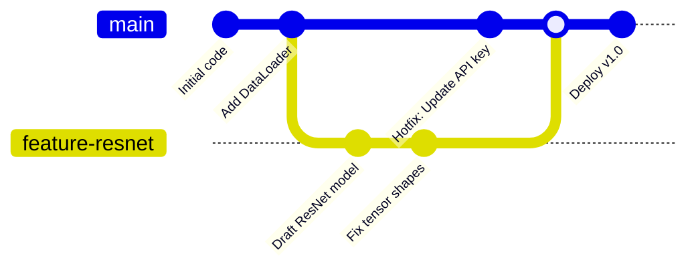

# 🐙 06. Git and GitHub for ML

> **Prerequisites**: Module 04 | **Difficulty**: ⭐⭐☆☆☆ Beginner

Machine Learning code rarely lives locally on your laptop forever. To collaborate with other engineers, track changes to experiments, reproduce older models, and deploy code to production, you must master Git.

---

## 📋 Table of Contents
1. [Git vs GitHub](#1-git-vs-github)
2. [The Core Git Architecture](#2-the-core-git-architecture)
3. [Basic Git Workflow](#3-basic-git-workflow)
4. [Branching Strategies](#4-branching-strategies)
5. [Merging & Conflict Resolution](#5-merging--conflict-resolution)
6. [Pull Requests (PRs) & Collaboration](#6-pull-requests-prs--collaboration)
7. [Git for ML: Handling Large Files (.gitignore & DVC)](#7-git-for-ml-handling-large-files)
8. [Professional Commit Messages](#8-professional-commit-messages)

---

## 1. Git vs GitHub

*   **Git**: The underlying engine. It is a command-line tool installed locally on your computer that tracks changes to your text files and saves them as snapshots (commits).
*   **GitHub**: A cloud hosting service (owned by Microsoft) that stores Git repositories online. It provides a visual interface for collaboration, code review, and CI/CD pipelines. (Alternatives include GitLab and Bitbucket).

---

## 2. The Core Git Architecture

To understand Git, you must understand its three "trees" (areas):



1.  **Working Directory**: Your actual files on your computer. Where you write code.
2.  **Staging Area (Index)**: A waiting room. You selectively add files here that you want to include in your next snapshot.
3.  **Local Repository**: The `.git` folder hidden in your directory. It holds all saved snapshots (commits).
4.  **Remote Repository**: The version stored on GitHub's servers.

---

## 3. Basic Git Workflow

The typical lifecycle of a code change:

1.  **Initialize**: Turn a normal folder into a Git repository.
    ```bash
    git init
    ```
2.  **Check Status**: See which files have been modified.
    ```bash
    git status
    ```
3.  **Stage Files**: Move files to the Staging Area.
    ```bash
    git add preprocessing.py   # Add a specific file
    git add .                  # Add ALL changed files in the directory
    ```
4.  **Commit**: Save the snapshot with a descriptive message.
    ```bash
    git commit -m "Add missing value imputation logic"
    ```
5.  **Push**: Upload your local commits to GitHub.
    ```bash
    git push origin main
    ```
6.  **Pull**: Download updates from GitHub to your local machine (crucial if teammates made changes).
    ```bash
    git pull origin main
    ```

---

## 4. Branching Strategies

**CRITICAL RULE**: Never push experimental code directly to the `main` branch. 

The `main` (or `master`) branch should always contain stable, working code. When building a new feature (like a new ML model), you create an isolated "Branch".



### Common Branching Commands

```bash
# Create and immediately switch to a new branch
git checkout -b feature/data-cleaning

# View all branches (the one with * is your current branch)
git branch

# Switch back to the main branch
git checkout main
```

---

## 5. Merging & Conflict Resolution

Once your feature branch is complete and tested, you merge it back into `main`.

```bash
# Ensure you are on the branch you want to pull INTO (usually main)
git checkout main

# Merge the feature branch into main
git merge feature/data-cleaning
```

### Handling Merge Conflicts
If you and a teammate edit the *exact same line* in the *exact same file*, Git won't know which version to keep. It will pause the merge and flag a **Merge Conflict**.

1.  Git modifies the file to show both versions:
    ```python
    <<<<<<< HEAD
    learning_rate = 0.001  # What is currently on main
    =======
    learning_rate = 0.005  # What is on your feature branch
    >>>>>>> feature/data-cleaning
    ```
2.  Open the file in VS Code. Choose which line to keep, and delete the Git markers (`<<<<`, `====`, `>>>>`).
3.  Stage and commit the resolved file:
    ```bash
    git add model.py
    git commit -m "Resolve merge conflict in learning rate"
    ```

---

## 6. Pull Requests (PRs) & Collaboration

In a professional environment, you rarely run `git merge` yourself. Instead, you use Pull Requests.

1.  Push your feature branch to GitHub.
    ```bash
    git push -u origin feature/data-cleaning
    ```
2.  Navigate to GitHub.com. You will see a green button: **"Compare & pull request"**.
3.  Open the PR. Explain what your code does.
4.  A Senior ML Engineer reviews your code. They might leave comments asking for optimizations.
5.  Once approved, they click the "Merge" button on GitHub, blending your branch into `main`.

---

## 7. Git for ML: Handling Large Files

**CRITICAL RULE**: Never commit large datasets (`.csv`, images) or large model weights (`.pt`, `.h5`) to Git! Git is designed to track tiny changes in text files, not 5GB data blobs. Doing so will freeze your repository.

### The `.gitignore` file
Create a file named precisely `.gitignore` in your project root. List files or folders you want Git to completely ignore.

```text
# Python specifics
__pycache__/
*.ipynb_checkpoints/
venv/
.env

# Ignore data and models
data/
*.csv
*.json
*.pt
*.pth
*.h5
```

### Tracking Data (DVC)
If you *must* track data versions (e.g., you need to know exactly which dataset trained Model v1.2), ML Engineers use **DVC (Data Version Control)**. DVC acts exactly like Git but is designed for massive files. It replaces large files in your Git repo with tiny text pointers, storing the actual heavy files in AWS S3 or Google Cloud Storage.

---

## 8. Professional Commit Messages

"Fixed bug" is a terrible commit message. A professional commit message tells a story.

**Format**: `[Type]: [Subject]`

*   `feat: Add Random Forest classifier to pipeline`
*   `fix: Resolve NaN output in loss function`
*   `docs: Update README with setup instructions`
*   `refactor: Simplify loop logic in data loader`

---

## 🎯 Summary Checklist

- [ ] I understand the 3 trees of Git (Working, Staging, Local Repo).
- [ ] I know how to `git add`, `git commit`, and `git push`.
- [ ] I understand why branching is mandatory for team collaboration.
- [ ] I know how to resolve a merge conflict.
- [ ] I have created a `.gitignore` file to ensure datasets and `.pt` files never hit GitHub.
- [ ] I understand the workflow of a GitHub Pull Request.

Next up, we will leave the GUI behind and master the terminal in **[07-Linux-Fundamentals.md](./07-Linux-Fundamentals.md)**!
