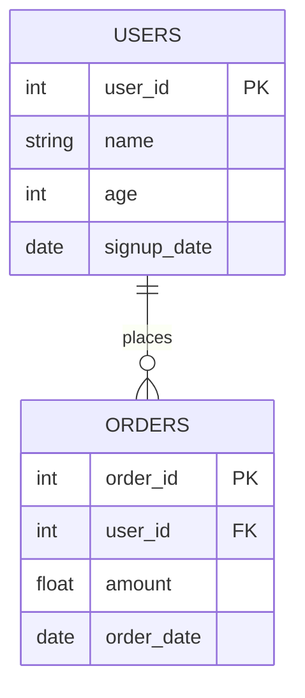

# 🗄️ 10. SQL for Data Science

> **Prerequisites**: Module 05 (Python Essentials) | **Difficulty**: ⭐⭐☆☆☆ Beginner

While many courses teach Machine Learning using pristine, pre-cleaned CSV files loaded via `pandas.read_csv()`, in the real world, **your data lives in a database or a cloud data warehouse** (e.g., PostgreSQL, Snowflake, BigQuery, Redshift). 

Before you can train a model, you must extract, join, and aggregate millions of rows of raw data. Doing this in Pandas or Python memory is often impossible. **SQL (Structured Query Language)** is the primary language used to extract and prepare data for ML pipelines.

---

## 📋 Table of Contents
1. [The Relational Data Model](#1-the-relational-data-model)
2. [Basic Retrieval & Filtering](#2-basic-retrieval--filtering)
3. [Aggregations (GROUP BY)](#3-aggregations-group-by)
4. [Joins (Combining Tables)](#4-joins-combining-tables)
5. [Window Functions (Crucial for ML Features)](#5-window-functions-crucial-for-ml-features)
6. [CTEs (Common Table Expressions)](#6-ctes-common-table-expressions)
7. [Connecting Python to SQL](#7-connecting-python-to-sql)

---

## 1. The Relational Data Model

Data in SQL databases is stored in **Tables** (like Excel spreadsheets).
Tables are connected via **Relations**.

- **Primary Key (PK)**: A column (or set of columns) that uniquely identifies each row in a table. (e.g., `user_id`).
- **Foreign Key (FK)**: A column in one table that refers to the Primary Key in another table, creating a link between them.



---

## 2. Basic Retrieval & Filtering

The core of SQL is the `SELECT` statement.

```sql
SELECT 
    user_id, 
    age, 
    signup_date
FROM users
WHERE age >= 18 
  AND status = 'active'
ORDER BY signup_date DESC
LIMIT 100;
```

**Order of Execution** (Important!):
SQL is declarative. You write what you want, but the engine processes it in a specific order:
1. `FROM` (Get the tables)
2. `WHERE` (Filter the rows)
3. `SELECT` (Grab the specific columns)
4. `ORDER BY` (Sort)
5. `LIMIT` (Return top N)

---

## 3. Aggregations (GROUP BY)

To build features for machine learning (e.g., "total spent by user" or "average order value"), you must aggregate row-level data.

```sql
SELECT 
    user_id,
    COUNT(order_id) AS total_orders,
    SUM(amount) AS total_spent,
    AVG(amount) AS avg_order_value,
    MAX(order_date) AS last_order_date
FROM orders
WHERE order_date >= '2023-01-01'
GROUP BY user_id
HAVING COUNT(order_id) > 5;
```

**`WHERE` vs `HAVING`**:
- `WHERE` filters rows **before** aggregation. (e.g., Only look at orders from 2023).
- `HAVING` filters rows **after** aggregation. (e.g., Only keep users who have more than 5 total orders).

---

## 4. Joins (Combining Tables)

In relational databases, data is normalized across multiple tables to save space. You use `JOIN` to bring them together to create a flat dataset for Machine Learning.

```sql
SELECT 
    u.user_id,
    u.age,
    SUM(o.amount) AS total_spent
FROM users u
LEFT JOIN orders o 
    ON u.user_id = o.user_id
GROUP BY u.user_id, u.age;
```

### Types of Joins:
- **INNER JOIN**: Keeps only rows that have a match in BOTH tables.
- **LEFT JOIN**: Keeps ALL rows from the left table (`users`), filling with `NULL`s if there are no matching orders. **(This is the most common join for building ML datasets, as you usually want to keep all users even if they haven't bought anything yet!)**
- **FULL OUTER JOIN**: Keeps all rows from both tables, filling with `NULL`s where there are no matches.

---

## 5. Window Functions (Crucial for ML Features)

Window functions perform calculations across a set of rows related to the current row. 

Unlike `GROUP BY`, they **do not collapse** the rows into a single output row. They are absolutely essential for time-series features (e.g., moving averages, days since last purchase).

```sql
SELECT 
    user_id,
    order_date,
    amount,
    
    -- Feature 1: Running total spent over time
    SUM(amount) OVER (
        PARTITION BY user_id 
        ORDER BY order_date
    ) AS running_total_spent,
    
    -- Feature 2: What was the amount of their PREVIOUS order?
    LAG(amount, 1) OVER (
        PARTITION BY user_id 
        ORDER BY order_date
    ) AS previous_order_amount,
    
    -- Feature 3: Rank their orders sequentially (1st order, 2nd order...)
    ROW_NUMBER() OVER (
        PARTITION BY user_id 
        ORDER BY order_date
    ) AS order_sequence_number

FROM orders;
```

---

## 6. CTEs (Common Table Expressions)

When building complex ML datasets, your SQL queries can become hundreds of lines long. **CTEs** (using the `WITH` clause) allow you to break complex queries into readable, modular, reusable blocks.

Think of them as temporary variables for tables.

```sql
WITH ActiveUsers AS (
    SELECT user_id, age
    FROM users 
    WHERE status = 'active'
),

UserSpend AS (
    SELECT user_id, SUM(amount) AS total_spent
    FROM orders
    GROUP BY user_id
)

-- Main Query combining the CTEs
SELECT 
    a.user_id,
    a.age,
    COALESCE(s.total_spent, 0) AS total_spent  -- Replace NULLs with 0
FROM ActiveUsers a
LEFT JOIN UserSpend s 
    ON a.user_id = s.user_id;
```

---

## 7. Connecting Python to SQL

In a real ML pipeline, you will write your SQL query as a string inside Python, send it to the database, and load the result directly into a Pandas DataFrame.

```python
import pandas as pd
import sqlite3

# 1. Connect to database
conn = sqlite3.connect('my_company.db')

# 2. Write your SQL query
query = """
    SELECT user_id, age, income 
    FROM users 
    WHERE status = 'active'
"""

# 3. Execute and load directly into a Pandas DataFrame!
df = pd.read_sql_query(query, conn)

print(df.head())

# 4. Always close the connection
conn.close()
```

---

## 🎯 Summary Checklist

- [ ] I understand `SELECT`, `FROM`, `WHERE`, `ORDER BY`, and `LIMIT`.
- [ ] I know how to use `GROUP BY` and aggregate functions (`COUNT`, `SUM`, `AVG`).
- [ ] I understand the difference between `WHERE` and `HAVING`.
- [ ] I understand the difference between an `INNER JOIN` and a `LEFT JOIN`.
- [ ] I know why Window Functions (`OVER`, `PARTITION BY`) are useful for feature engineering.
- [ ] I can read a query that uses CTEs (`WITH`).
- [ ] I know how to execute a SQL query in Python using `pandas.read_sql_query`.

---

## What's Next

Congratulations! You have completed the **Prerequisites** module. You now have the mathematical, programming, and tooling foundation required to tackle real Machine Learning.

| Next Topic | Why |
|------------|-----|
| [What Is Data Science And ML](../01-Data-Science-Foundations/01-What-Is-Data-Science-And-ML.md) | Begin the core Data Science module |

---

[← Probability and Statistics](./09-Probability-And-Statistics.md) | [Back to Index](../README.md) | [Next: What Is Data Science And ML →](../01-Data-Science-Foundations/01-What-Is-Data-Science-And-ML.md)
