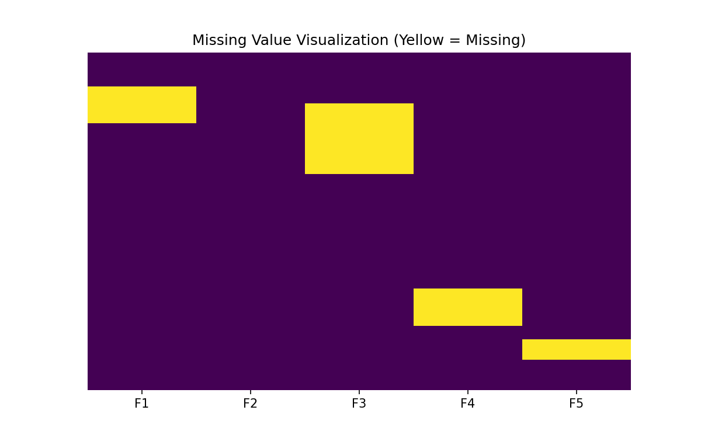

# 🧹 Data Cleaning

> **Prerequisites**: [Data Collection](./05-Data-Collection.md) | **Difficulty**: ⭐⭐☆☆☆ Intermediate

---

## 📋 Table of Contents

1. [Why Data Cleaning is Crucial](#1-why-data-cleaning-is-crucial)
2. [Handling Missing Values (NaN)](#2-handling-missing-values-nan)
3. [Fixing Data Types & Formats](#3-fixing-data-types--formats)
4. [Handling Duplicates & Inconsistencies](#4-handling-duplicates--inconsistencies)
5. [Dealing with Outliers](#5-dealing-with-outliers)
6. [Data Validation Rules](#6-data-validation-rules)
7. [What's Next](#7-whats-next)

---

## 1. Why Data Cleaning is Crucial

### 🟢 Beginner

**"Garbage In, Garbage Out" (GIGO)** is the golden rule of Data Science.
If you feed messy, incorrect data into an advanced Deep Learning model, the model will confidently give you incorrect predictions.

Real-world data is dirty because:
- Humans make typos in forms
- Sensors fail and drop data packets
- Web scrapers break when a website layout changes
- Database migrations corrupt formatting

In an applied Data Science project, **60-80% of your time will be spent cleaning data.**

---

## 2. Handling Missing Values (NaN)

### 🟢 Beginner

When data is missing, Pandas represents it as `NaN` (Not a Number) or `None`. Machine Learning models (like Scikit-Learn's Random Forest) will throw an error if you try to train them on data containing NaNs.

```python
import pandas as pd
import numpy as np

# Sample messy data
df = pd.DataFrame({
    'Age': [25, 30, np.nan, 22, 35],
    'Salary': [50k, np.nan, 70k, 45k, np.nan],
    'City': ['NY', 'LA', 'NY', None, 'SF']
})

# 1. Identify missing data
print(df.isnull().sum())
# Output: Age: 1, Salary: 2, City: 1

# 2. Strategy A: Drop rows with ANY missing data (Harsh!)
df_dropped = df.dropna()

# 3. Strategy B: Fill with a constant value
df['City'] = df['City'].fillna('Unknown')
```

### 🟡 Intermediate

Dropping rows loses valuable information. Instead, we use **Imputation** (filling in educated guesses).

```python
# Strategy C: Fill numerical columns with Mean or Median
# Use Median if there are extreme outliers, use Mean if symmetric
df['Age'] = df['Age'].fillna(df['Age'].median())

# Strategy D: Forward Fill (Time Series Data)
# If a stock price is missing today, assume it's the same as yesterday
stock_prices = pd.Series([150, np.nan, 155, np.nan, 160])
stock_prices = stock_prices.ffill() # Fills forward
```

### 🔴 Advanced

**Algorithmic Imputation**

Instead of just using the mean, we can use Machine Learning to predict the missing values based on other columns!

```python
from sklearn.impute import KNNImputer

# KNN Imputer looks at the 'K' most similar rows and averages their values
# to fill in the missing data
imputer = KNNImputer(n_neighbors=2)
# Requires all numeric data
df_numeric = df[['Age', 'Salary']] 
imputed_data = imputer.fit_transform(df_numeric)
```

---

## 3. Fixing Data Types & Formats

### 🟢 Beginner

Often, a column containing numbers will be read as a "string" (text) because one row has a typo like `"1,000"` instead of `1000`. You cannot do math on strings!

```python
df = pd.DataFrame({
    'Price': ['10.50', '20.00', 'Unknown', '15.25'],
    'Date': ['2023-01-01', '01/02/2023', '2023-03-01', 'Jan 4, 2023']
})

# Checking types (Notice 'Price' is 'object', meaning string)
print(df.dtypes) 
```

### 🟡 Intermediate

**Cleaning Strings to Numbers**

```python
# 1. Force strings to numeric, converting errors to NaN
df['Price'] = pd.to_numeric(df['Price'], errors='coerce')
# Now 'Unknown' becomes NaN, which we can fill later!

# 2. String manipulation (Removing currency symbols)
messy_revenue = pd.Series(['$1,500.50', '$2,000.00'])
clean_revenue = messy_revenue.str.replace('$', '').str.replace(',', '').astype(float)
```

**Standardizing Dates**
Dates are notoriously difficult. Pandas provides powerful datetime parsing.

```python
# Convert messy date formats into a standard YYYY-MM-DD datetime object
df['Date'] = pd.to_datetime(df['Date'], format='mixed', errors='coerce')

# Now you can extract useful ML features!
df['Month'] = df['Date'].dt.month
df['DayOfWeek'] = df['Date'].dt.day_name()
```

---

## 4. Handling Duplicates & Inconsistencies

### 🟢 Beginner

**Duplicates**
```python
# Count duplicate rows
print(f"Duplicates: {df.duplicated().sum()}")

# Drop duplicate rows (keep the first occurrence)
df = df.drop_duplicates(keep='first')

# Drop based on a specific column (e.g., User ID should be unique)
df = df.drop_duplicates(subset=['User_ID'])
```

### 🟡 Intermediate

**Text Inconsistencies (Categorical Data)**
Users typing freely causes chaos: 'New York', 'new york', 'NY', 'N.Y.' are the same to a human, but 4 different categories to a machine.

```python
cities = pd.DataFrame({'City': ['New York ', 'new york', 'NY', 'Boston', 'BOSTON']})

# 1. Standardize case and strip whitespace
cities['Clean_City'] = cities['City'].str.lower().str.strip()

# 2. Map known variations using a dictionary
city_map = {
    'ny': 'new york',
    'boston': 'boston'
}
cities['Clean_City'] = cities['Clean_City'].map(city_map).fillna(cities['Clean_City'])
```

---

## 5. Dealing with Outliers

### 🟡 Intermediate

An outlier is a data point that differs significantly from other observations. (e.g., Someone with an age of 999).
They can severely skew the Mean and ruin models like Linear Regression.

**Method 1: Z-Score (For normally distributed data)**
If a value is more than 3 standard deviations from the mean, it's an outlier.

```python
import numpy as np
from scipy import stats

df = pd.DataFrame({'Salary': [45000, 50000, 55000, 60000, 1_000_000]})

# Calculate Z-scores
z_scores = np.abs(stats.zscore(df['Salary']))

# Filter out rows where Z-score is > 3
df_clean = df[z_scores < 3] 
# The 1,000,000 salary is dropped!
```

### 🔴 Advanced

**Method 2: IQR (Interquartile Range - Robust to extreme values)**
Z-score uses the Mean, which is itself ruined by outliers. IQR uses the Median, making it "Robust."

```python
# Calculate Q1 (25th percentile) and Q3 (75th percentile)
Q1 = df['Salary'].quantile(0.25)
Q3 = df['Salary'].quantile(0.75)
IQR = Q3 - Q1

# Define boundaries
lower_bound = Q1 - 1.5 * IQR
upper_bound = Q3 + 1.5 * IQR

# Filter
df_clean_iqr = df[(df['Salary'] >= lower_bound) & (df['Salary'] <= upper_bound)]
```

---

## 6. Data Validation Rules

### 🔴 Advanced

Before saving your clean data, you should run validation checks. If any of these fail, the cleaning pipeline should raise an error.

```python
def validate_data(df):
    assert df['Age'].between(0, 120).all(), "Found impossible ages!"
    assert df.duplicated(subset=['User_ID']).sum() == 0, "Duplicate Users found!"
    assert df['Salary'].isnull().sum() == 0, "Null salaries remaining!"
    print("✅ Data passed validation!")

# In a production pipeline:
# df = load_data()
# df = clean_data(df)
# validate_data(df)
# save_to_database(df)
```

For large production systems, look into libraries like **Great Expectations** or **Pydantic** for rigorous data validation.

---

## 7. What's Next

Now that your data is clean, complete, and formatted correctly, you are ready to actually look at it and discover insights.

| Next Topic | Why |
|------------|-----|
| [Exploratory Data Analysis](./07-Exploratory-Data-Analysis.md) | Learn how to visualize your clean data to uncover hidden patterns and correlations. |

### 🟢 Visual Examples



---

[← Data Collection](05-Data-Collection.md) | [Back to Index](../README.md) | [Next: Exploratory Data Analysis (EDA) →](07-Exploratory-Data-Analysis.md)
