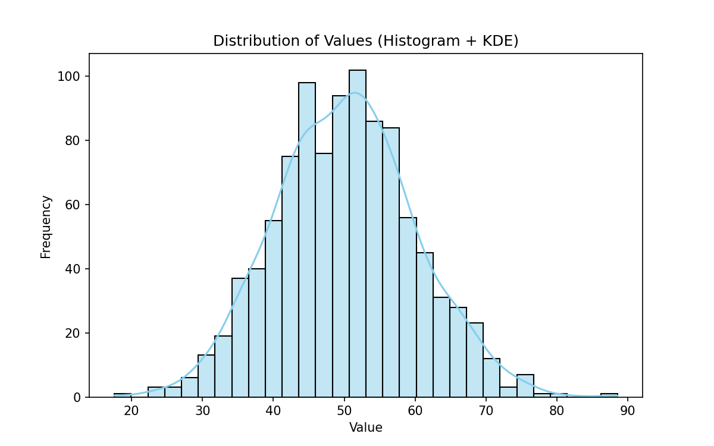
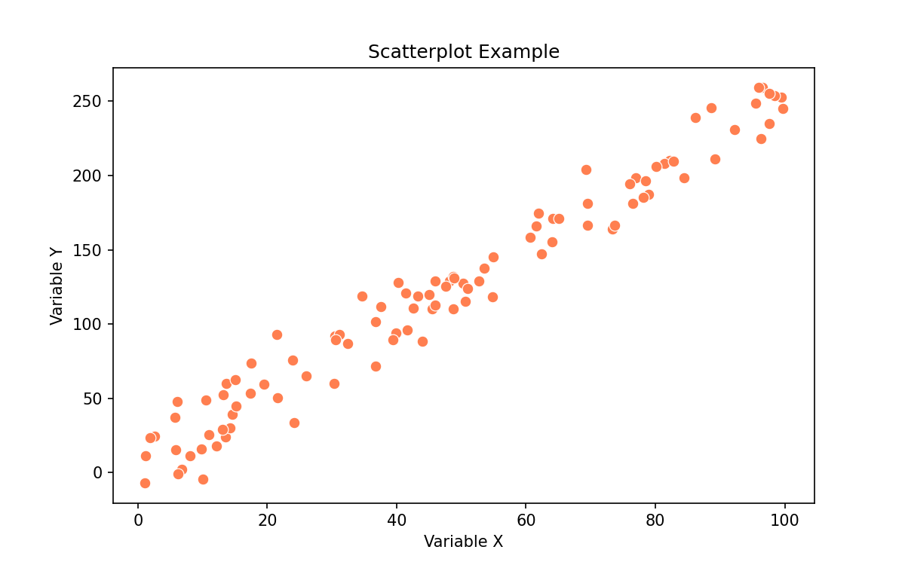

# 🎨 Data Visualization

> **Prerequisites**: [Exploratory Data Analysis](./05-Exploratory-Data-Analysis.md) | **Difficulty**: ⭐⭐☆☆☆ Intermediate

---

## 📋 Table of Contents

1. [The Grammar of Graphics](#1-the-grammar-of-graphics)
2. [Matplotlib (The Foundation)](#2-matplotlib-the-foundation)
3. [Seaborn (Statistical Visualization)](#3-seaborn-statistical-visualization)
4. [Plotly (Interactive Dashboards)](#4-plotly-interactive-dashboards)
5. [Choosing the Right Chart](#5-choosing-the-right-chart)
6. [Visualization Best Practices & Storytelling](#6-visualization-best-practices--storytelling)
7. [What's Next](#7-whats-next)

---

## 1. The Grammar of Graphics

### 🟢 Beginner

Visualization is not just about making pretty pictures; it is about encoding numerical data into visual properties (color, shape, size, position) so the human brain can process it instantly.

A good visualization has:
1. **Data**: The actual numbers.
2. **Aesthetics**: What the numbers map to (x-axis, y-axis, color, size).
3. **Geometries**: The shapes used (points, lines, bars).
4. **Facets**: Subplots splitting data by category.

---

## 2. Matplotlib (The Foundation)

### 🟡 Intermediate

Matplotlib is the grandfather of Python visualization. It is powerful but requires a lot of code. We use the **Object-Oriented API** (`fig, ax = plt.subplots()`) rather than the state-based API (`plt.plot()`) because it gives us total control.

```python
import matplotlib.pyplot as plt
import numpy as np

# Data
x = np.linspace(0, 10, 100)
y1 = np.sin(x)
y2 = np.cos(x)

# 1. Create Figure (the canvas) and Axes (the actual plots)
fig, ax = plt.subplots(figsize=(10, 5))

# 2. Plot data (Geometries)
ax.plot(x, y1, label='Sine', color='#1f77b4', linestyle='-', linewidth=2)
ax.plot(x, y2, label='Cosine', color='#ff7f0e', linestyle='--', linewidth=2)

# 3. Customize (Aesthetics)
ax.set_title('Trigonometric Functions', fontsize=16, fontweight='bold')
ax.set_xlabel('Time (s)', fontsize=12)
ax.set_ylabel('Amplitude', fontsize=12)
ax.grid(True, alpha=0.3)
ax.legend(loc='upper right')

# 4. Remove top and right borders (Spines) for a cleaner look
ax.spines['top'].set_visible(False)
ax.spines['right'].set_visible(False)

plt.tight_layout()
plt.show()
```

---

## 3. Seaborn (Statistical Visualization)

### 🟡 Intermediate

Seaborn is built on top of Matplotlib. It takes 10 lines of Matplotlib code and turns it into 1 line of Seaborn code. It is designed specifically for Pandas DataFrames and statistical plotting.

```python
import seaborn as sns
import matplotlib.pyplot as plt

# Load sample dataset
tips = sns.load_dataset("tips")

# Set a beautiful default theme
sns.set_theme(style="whitegrid")

# 1. Scatter plot with regression line (LM Plot)
sns.lmplot(data=tips, x="total_bill", y="tip", hue="smoker", height=6, aspect=1.2)
plt.title("Tip Amount vs Total Bill (by Smoker Status)")
plt.show()

# 2. Distribution Plot (Violin)
plt.figure(figsize=(8, 5))
sns.violinplot(data=tips, x="day", y="total_bill", hue="sex", split=True, palette="pastel")
plt.title("Bill Distribution by Day and Gender")
plt.show()
```

---

## 4. Plotly (Interactive Dashboards)

### 🔴 Advanced

While Matplotlib and Seaborn create static PNG images, **Plotly** creates interactive HTML/JS plots. Users can hover, zoom, and pan. Plotly is the engine behind dashboarding tools like Dash and Streamlit.

```python
import plotly.express as px

# Load data
df = px.data.gapminder()
df_2007 = df[df.year == 2007]

# Create an interactive bubble chart
fig = px.scatter(
    df_2007, 
    x="gdpPercap", 
    y="lifeExp", 
    size="pop",            # Size of bubble = Population
    color="continent",     # Color = Continent
    hover_name="country",  # Tooltip text
    log_x=True,            # Logarithmic X axis
    size_max=60,
    title="Global Wealth vs Health (2007)"
)

# Customize the layout
fig.update_layout(
    template="plotly_dark",
    xaxis_title="GDP per Capita (Log)",
    yaxis_title="Life Expectancy (Years)"
)

# This renders interactively in a Jupyter Notebook!
fig.show() 
```

---

## 5. Choosing the Right Chart

### 🟢 Beginner

The biggest mistake beginners make is using the wrong chart for the data.

| Goal | Best Chart | Python Library |
|------|------------|----------------|
| **Trend over time** | Line Chart | `sns.lineplot()` |
| **Comparison (Categories)** | Bar Chart | `sns.barplot()` |
| **Relationship / Correlation** | Scatter Plot | `sns.scatterplot()` |
| **Distribution of 1 Variable** | Histogram / KDE | `sns.histplot()` |
| **Distribution & Outliers** | Boxplot / Violin | `sns.boxplot()` |
| **Composition (Parts of a whole)**| Stacked Bar (Avoid Pie charts) | `df.plot(kind='bar', stacked=True)`|
| **Multi-variable correlation** | Heatmap | `sns.heatmap()` |

---

## 6. Visualization Best Practices & Storytelling

### 🔴 Advanced

A visualization is only useful if it drives a business decision. Follow these rules to move from "Data Analyst" to "Data Storyteller":

1. **Don't Use Pie Charts**: Humans are terrible at judging angles and area. We are great at judging length. Use a Bar Chart instead.
2. **Start the Y-Axis at Zero**: Bar charts must ALWAYS start at 0. Truncating the y-axis exaggerates differences and is considered deceptive data manipulation.
3. **Minimize the Data-to-Ink Ratio**: Remove background colors, heavy gridlines, borders, and 3D effects. Every drop of "ink" should represent data.
4. **Use Color Intentionally**:
   - Make everything gray, and highlight the one data point you want the audience to see in **red** or **blue**.
   - Be mindful of colorblindness (avoid Red/Green combos).
5. **Write Actionable Titles**: Instead of "Sales over Time", write "Sales dropped 20% in Q3 due to supply chain issues." Tell the reader the conclusion before they look at the chart.

---

## 7. What's Next

You've explored the data, found the patterns, and visualized them perfectly. Now it's time to prepare that data for Machine Learning models.

| Next Topic | Why |
|------------|-----|
| [Data Preprocessing](./11-Data-Preprocessing.md) | Machine Learning models only understand numbers. Learn how to convert text categories, scale features, and build ML pipelines. |

---

[← Previous: Bayesian Statistics](./09-Bayesian-Statistics.md) | [Back to Main Index](../README.md) | [Next: Data Preprocessing →](./11-Data-Preprocessing.md)


### 🟢 Visual Examples



