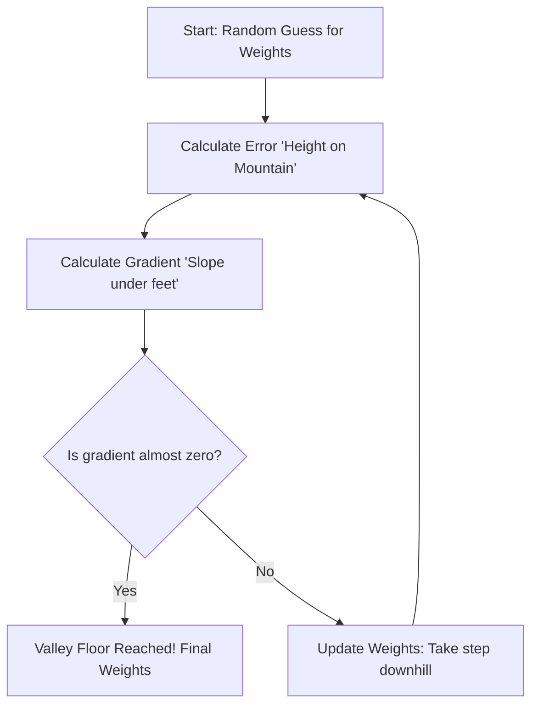

# 📈 Linear Regression — From Math to Implementation

> **Prerequisites**: Mathematical Foundations, Data Preprocessing | **Difficulty**: ⭐⭐☆☆☆ Elementary

---

## 📋 Table of Contents

1. [Intuition and Theory](#1-intuition-and-theory)
2. [Simple Linear Regression](#2-simple-linear-regression)
3. [The Mathematics of OLS](#3-the-mathematics-of-ols)
4. [Gradient Descent for Linear Regression](#4-gradient-descent-for-linear-regression)
5. [Multiple Linear Regression](#5-multiple-linear-regression)
6. [Assumptions of Linear Regression](#6-assumptions-of-linear-regression)
7. [Implementation from Scratch](#7-implementation-from-scratch)
8. [scikit-learn Implementation](#8-scikit-learn-implementation)
9. [Evaluation Metrics for Regression](#9-evaluation-metrics-for-regression)
10. [Practical Tips](#10-practical-tips)
11. [Project Ideas](#11-project-ideas)
12. [What's Next](#12-whats-next)

---

## 1. Intuition and Theory

**Linear Regression** finds the "best-fit line" through data points. It models the relationship between a dependent variable $y$ and one or more independent variables $X$.

**Real-world analogy**: You notice that houses with more square footage tend to cost more. Linear regression finds exactly how much more, on average, each additional square foot adds to the price.

**Model equation**:

$$\hat{y} = w_0 + w_1 x_1 + w_2 x_2 + \cdots + w_n x_n = \mathbf{w}^T \mathbf{x} + b$$

where:
- $\hat{y}$ = predicted value
- $w_i$ = weights (coefficients) — **learned from data**
- $x_i$ = features (input variables)
- $b$ (or $w_0$) = bias (intercept)

---

## 2. Simple Linear Regression

One feature, one target: $\hat{y} = wx + b$

```python
import numpy as np
import matplotlib.pyplot as plt

# Generate data: y = 3x + 7 + noise
np.random.seed(42)
X = 2 * np.random.rand(100)
y = 7 + 3 * X + np.random.randn(100) * 0.5

fig, ax = plt.subplots(figsize=(10, 6))
ax.scatter(X, y, alpha=0.6, color='#36A2EB', s=40, label='Data points')
ax.set_xlabel('X (Feature)', fontsize=12)
ax.set_ylabel('y (Target)', fontsize=12)
ax.set_title('Simple Linear Regression — Finding the Best Line', fontsize=14, fontweight='bold')
ax.legend()
ax.grid(True, alpha=0.3)
plt.tight_layout()
plt.savefig('simple_lr_data.png', dpi=150)
plt.show()
```

---

## 3. The Mathematics of OLS

### 3.1 Ordinary Least Squares (OLS)

> **🧠 ELI5 Analogy:** Imagine you're holding a straight ruler over a board with lots of pins sticking out of it. You want to place the ruler so it rests as closely as possible to all the pins. OLS mathematically measures the exact distance from the ruler to every single pin, squares those distances, and finds the exact position that makes the total sum of those squared distances the absolute smallest!

OLS finds the line that minimizes the **sum of squared residuals**:

$$\min_{w, b} \quad J(w, b) = \sum_{i=1}^{n} (y_i - (wx_i + b))^2 = \sum_{i=1}^{n} (y_i - \hat{y}_i)^2$$

**Why squared?**
- Makes all errors positive
- Penalizes large errors more than small ones
- Results in a smooth, convex function (guarantees a unique minimum)
- Derivative is easy to compute

### 3.2 Deriving the Closed-Form Solution

For simple linear regression, we can derive exact formulas by setting derivatives to zero.

**Step 1**: Define the loss function:
$$J(w, b) = \sum_{i=1}^{n} (y_i - wx_i - b)^2$$

**Step 2**: Take partial derivatives:

$$\frac{\partial J}{\partial w} = -2\sum_{i=1}^{n} x_i(y_i - wx_i - b) = 0$$

$$\frac{\partial J}{\partial b} = -2\sum_{i=1}^{n} (y_i - wx_i - b) = 0$$

**Step 3**: Solve the system of equations.

From the second equation:
$$\sum y_i = w\sum x_i + nb \implies b = \bar{y} - w\bar{x}$$

Substituting into the first equation:
$$w = \frac{\sum_{i=1}^{n}(x_i - \bar{x})(y_i - \bar{y})}{\sum_{i=1}^{n}(x_i - \bar{x})^2} = \frac{\text{Cov}(X, Y)}{\text{Var}(X)}$$

$$b = \bar{y} - w\bar{x}$$

```python
import numpy as np

# Generate data
np.random.seed(42)
X = 2 * np.random.rand(100)
y = 7 + 3 * X + np.random.randn(100) * 0.5

# Closed-form solution (by hand!)
x_mean = np.mean(X)
y_mean = np.mean(y)

# w = Cov(X,Y) / Var(X)
numerator = np.sum((X - x_mean) * (y - y_mean))
denominator = np.sum((X - x_mean) ** 2)
w = numerator / denominator

# b = y_mean - w * x_mean
b = y_mean - w * x_mean

print(f"Closed-form solution:")
print(f"  w = {w:.4f} (true: 3.0)")
print(f"  b = {b:.4f} (true: 7.0)")
```

### 3.3 Matrix Form (Multiple Features)

For multiple features, the model is $\hat{\mathbf{y}} = \mathbf{X}\boldsymbol{\theta}$ where $\boldsymbol{\theta} = [b, w_1, w_2, \ldots, w_n]^T$.

The **Normal Equation** gives the closed-form solution:

$$\boldsymbol{\theta} = (\mathbf{X}^T\mathbf{X})^{-1}\mathbf{X}^T\mathbf{y}$$

**Derivation**:

Loss function in matrix form:
$$J(\boldsymbol{\theta}) = (\mathbf{y} - \mathbf{X}\boldsymbol{\theta})^T(\mathbf{y} - \mathbf{X}\boldsymbol{\theta})$$

Expanding:
$$J = \mathbf{y}^T\mathbf{y} - 2\boldsymbol{\theta}^T\mathbf{X}^T\mathbf{y} + \boldsymbol{\theta}^T\mathbf{X}^T\mathbf{X}\boldsymbol{\theta}$$

Taking the gradient and setting to zero:
$$\nabla_\theta J = -2\mathbf{X}^T\mathbf{y} + 2\mathbf{X}^T\mathbf{X}\boldsymbol{\theta} = 0$$

$$\mathbf{X}^T\mathbf{X}\boldsymbol{\theta} = \mathbf{X}^T\mathbf{y}$$

$$\boldsymbol{\theta} = (\mathbf{X}^T\mathbf{X})^{-1}\mathbf{X}^T\mathbf{y}$$

```python
import numpy as np

# Normal Equation implementation
np.random.seed(42)
X = 2 * np.random.rand(100)
y = 7 + 3 * X + np.random.randn(100) * 0.5

# Add bias column (column of 1s)
X_b = np.c_[np.ones(len(X)), X]  # Shape: (100, 2)

# Normal equation: θ = (X^T X)^(-1) X^T y
theta = np.linalg.inv(X_b.T @ X_b) @ X_b.T @ y

print(f"Normal equation solution:")
print(f"  Intercept (b): {theta[0]:.4f} (true: 7.0)")
print(f"  Slope (w):     {theta[1]:.4f} (true: 3.0)")
```

---

## 4. Gradient Descent for Linear Regression

> **🧠 ELI5 Analogy:** Imagine you are blindfolded on the side of a mountain, and your goal is to reach the valley floor (representing the lowest possible error). You can't see the whole mountain, but you can feel the slope of the ground under your feet. Gradient Descent means you simply feel the slope and take a step straight downhill. If it's steep, you take a big step. As it levels out near the valley floor, your steps become smaller until you safely stop at the exact bottom.



When the normal equation is too expensive (large datasets), we use **gradient descent**.

### 4.1 Algorithm

$$\boldsymbol{\theta} \leftarrow \boldsymbol{\theta} - \alpha \nabla_\theta J(\boldsymbol{\theta})$$

For MSE loss:
$$\nabla_\theta J = \frac{2}{n}\mathbf{X}^T(\mathbf{X}\boldsymbol{\theta} - \mathbf{y})$$

### 4.2 Implementation

```python
import numpy as np
import matplotlib.pyplot as plt

np.random.seed(42)
X = 2 * np.random.rand(100)
y = 7 + 3 * X + np.random.randn(100) * 0.5

# Add bias column
X_b = np.c_[np.ones(len(X)), X]
n = len(X)

# Gradient Descent
learning_rate = 0.1
n_iterations = 1000
theta = np.random.randn(2)  # Random initialization

losses = []
theta_history = [theta.copy()]

for iteration in range(n_iterations):
    # Forward pass
    y_pred = X_b @ theta
    
    # Compute loss (MSE)
    loss = np.mean((y - y_pred) ** 2)
    losses.append(loss)
    
    # Compute gradients
    gradients = (2/n) * X_b.T @ (y_pred - y)
    
    # Update parameters
    theta = theta - learning_rate * gradients
    
    if iteration < 10 or iteration % 100 == 0:
        theta_history.append(theta.copy())

print(f"Gradient descent solution:")
print(f"  Intercept: {theta[0]:.4f}")
print(f"  Slope:     {theta[1]:.4f}")

# Visualize convergence
fig, axes = plt.subplots(1, 3, figsize=(18, 5))

# Loss curve
axes[0].plot(losses, color='#FF6384', linewidth=2)
axes[0].set_xlabel('Iteration')
axes[0].set_ylabel('MSE Loss')
axes[0].set_title('Loss Convergence', fontsize=13, fontweight='bold')
axes[0].grid(True, alpha=0.3)

# Data with learned line
axes[1].scatter(X, y, alpha=0.5, s=20, color='#36A2EB')
X_line = np.linspace(0, 2, 100)
axes[1].plot(X_line, theta[0] + theta[1] * X_line, 'r-', linewidth=2,
             label=f'y = {theta[1]:.2f}x + {theta[0]:.2f}')
axes[1].set_title('Fitted Line', fontsize=13, fontweight='bold')
axes[1].legend()
axes[1].grid(True, alpha=0.3)

# Gradient descent path in parameter space
thetas = np.array(theta_history)
w_range = np.linspace(1, 5, 100)
b_range = np.linspace(5, 9, 100)
W, B = np.meshgrid(w_range, b_range)
Z = np.zeros_like(W)
for i in range(len(w_range)):
    for j in range(len(b_range)):
        y_pred = B[j, i] + W[j, i] * X
        Z[j, i] = np.mean((y - y_pred) ** 2)

axes[2].contour(W, B, Z, levels=30, cmap='viridis')
axes[2].plot(thetas[:, 1], thetas[:, 0], 'ro-', markersize=3, alpha=0.7)
axes[2].plot(thetas[0, 1], thetas[0, 0], 'go', markersize=10, label='Start')
axes[2].plot(thetas[-1, 1], thetas[-1, 0], 'r*', markersize=15, label='End')
axes[2].set_xlabel('w (slope)')
axes[2].set_ylabel('b (intercept)')
axes[2].set_title('Gradient Descent Path', fontsize=13, fontweight='bold')
axes[2].legend()

plt.tight_layout()
plt.savefig('gradient_descent_lr.png', dpi=150)
plt.show()
```

### 4.3 Batch vs Stochastic vs Mini-Batch

```python
import numpy as np

np.random.seed(42)
X = 2 * np.random.rand(1000)
y = 7 + 3 * X + np.random.randn(1000) * 0.5
X_b = np.c_[np.ones(len(X)), X]
n = len(X)

# Stochastic Gradient Descent (SGD)
theta_sgd = np.random.randn(2)
learning_rate = 0.01
n_epochs = 50

for epoch in range(n_epochs):
    # Shuffle data each epoch
    indices = np.random.permutation(n)
    X_shuffled = X_b[indices]
    y_shuffled = y[indices]
    
    for i in range(n):
        xi = X_shuffled[i:i+1]  # Single sample
        yi = y_shuffled[i:i+1]
        gradient = 2 * xi.T @ (xi @ theta_sgd - yi)
        theta_sgd = theta_sgd - learning_rate * gradient.flatten()

print(f"SGD solution: w={theta_sgd[1]:.4f}, b={theta_sgd[0]:.4f}")

# Mini-Batch Gradient Descent
theta_mb = np.random.randn(2)
batch_size = 32

for epoch in range(n_epochs):
    indices = np.random.permutation(n)
    for start in range(0, n, batch_size):
        end = min(start + batch_size, n)
        idx = indices[start:end]
        xi = X_b[idx]
        yi = y[idx]
        gradient = (2/len(idx)) * xi.T @ (xi @ theta_mb - yi)
        theta_mb = theta_mb - learning_rate * gradient

print(f"Mini-batch solution: w={theta_mb[1]:.4f}, b={theta_mb[0]:.4f}")
```

---

## 5. Multiple Linear Regression

$$\hat{y} = w_0 + w_1 x_1 + w_2 x_2 + \cdots + w_n x_n$$

```python
import numpy as np
import pandas as pd
from sklearn.datasets import fetch_california_housing
import matplotlib.pyplot as plt

# Load California Housing dataset
housing = fetch_california_housing()
X = pd.DataFrame(housing.data, columns=housing.feature_names)
y = housing.target

print(f"Features: {list(X.columns)}")
print(f"Shape: {X.shape}")
print(f"\n{X.describe().round(2)}")

# Visualize feature-target relationships
fig, axes = plt.subplots(2, 4, figsize=(20, 10))
for i, (ax, col) in enumerate(zip(axes.flat, X.columns)):
    ax.scatter(X[col], y, alpha=0.1, s=5, color='#36A2EB')
    ax.set_xlabel(col)
    ax.set_ylabel('Price')
    ax.set_title(f'{col} vs Price', fontsize=10)
    
    # Add correlation
    corr = np.corrcoef(X[col], y)[0, 1]
    ax.text(0.05, 0.95, f'r = {corr:.3f}', transform=ax.transAxes,
            fontsize=10, verticalalignment='top',
            bbox=dict(boxstyle='round', facecolor='wheat', alpha=0.5))

plt.suptitle('Feature-Target Relationships', fontsize=16, fontweight='bold')
plt.tight_layout()
plt.savefig('multiple_lr_features.png', dpi=150)
plt.show()
```

---

## 6. Assumptions of Linear Regression

Linear regression makes several assumptions. Violating them can lead to poor models.

| # | Assumption | Test | Fix |
|---|------------|------|-----|
| 1 | **Linearity** | Residual plots | Polynomial features, transformations |
| 2 | **Independence** | Durbin-Watson test | Time series methods |
| 3 | **Homoscedasticity** | Residual vs predicted plot | Weighted least squares, log transform |
| 4 | **Normality of residuals** | Q-Q plot, Shapiro-Wilk | Transform target, use robust regression |
| 5 | **No multicollinearity** | VIF (Variance Inflation Factor) | Remove correlated features, PCA |

```python
import numpy as np
import matplotlib.pyplot as plt
from sklearn.linear_model import LinearRegression
from scipy import stats

np.random.seed(42)
X = np.random.randn(200, 1)
y = 2 * X.ravel() + np.random.randn(200) * 0.5

model = LinearRegression()
model.fit(X, y)
y_pred = model.predict(X)
residuals = y - y_pred

fig, axes = plt.subplots(2, 2, figsize=(14, 10))

# 1. Residuals vs Predicted (check linearity + homoscedasticity)
axes[0, 0].scatter(y_pred, residuals, alpha=0.5, s=20, color='#36A2EB')
axes[0, 0].axhline(y=0, color='red', linestyle='--')
axes[0, 0].set_xlabel('Predicted Values')
axes[0, 0].set_ylabel('Residuals')
axes[0, 0].set_title('Residuals vs Predicted', fontsize=13, fontweight='bold')

# 2. Q-Q Plot (check normality of residuals)
stats.probplot(residuals, dist="norm", plot=axes[0, 1])
axes[0, 1].set_title('Q-Q Plot (Normality Check)', fontsize=13, fontweight='bold')

# 3. Histogram of residuals
axes[1, 0].hist(residuals, bins=30, density=True, color='#4CAF50', edgecolor='white', alpha=0.7)
x_norm = np.linspace(residuals.min(), residuals.max(), 100)
axes[1, 0].plot(x_norm, stats.norm.pdf(x_norm, residuals.mean(), residuals.std()),
                'r-', linewidth=2, label='Normal fit')
axes[1, 0].set_title('Residual Distribution', fontsize=13, fontweight='bold')
axes[1, 0].legend()

# 4. Actual vs Predicted
axes[1, 1].scatter(y, y_pred, alpha=0.5, s=20, color='#FF6384')
axes[1, 1].plot([y.min(), y.max()], [y.min(), y.max()], 'k--', linewidth=2)
axes[1, 1].set_xlabel('Actual')
axes[1, 1].set_ylabel('Predicted')
axes[1, 1].set_title('Actual vs Predicted', fontsize=13, fontweight='bold')

plt.suptitle('Linear Regression Diagnostic Plots', fontsize=16, fontweight='bold')
plt.tight_layout()
plt.savefig('lr_diagnostics.png', dpi=150)
plt.show()
```

---

## 7. Implementation from Scratch

```python
import numpy as np

class LinearRegressionFromScratch:
    """Linear Regression using Gradient Descent — built from scratch."""
    
    def __init__(self, learning_rate=0.01, n_iterations=1000):
        self.lr = learning_rate
        self.n_iterations = n_iterations
        self.weights = None
        self.bias = None
        self.losses = []
    
    def fit(self, X, y):
        n_samples, n_features = X.shape
        
        # Initialize parameters
        self.weights = np.zeros(n_features)
        self.bias = 0
        self.losses = []
        
        for i in range(self.n_iterations):
            # Forward pass
            y_pred = X @ self.weights + self.bias
            
            # Compute loss (MSE)
            loss = np.mean((y - y_pred) ** 2)
            self.losses.append(loss)
            
            # Compute gradients
            dw = -(2/n_samples) * X.T @ (y - y_pred)
            db = -(2/n_samples) * np.sum(y - y_pred)
            
            # Update parameters
            self.weights -= self.lr * dw
            self.bias -= self.lr * db
        
        return self
    
    def predict(self, X):
        return X @ self.weights + self.bias
    
    def score(self, X, y):
        """R² score."""
        y_pred = self.predict(X)
        ss_res = np.sum((y - y_pred) ** 2)
        ss_tot = np.sum((y - np.mean(y)) ** 2)
        return 1 - ss_res / ss_tot

# Test our implementation
np.random.seed(42)
X = np.random.randn(200, 3)
true_weights = np.array([2, -1, 0.5])
y = X @ true_weights + 3 + np.random.randn(200) * 0.3

# Our model
model = LinearRegressionFromScratch(learning_rate=0.01, n_iterations=1000)
model.fit(X, y)

print(f"True weights:    {true_weights}")
print(f"Learned weights: {model.weights.round(4)}")
print(f"True bias:       3.0")
print(f"Learned bias:    {model.bias:.4f}")
print(f"R² score:        {model.score(X, y):.6f}")
```

---

## 8. scikit-learn Implementation

```python
import numpy as np
import pandas as pd
from sklearn.linear_model import LinearRegression
from sklearn.model_selection import train_test_split
from sklearn.preprocessing import StandardScaler
from sklearn.metrics import mean_squared_error, r2_score, mean_absolute_error
from sklearn.datasets import fetch_california_housing
import matplotlib.pyplot as plt

# Load data
housing = fetch_california_housing()
X = pd.DataFrame(housing.data, columns=housing.feature_names)
y = housing.target

# Split
X_train, X_test, y_train, y_test = train_test_split(X, y, test_size=0.2, random_state=42)

# Scale
scaler = StandardScaler()
X_train_scaled = scaler.fit_transform(X_train)
X_test_scaled = scaler.transform(X_test)

# Train
model = LinearRegression()
model.fit(X_train_scaled, y_train)

# Predict
y_pred = model.predict(X_test_scaled)

# Evaluate
print("=" * 50)
print("LINEAR REGRESSION RESULTS")
print("=" * 50)
print(f"R² Score:          {r2_score(y_test, y_pred):.4f}")
print(f"MSE:               {mean_squared_error(y_test, y_pred):.4f}")
print(f"RMSE:              {np.sqrt(mean_squared_error(y_test, y_pred)):.4f}")
print(f"MAE:               {mean_absolute_error(y_test, y_pred):.4f}")

# Coefficients
print(f"\nCoefficients:")
for name, coef in sorted(zip(housing.feature_names, model.coef_), key=lambda x: abs(x[1]), reverse=True):
    print(f"  {name:>15}: {coef:>8.4f}")
print(f"  {'Intercept':>15}: {model.intercept_:>8.4f}")

# Visualize
fig, axes = plt.subplots(1, 2, figsize=(14, 5))

axes[0].scatter(y_test, y_pred, alpha=0.3, s=10, color='#36A2EB')
axes[0].plot([0, 5], [0, 5], 'r--', linewidth=2)
axes[0].set_xlabel('Actual Price')
axes[0].set_ylabel('Predicted Price')
axes[0].set_title('Actual vs Predicted', fontsize=13, fontweight='bold')

residuals = y_test - y_pred
axes[1].hist(residuals, bins=50, color='#4CAF50', edgecolor='white', alpha=0.7)
axes[1].set_title('Residual Distribution', fontsize=13, fontweight='bold')
axes[1].set_xlabel('Residual')

plt.tight_layout()
plt.savefig('sklearn_lr.png', dpi=150)
plt.show()
```

---

## 9. Evaluation Metrics for Regression

| Metric | Formula | Interpretation |
|--------|---------|----------------|
| **MSE** | $\frac{1}{n}\sum(y_i - \hat{y}_i)^2$ | Average squared error. Penalizes large errors. |
| **RMSE** | $\sqrt{MSE}$ | Same units as target. Most interpretable. |
| **MAE** | $\frac{1}{n}\sum\|y_i - \hat{y}_i\|$ | Average absolute error. Robust to outliers. |
| **R²** | $1 - \frac{SS_{res}}{SS_{tot}}$ | % of variance explained. 1 = perfect. |
| **Adjusted R²** | $1 - \frac{(1-R^2)(n-1)}{n-p-1}$ | R² adjusted for number of features. |
| **MAPE** | $\frac{100}{n}\sum\|\frac{y_i - \hat{y}_i}{y_i}\|$ | Percentage error. Good for business context. |

---

## 10. Practical Tips

### When to Use Linear Regression
- ✅ Linear relationship between features and target
- ✅ Need interpretable model (coefficients tell a story)
- ✅ Baseline model for any regression task
- ✅ Few features relative to samples

### When NOT to Use
- ❌ Complex non-linear relationships
- ❌ Lots of outliers (use robust regression)
- ❌ Features are highly correlated (multicollinearity)

### Normal Equation vs Gradient Descent

| Aspect | Normal Equation | Gradient Descent |
|--------|----------------|-----------------|
| Formula | $\theta = (X^TX)^{-1}X^Ty$ | Iterative updates |
| Speed (small n) | Fast | Slower |
| Speed (large n) | Slow ($O(n^3)$ for inversion) | Fast |
| Feature scaling | Not needed | Required |
| Hyperparameters | None | Learning rate, iterations |

---

## 11. Project Ideas

### 🟢 Project 1: House Price Predictor (Beginner)
- **Dataset:** California Housing or Ames Housing dataset (Kaggle).
- **Task:** Predict the median house value for a given neighborhood.
- **Skills:** Basic data loading (Pandas), building a simple Linear Regression model (scikit-learn), handling missing values.
- **Evaluation:** Measure performance using Mean Absolute Error (MAE) and R².
- **Bonus:** Create a scatter plot of predicted vs actual prices to visually inspect model performance.

### 🟡 Project 2: Salary Predictor (Intermediate)
- **Dataset:** StackOverflow Developer Survey or similar tech salary datasets.
- **Task:** Predict developer salary based on years of experience, education level, and geographic location.
- **Skills:** Categorical encoding (One-Hot Encoding), Feature Engineering (polynomial features or interaction terms).
- **Evaluation:** Compare standard OLS regression against Gradient Descent implementations. Analyze feature importance using model coefficients.

### 🔴 Project 3: Stock Price Direction (Advanced)
- **Dataset:** Historical stock data using the `yfinance` library.
- **Task:** Forecast the closing price of a stock for the next day.
- **Skills:** Time-series feature engineering (moving averages, momentum indicators), rigorous feature selection to avoid multicollinearity.
- **Evaluation:** Backtesting predictions against actual returns using Walk-Forward validation. Understand the limitations of linear regression in financial forecasting.

---

## 12. What's Next

Congratulations on completing the foundation of predictive modeling! Here's where to go next:

| Next Topic | Why it's Important |
|------------|--------------------|
| [Polynomial & Regularization](./02-Polynomial-And-Regularization.md) | Standard linear regression struggles with non-linear relationships and is prone to overfitting. Regularization (Ridge/Lasso) solves this. |
| [Logistic Regression](./03-Logistic-Regression.md) | What if your target isn't a continuous number but a discrete category (e.g., Yes/No)? We adapt regression for classification. |
| [Exploratory Data Analysis](../01-Data-Science-Foundations/06-EDA.md) | Better models start with better data understanding. |

---

[← Imbalanced Data](../01-Data-Science-Foundations/10-Imbalanced-Data.md) | [Back to Index](../README.md) | [Next: Polynomial And Regularization →](./02-Polynomial-And-Regularization.md)
