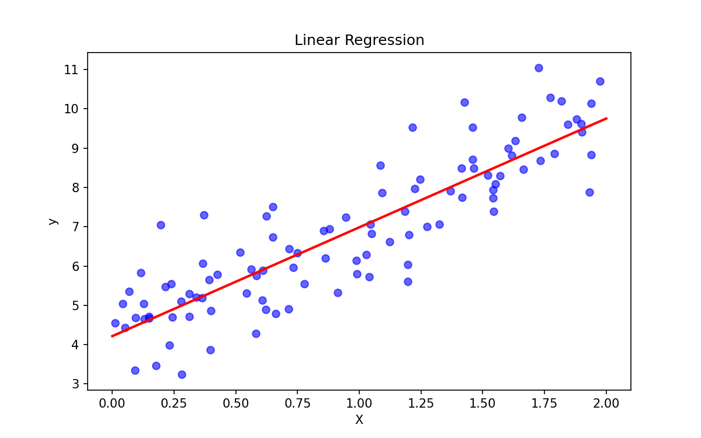

# 📈 Linear Regression

> **Prerequisites**: Math Foundations | **Difficulty**: ⭐⭐☆☆☆ Intermediate

---

## 1. Simple & Multiple Linear Regression

### 🟢 Beginner
**Simple Explanation**: Drawing the best-fitting straight line through a scatterplot of data points to predict a continuous value.

**Visual Intuition**: 

### 🟡 Intermediate
**Working Mechanism**: It finds the weights (coefficients) that minimize the sum of squared residuals between predicted and actual values.
**Practical Workflow**: Fit the model using `sklearn.linear_model.LinearRegression`. 

### 🔴 Advanced
**Mathematics & Optimization**: 
Cost Function (MSE): $J(\theta) = \frac{1}{2m} \sum_{i=1}^{m} (h_\theta(x^{(i)}) - y^{(i)})^2$
Optimization via Gradient Descent: $\theta_j := \theta_j - \alpha \frac{\partial}{\partial \theta_j} J(\theta)$
Or via Normal Equation: $\theta = (X^T X)^{-1} X^T y$

**Assumptions**: Linearity, Independence, Homoscedasticity, Normality of Residuals.

---

[← Introduction to Supervised Learning](01-Introduction-To-Supervised-Learning.md) | [Back to Index](../README.md) | [Next: Polynomial Regression →](03-Polynomial-Regression.md)
