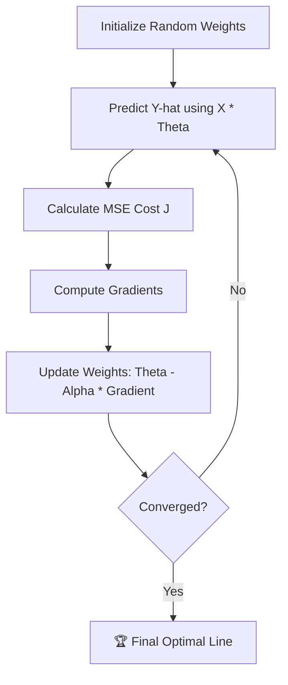

# 🎯 Linear Regression

> **Difficulty:** ⭐☆☆☆☆ Beginner | **Prerequisites:** Algebra, Basic Calculus (Derivatives) | **Estimated Reading Time:** 20 minutes

---

## 📋 Table of Contents
1. [What Problem Does This Solve?](#1-what-problem-does-this-solve)
2. [Intuition](#2-intuition)
3. [Mathematics](#3-mathematics)
4. [Algorithm Workflow](#4-algorithm-workflow)
5. [From Scratch Implementation](#5-from-scratch-implementation)
6. [Scikit-Learn Implementation](#6-scikit-learn-implementation)
7. [Hyperparameter Deep Dive](#7-hyperparameter-deep-dive)
8. [Failure Cases](#8-failure-cases)
9. [Industry Applications](#9-industry-applications)

---

## 1. What Problem Does This Solve?

### 🟢 Beginner
You want to sell your house. You know that larger houses sell for more money. You look at the recent sales of 5 houses in your neighborhood and their square footage. Linear Regression is the tool that lets you say: *"If my house is exactly 2,100 square feet, I should list it for exactly \$435,000."* It draws a "line of best fit" through historical data so you can predict future numbers.

### 🟡 Intermediate
Linear Regression is the foundational algorithm for **Regression** tasks in Supervised Learning (predicting continuous numerical targets). It assumes that the relationship between your input features ($X$) and your target variable ($y$) is fundamentally linear. It finds the mathematically optimal weights to multiply against your inputs to yield the most accurate prediction possible.

### 🔴 Advanced
While simple, Linear Regression is an incredibly robust, high-bias/low-variance model. It serves as the ultimate baseline for tabular regression tasks. It is fully interpretable (white-box), meaning every single coefficient maps directly to feature importance. Furthermore, the math behind it (Gradient Descent, Cost Functions) forms the exact underlying architecture of modern Deep Learning Neural Networks.

---

## 2. Intuition

Imagine stretching a large rubber band across a pegboard. There are dozens of pegs scattered across the board, moving diagonally upwards from left to right. 

If you let go of the rubber band, it will snap into a straight line right through the exact center of all the pegs. The rubber band naturally wants to minimize its tension.

Linear Regression works the exact same way. It draws a line through the data and tries to minimize the "tension" (the distance from the line to all the data points). The optimal line is the one where the total distance from every point to the line is as small as possible.

---

## 3. Mathematics

### 3.1 The Hypothesis Function
The prediction $\hat{y}$ is a linear combination of the input features $x$.
$$ \hat{y} = \theta_0 + \theta_1 x_1 + \theta_2 x_2 + \dots + \theta_n x_n $$
- $\theta_0$ is the **y-intercept** (bias).
- $\theta_1, \theta_2...$ are the **weights** (coefficients).

**Vectorized:** $\hat{y} = X \cdot \theta$

### 3.2 Mean Squared Error (MSE) Cost Function
How do we know if our line is good? We calculate the error between our prediction ($\hat{y}$) and the true value ($y$), square it to remove negative signs and punish large errors, and find the average.
$$ J(\theta) = \frac{1}{2m} \sum_{i=1}^{m} (\hat{y}^{(i)} - y^{(i)})^2 $$

### 3.3 Gradient Descent
To find the best weights, we take the derivative (gradient) of the MSE cost function and update our weights $\theta$ by taking a small step $\alpha$ (learning rate) downhill.
$$ \theta_j = \theta_j - \alpha \frac{\partial}{\partial \theta_j} J(\theta) $$
The derivative works out beautifully to:
$$ \theta_j = \theta_j - \alpha \frac{1}{m} \sum_{i=1}^{m} (\hat{y}^{(i)} - y^{(i)}) \cdot x_j^{(i)} $$

---

## 4. Algorithm Workflow



> **Note:** The Cost Function $J(\theta)$ for Linear Regression is always a perfectly convex bowl. This means Gradient Descent is guaranteed to find the global minimum!

1. **Initialize Parameters**: Start with random weights ($\theta$) or all zeros.
2. **Forward Pass**: Multiply the input features $X$ by the weights $\theta$ to get predictions $\hat{y}$.
3. **Calculate Loss**: Compare predictions $\hat{y}$ to true targets $y$ using Mean Squared Error.
4. **Calculate Gradients**: Find the slope of the error curve with respect to each weight.
5. **Update Weights**: Adjust the weights slightly in the opposite direction of the gradient to reduce the error.
6. **Repeat**: Loop steps 2-5 for hundreds of *epochs* until the error stops decreasing.

---

## 5. From Scratch Implementation

```python
import random

class SimpleLinearRegression:
    def __init__(self, learning_rate=0.01, epochs=1000):
        self.lr = learning_rate
        self.epochs = epochs
        self.weight = 0
        self.bias = 0
        
    def fit(self, X, y):
        m = len(X)
        for _ in range(self.epochs):
            # 1. Forward Pass
            y_pred = [self.weight * x + self.bias for x in X]
            
            # 2. Calculate Gradients
            dw = (1/m) * sum((y_pred[i] - y[i]) * X[i] for i in range(m))
            db = (1/m) * sum((y_pred[i] - y[i]) for i in range(m))
            
            # 3. Update Parameters
            self.weight -= self.lr * dw
            self.bias -= self.lr * db
            
    def predict(self, X):
        return [self.weight * x + self.bias for x in X]
```

---

## 6. Scikit-Learn Implementation

*Industry standard workflow using the Normal Equation (Closed-form solution) instead of iterative Gradient Descent.*

```python
from sklearn.linear_model import LinearRegression
from sklearn.model_selection import train_test_split
from sklearn.metrics import mean_squared_error, r2_score
import numpy as np

# 1. Prepare Data
X = np.array([[1000], [1500], [2000], [2500]]) # Square footage
y = np.array([[300000], [400000], [500000], [600000]]) # Price

X_train, X_test, y_train, y_test = train_test_split(X, y, test_size=0.2, random_state=42)

# 2. Initialize and Train
model = LinearRegression()
model.fit(X_train, y_train)

# 3. Predict and Evaluate
predictions = model.predict(X_test)
print(f"R-Squared: {r2_score(y_test, predictions)}")
print(f"Learned Weight: {model.coef_[0][0]}")
print(f"Learned Bias: {model.intercept_[0]}")
```

---

## 7. Hyperparameter Deep Dive

Standard Scikit-Learn `LinearRegression` uses the Normal Equation, so it doesn't have learning rates or epochs. However, if using `SGDRegressor` (Gradient Descent):

- **`learning_rate` / `eta0`** ($\alpha$): The step size.
  - *Too large*: The model overshoots the minimum and the error explodes to infinity.
  - *Too small*: The model takes millions of tiny steps and trains too slowly.
- **`max_iter`** (epochs): How many times to loop over the data.
- **`penalty`** (Regularization): Use `l2` (Ridge) or `l1` (Lasso) to prevent the weights from growing too large.

---

## 8. Failure Cases

### Outliers
Because MSE squares the errors, a single massive outlier will act like a magnet and drag the entire line of best fit towards it. 
*Fix: Remove outliers or use Mean Absolute Error (MAE) via a robust regressor.*

### Non-Linear Relationships
If the data is curved (like a parabola), a straight line will underfit miserably. 
*Fix: Use Polynomial Regression or a Decision Tree.*

### Multicollinearity
If two features are highly correlated (e.g., "House Area in Sq Ft" and "House Area in Sq Meters"), the model cannot figure out which weight to assign to which feature, leading to mathematically unstable and wildly fluctuating weights.

---

## 9. Industry Applications

- **Real Estate**: Automated Valuation Models (AVMs) like Zestimate use heavily regularized linear models at their core.
- **Sales Forecasting**: Predicting next quarter's revenue based on ad spend.
- **Capital Asset Pricing Model (CAPM)**: Used globally in finance to determine the relationship between expected return and market risk.

---

[← Introduction to Supervised Learning](01-Introduction-To-Supervised-Learning.md) | [Back to Index](../README.md) | [Next: Polynomial Regression →](03-Polynomial-Regression.md)
