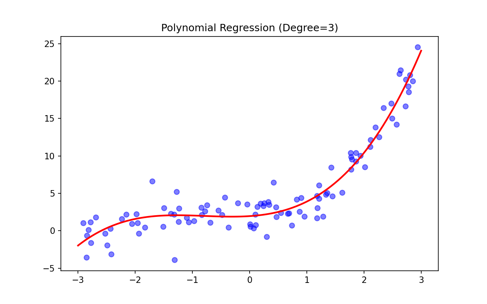

# 🎢 Polynomial Regression

> **Prerequisites**: Linear Regression | **Difficulty**: ⭐⭐☆☆☆ Intermediate

---

## 1. Non-linear Relationships

### 🟢 Beginner
**Simple Explanation**: When a straight line doesn't fit the data well (like a curved trend), we add curves to our line.

**Visual Intuition**: 

### 🟡 Intermediate
**Working Mechanism**: We create new features by squaring or cubing existing features, and then apply standard Linear Regression.

### 🔴 Advanced
**Mathematics & Complexity**: By using a feature mapping $\phi(x) = [1, x, x^2, \dots, x^d]$, we transform the space such that non-linear relationships become linear in the higher-dimensional space. Be careful: too high a degree causes severe overfitting (Runge's phenomenon).

---

[← Linear Regression](02-Linear-Regression.md) | [Back to Index](../README.md) | [Next: Logistic Regression →](04-Logistic-Regression.md)
