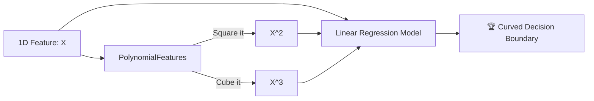

# 📈 Polynomial Regression

> **Difficulty:** ⭐⭐☆☆☆ Intermediate | **Prerequisites:** Linear Regression | **Estimated Reading Time:** 15 minutes

---

## 📋 Table of Contents
1. [What Problem Does This Solve?](#1-what-problem-does-this-solve)
2. [Intuition](#2-intuition)
3. [Mathematics](#3-mathematics)
4. [Algorithm Workflow](#4-algorithm-workflow)
5. [Scikit-Learn Implementation](#5-scikit-learn-implementation)
6. [Hyperparameter Deep Dive](#6-hyperparameter-deep-dive)
7. [Failure Cases](#7-failure-cases)
8. [Industry Applications](#8-industry-applications)

---

## 1. What Problem Does This Solve?

### 🟢 Beginner
Linear Regression draws a straight line. But what if your data curves? For example, human height grows rapidly from ages 0-15, slows down from 15-20, and then stops completely. If you draw a straight line through that, it will predict that a 90-year-old is 15 feet tall! Polynomial Regression allows you to bend the line to fit curves.

### 🟡 Intermediate
Polynomial Regression is technically just Multiple Linear Regression in disguise. When the true relationship between features and target is non-linear, we artificially create new features by raising existing features to a power (e.g., squaring them or cubing them). This allows a linear model to fit a non-linear boundary.

### 🔴 Advanced
Polynomial expansion is a fundamental technique for increasing the dimensionality of your feature space. However, it suffers heavily from the **Curse of Dimensionality**. If you have 10 features and you expand them to degree 4, you instantly create hundreds of highly correlated, redundant features, which can mathematically destabilize the closed-form Normal Equation and lead to massive overfitting.

---

## 2. Intuition

Imagine you have a single slider variable: $x$. A straight line can only ever be a straight line: $y = mx + b$.

But what if, behind the scenes, you secretly calculate $x^2$ and feed it to the model as a *brand new variable* $z$? 
Now the model is solving: $y = w_1 x + w_2 z + b$.
Because the model doesn't know that $z$ is secretly $x^2$, it just treats it like a normal linear regression problem in a 2D space. But when you plot the result back onto the original 1D graph of $x$, the line magically forms a perfect parabola!

---

## 3. Mathematics

### 3.1 Feature Expansion
To fit a $d$-degree polynomial on a single feature $x$, we create a matrix of expanded features:
$$ X_{\text{poly}} = [1, x, x^2, x^3, \dots, x^d] $$

### 3.2 The Linear Hypothesis
Once the features are expanded, the math is **identical** to standard Linear Regression.
$$ \hat{y} = \theta_0 + \theta_1 x + \theta_2 x^2 + \dots + \theta_d x^d $$

Notice that the equation is non-linear with respect to the input data $x$, but it is **strictly linear** with respect to the parameters $\theta$. This is why it is still considered "Linear" Regression—we are still just finding optimal weights for terms!

### 3.3 The Curse of Dimensionality
If you have two features $a$ and $b$, and you want a degree-3 expansion, you don't just get $a^3$ and $b^3$. You get all interaction terms:
$$ [1, a, b, a^2, b^2, ab, a^3, b^3, a^2b, ab^2] $$
The number of features explodes factorially!

---

## 4. Algorithm Workflow



1. **Input Data**: You have an input matrix $X$.
2. **Transform**: Pass $X$ through a Polynomial feature transformer to generate new columns of squared, cubed, and interaction terms.
3. **Scale**: **CRITICAL STEP**. Because $10^3 = 1000$, the new features will have wildly different scales. You MUST apply standard scaling.
4. **Train**: Pass the expanded, scaled matrix to a standard Linear Regression model.
5. **Predict**: When predicting new data, you must apply the exact same transformation and scaling before predicting.

---

## 5. Scikit-Learn Implementation

```python
from sklearn.preprocessing import PolynomialFeatures, StandardScaler
from sklearn.linear_model import LinearRegression
from sklearn.pipeline import Pipeline
import numpy as np

# 1. Data
X = np.array([[1], [2], [3], [4], [5]])
y = np.array([[1], [4], [9], [16], [25]]) # Perfect parabola

# 2. Create a Pipeline! (Best Practice)
poly_model = Pipeline([
    ('poly', PolynomialFeatures(degree=2, include_bias=False)),
    ('scaler', StandardScaler()),
    ('lin_reg', LinearRegression())
])

# 3. Train
poly_model.fit(X, y)

# 4. Predict
print(f"Prediction for 6: {poly_model.predict([[6]])[0][0]:.2f}") # Should be ~36
```

---

## 6. Hyperparameter Deep Dive

- **`degree`**: The highest power to raise your features to.
  - *Degree 1*: Standard straight line.
  - *Degree 2*: Parabola (U-shape).
  - *Degree 3*: S-curve.
  - *Degree 20*: Madness (Massive Overfitting).
- **`interaction_only`**: If `True`, it will only calculate interaction features like $a \times b$, but not $a^2$ or $b^2$. Useful if you suspect features multiply together (like width $\times$ height) but don't curve individually.

---

## 7. Failure Cases

### Runge's Phenomenon (Extreme Overfitting)
If you set the `degree` too high (e.g., 20), the model will force the curve to snake up and down violently to perfectly hit every single training data point. When given new data, the curve will output numbers in the millions or billions. 
*Fix: Heavily restrict the degree to 2 or 3, or use heavily regularized models like Ridge/Lasso.*

---

## 8. Industry Applications

- **Physics & Engineering**: Modeling trajectories (which are inherently parabolic due to gravity).
- **Economics**: Yield curve modeling.
- **Epidemiology**: Early stages of viral spread can often be modeled effectively with low-degree polynomial curves before exponential growth kicks in.

---

[← Linear Regression](02-Linear-Regression.md) | [Back to Index](../README.md) | [Next: Logistic Regression →](04-Logistic-Regression.md)
