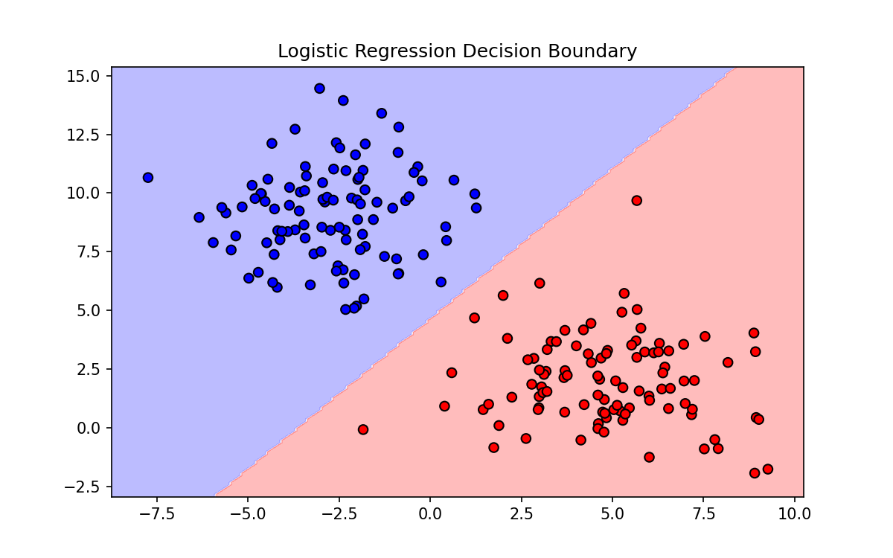

# 📊 Logistic Regression

> **Prerequisites**: Linear Regression | **Difficulty**: ⭐⭐☆☆☆ Intermediate

---

## 1. Binary Classification

### 🟢 Beginner
**Simple Explanation**: Despite the name "regression", this is for classification. It predicts the probability that an email is Spam (1) or Not Spam (0).

**Visual Intuition**: 

### 🟡 Intermediate
**Working Mechanism**: It squashes a linear combination of inputs into a probability (0 to 1) using the Sigmoid function. If probability > 0.5, it predicts class 1.

### 🔴 Advanced
**Mathematics & Optimization**:
Sigmoid Function: $\sigma(z) = \frac{1}{1 + e^{-z}}$
Cost Function (Log Loss / Cross-Entropy): 
$J(\theta) = -\frac{1}{m} \sum_{i=1}^m [y^{(i)}\log(h_\theta(x^{(i)})) + (1 - y^{(i)})\log(1 - h_\theta(x^{(i)}))]$

---

[← Polynomial Regression](03-Polynomial-Regression.md) | [Back to Index](../README.md) | [Next: K-Nearest Neighbors (KNN) →](05-KNN.md)
