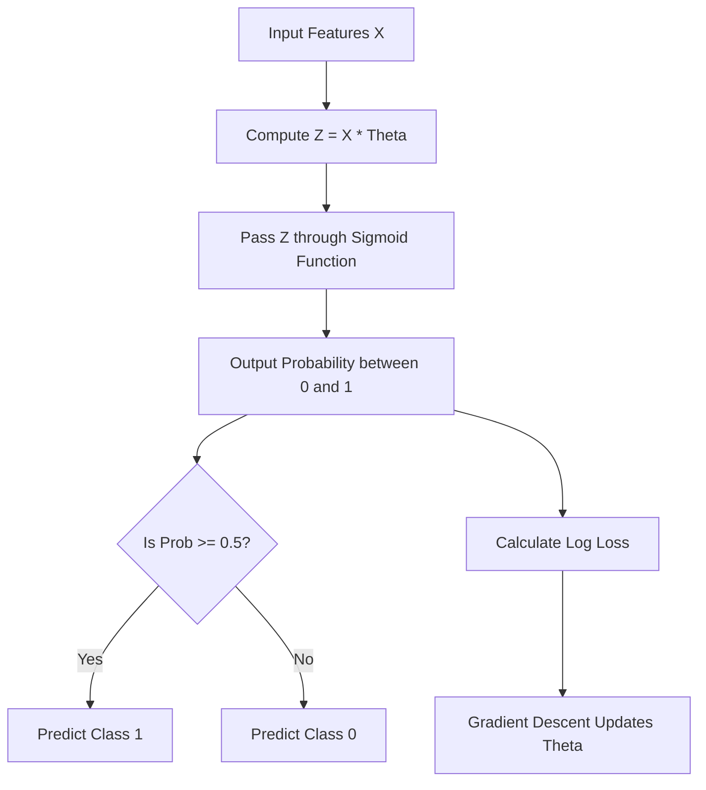

# 📊 Logistic Regression

> **Difficulty:** ⭐⭐☆☆☆ Beginner | **Prerequisites:** Linear Regression, Probabilities | **Estimated Reading Time:** 20 minutes

---

## 📋 Table of Contents
1. [What Problem Does This Solve?](#1-what-problem-does-this-solve)
2. [Intuition](#2-intuition)
3. [Mathematics](#3-mathematics)
4. [Algorithm Workflow](#4-algorithm-workflow)
5. [From Scratch Implementation](#5-from-scratch-implementation)
6. [Scikit-Learn Implementation](#6-scikit-learn-implementation)
7. [Hyperparameter Deep Dive](#7-hyperparameter-deep-dive)
8. [Failure Cases](#8-failure-cases)
9. [Industry Applications](#9-industry-applications)

---

## 1. What Problem Does This Solve?

### 🟢 Beginner
Linear Regression predicts a number (e.g., house price = \$450,000). But what if you want to predict a **Yes or No** question? Will this patient survive? Will this email be marked as spam? Will this customer click on the ad?
You can't predict a price for these. You need a percentage. Logistic Regression is the algorithm that predicts the **probability** (from 0% to 100%) that something belongs to a certain category.

### 🟡 Intermediate
Despite having "Regression" in the name, Logistic Regression is fundamentally a **Classification** algorithm. It is used for binary classification (0 or 1). Instead of drawing a straight line through points, it draws an S-shaped curve that bounds all predictions strictly between 0.0 and 1.0. If the output is > 0.5, it predicts class 1. Otherwise, class 0.

### 🔴 Advanced
Logistic Regression serves as the fundamental unit (a single neuron/perceptron) of modern Deep Learning architectures. The mathematics of logistic regression—specifically the Sigmoid activation function and the Binary Cross-Entropy (Log Loss) cost function—are the exact same mathematical constructs used in the output layers of advanced classification Neural Networks.

---

## 2. Intuition

Imagine you try to use Linear Regression to classify Malignant (1) vs Benign (0) tumors based on tumor size. 
You draw a straight line through the data. For a while, it works: tumors smaller than 2cm output a number $< 0.5$ (Benign), and tumors $> 2$cm output a number $> 0.5$ (Malignant).

But then, a massive 15cm tumor is added to the dataset. The straight line tilts wildly upward to accommodate it. Now, 3cm tumors that *should* be malignant are suddenly outputting $0.3$ and being classified as benign! Furthermore, the 15cm tumor outputs a "probability" of $2.5$ (250%), which makes no sense.

Logistic Regression solves this by putting a "ceiling" at 1 and a "floor" at 0. It squashes the straight line into an S-curve, ensuring no matter how massive the outlier is, the probability approaches, but never exceeds, 1.0.

---

## 3. Mathematics

### 3.1 The Sigmoid Function
How do we squash a linear line $z = \theta^T X$ into the range $(0, 1)$? We pass it through the **Sigmoid (Logistic) Function**:
$$ \sigma(z) = \frac{1}{1 + e^{-z}} $$
If $z$ is a huge positive number, $e^{-z}$ becomes $0$, and the output is $\frac{1}{1} = 1$.
If $z$ is a huge negative number, $e^{-z}$ becomes $\infty$, and the output is $\frac{1}{\infty} = 0$.

### 3.2 The Hypothesis
$$ \hat{y} = \sigma(\theta^T X) $$

### 3.3 Log Loss (Binary Cross-Entropy)
We cannot use Mean Squared Error (MSE) because wrapping MSE around the Sigmoid function creates a non-convex, wavy cost function full of local minima. 
Instead, we use **Log Loss**, which heavily penalizes being confidently wrong:
$$ J(\theta) = -\frac{1}{m} \sum_{i=1}^m \left[ y^{(i)} \log(\hat{y}^{(i)}) + (1 - y^{(i)}) \log(1 - \hat{y}^{(i)}) \right] $$
- If $y=1$, the right half disappears. We want $\log(\hat{y})$ to be close to 1.
- If $y=0$, the left half disappears. We want $\log(1-\hat{y})$ to be close to 1.

### 3.4 Gradient Descent
Miraculously, the derivative of Log Loss with the Sigmoid function cancels out beautifully, resulting in the exact same gradient formula as Linear Regression!
$$ \theta_j = \theta_j - \alpha \frac{1}{m} \sum_{i=1}^{m} (\hat{y}^{(i)} - y^{(i)}) \cdot x_j^{(i)} $$

---

## 4. Algorithm Workflow



1. **Calculate Linear Equation**: Multiply inputs by weights.
2. **Squash**: Pass the result through the sigmoid function to get a probability.
3. **Threshold**: Convert the probability to a discrete class label (usually using 0.5 as the cutoff).
4. **Evaluate Error**: Calculate the Log Loss using the true labels.
5. **Update**: Use Gradient Descent to adjust weights.

---

## 5. From Scratch Implementation

```python
import math

class SimpleLogisticRegression:
    def __init__(self, lr=0.01, epochs=1000):
        self.lr = lr
        self.epochs = epochs
        self.w = 0.0
        self.b = 0.0
        
    def _sigmoid(self, z):
        # Clip z to prevent math overflow errors
        z = max(min(z, 250), -250)
        return 1 / (1 + math.exp(-z))
        
    def fit(self, X, y):
        m = len(X)
        for _ in range(self.epochs):
            # Forward pass
            y_pred = [self._sigmoid(self.w * X[i] + self.b) for i in range(m)]
            
            # Gradients (Same as Linear Regression!)
            dw = (1/m) * sum((y_pred[i] - y[i]) * X[i] for i in range(m))
            db = (1/m) * sum((y_pred[i] - y[i]) for i in range(m))
            
            # Update
            self.w -= self.lr * dw
            self.b -= self.lr * db
            
    def predict_proba(self, X):
        return [self._sigmoid(self.w * x + self.b) for x in X]
        
    def predict(self, X):
        probs = self.predict_proba(X)
        return [1 if p >= 0.5 else 0 for p in probs]
```

---

## 6. Scikit-Learn Implementation

```python
from sklearn.linear_model import LogisticRegression
from sklearn.model_selection import train_test_split
from sklearn.metrics import accuracy_score, confusion_matrix
import numpy as np

# 1. Data (Tumor size predicting Malignant 1 or Benign 0)
X = np.array([[1.1], [1.5], [2.2], [2.9], [4.5], [5.1], [6.2]])
y = np.array([0, 0, 0, 1, 1, 1, 1])

# 2. Train
model = LogisticRegression(penalty='l2', C=1.0) # Built-in L2 Regularization!
model.fit(X, y)

# 3. Predict Probabilities
probs = model.predict_proba([[2.5]])
print(f"Prob Benign: {probs[0][0]:.2f}, Prob Malignant: {probs[0][1]:.2f}")

# 4. Evaluate
preds = model.predict(X)
print(f"Accuracy: {accuracy_score(y, preds)}")
print(f"Confusion Matrix:\n{confusion_matrix(y, preds)}")
```

---

## 7. Hyperparameter Deep Dive

- **`penalty`**: Logistic Regression mathematically risks pushing weights to infinity to perfectly separate classes (if the data is perfectly separable). Scikit-Learn applies `l2` regularization by default to prevent this.
- **`C`**: The inverse of regularization strength (just like SVMs). 
  - *Small `C` (e.g. 0.01)*: Strong regularization. Forces weights to be tiny. High Bias, Low Variance.
  - *Large `C` (e.g. 100)*: Weak regularization. Allows weights to grow. Low Bias, High Variance.
- **`solver`**: The algorithm used to find the minimum of the cost function. `lbfgs` is the default, `liblinear` is better for small datasets, and `saga` is best for massive datasets and L1 penalties.
- **`class_weight`**: Set to `'balanced'` if you have highly imbalanced data (e.g., 99% non-spam, 1% spam). It forces the algorithm to penalize errors on the minority class more heavily.

---

## 8. Failure Cases

### Non-Linear Boundaries
Just like Linear Regression, Logistic Regression creates a straight decision boundary (a hyperplane). If your data requires a circular or complex curvy boundary (like a donut shape), Logistic Regression will fail entirely unless you use Polynomial Features.

### Imbalanced Data
If 99% of your data is Class 0, the model will just learn to always predict 0 to achieve 99% accuracy. It will never learn the pattern for Class 1. 
*Fix: Use `class_weight='balanced'` or techniques like SMOTE.*

---

## 9. Industry Applications

- **Credit Scoring**: Predicting if a user will default on a loan (1) or not (0). Highly favored in finance because the coefficients are fully interpretable by regulators.
- **Medical Diagnostics**: Predicting the probability of a disease based on patient vitals.
- **Marketing**: Predicting the Probability of Click (CTR) for online advertisements.

---

[← Polynomial Regression](03-Polynomial-Regression.md) | [Back to Index](../README.md) | [Next: K-Nearest Neighbors (KNN) →](05-KNN.md)
