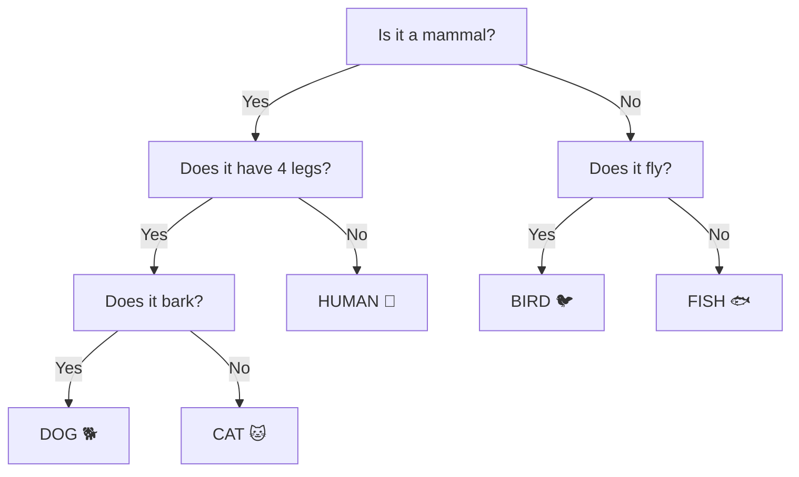

# 🌳 Decision Trees — CART, Entropy & Information Gain

> **Prerequisites**: Basic ML Concepts | **Difficulty**: ⭐⭐☆☆☆ Elementary

---

## 📋 Table of Contents
1. [Intuition](#1-intuition)
2. [How Trees Make Decisions](#2-how-trees-make-decisions)
3. [Splitting Criteria — The Mathematics](#3-splitting-criteria--the-mathematics)
4. [Tree Building Algorithm](#4-tree-building-algorithm)
5. [Pruning](#5-pruning)
6. [Implementation from Scratch](#6-implementation-from-scratch)
7. [scikit-learn Implementation](#7-scikit-learn-implementation)
8. [Advantages and Limitations](#8-advantages-and-limitations)
9. [Project Ideas & What's Next](#9-project-ideas--whats-next)

---

## 1. Intuition

## 1. Intuition

> **🧠 ELI5 Analogy:** A decision tree is exactly like playing the game "20 Questions". You start with a big group of possibilities (e.g., all animals). You ask a yes/no question ("Does it have 4 legs?"). Depending on the answer, you split the possibilities into two smaller, more specific groups. You keep asking questions until you are absolutely sure of the answer!



---

## 2. How Trees Make Decisions

At each **internal node**, the tree asks: "Which feature and threshold gives the **best split**?"

**Best split** = the one that creates the most **pure** (homogeneous) child nodes.

---

## 3. Splitting Criteria — The Mathematics

### 3.1 Entropy

Measures the **impurity** (uncertainty) of a node:

$$H(S) = -\sum_{i=1}^{C} p_i \log_2(p_i)$$

where $p_i$ is the proportion of class $i$ in set $S$.

- **Pure node** (all same class): $H = 0$
- **Maximum impurity** (uniform distribution): $H = \log_2(C)$

### 3.2 Information Gain

The **reduction in entropy** after splitting on feature $A$:

$$\text{IG}(S, A) = H(S) - \sum_{v \in \text{values}(A)} \frac{|S_v|}{|S|} H(S_v)$$

**Choose the feature with the highest information gain!**

### 3.3 Gini Impurity

> **🧠 ELI5 Analogy:** Imagine a bucket filled with 100 colored balls. 
> - If all 100 balls are red, the bucket is completely *pure* (Gini = 0). If you reach in blindfolded, you have zero chance of guessing wrong.
> - If there are 50 red balls and 50 blue balls, the bucket is completely *impure* (Gini = 0.5). If you reach in, it's a total coin toss.
> Decision trees want to split the data so the resulting "buckets" (leaf nodes) are as close to Gini=0 as possible!

$$G(S) = 1 - \sum_{i=1}^{C} p_i^2$$

- **Pure node**: $G = 0$
- **Maximum impurity** (2 classes): $G = 0.5$

**Gini vs Entropy**: In practice, they give similar results. Gini is slightly faster to compute.

```python
import numpy as np
import matplotlib.pyplot as plt

def entropy(probs):
    probs = probs[probs > 0]
    return -np.sum(probs * np.log2(probs))

def gini(probs):
    return 1 - np.sum(probs**2)

# Compare entropy and gini for binary classification
p = np.linspace(0.01, 0.99, 100)
entropy_vals = [entropy(np.array([pi, 1-pi])) for pi in p]
gini_vals = [gini(np.array([pi, 1-pi])) for pi in p]
misclass = [min(pi, 1-pi) for pi in p]

fig, ax = plt.subplots(figsize=(10, 6))
ax.plot(p, entropy_vals, 'b-', linewidth=2, label='Entropy (scaled)')
ax.plot(p, gini_vals, 'r-', linewidth=2, label='Gini Impurity')
ax.plot(p, misclass, 'g--', linewidth=2, label='Misclassification')
ax.set_xlabel('P(class 1)', fontsize=12)
ax.set_ylabel('Impurity', fontsize=12)
ax.set_title('Impurity Measures Comparison', fontsize=14, fontweight='bold')
ax.legend(fontsize=11)
ax.grid(True, alpha=0.3)
plt.tight_layout()
plt.savefig('impurity_measures.png', dpi=150)
plt.show()

# Information Gain Example
print("=" * 50)
print("INFORMATION GAIN EXAMPLE")
print("=" * 50)
# Dataset: 14 examples, 9 Yes, 5 No (play tennis?)
p_yes, p_no = 9/14, 5/14
H_parent = entropy(np.array([p_yes, p_no]))
print(f"Parent entropy: H = {H_parent:.4f}")

# Split on "Outlook" feature:
# Sunny: 2 Yes, 3 No → H = 0.971
# Overcast: 4 Yes, 0 No → H = 0.0
# Rainy: 3 Yes, 2 No → H = 0.971
H_sunny = entropy(np.array([2/5, 3/5]))
H_overcast = entropy(np.array([1.0]))  # Pure
H_rainy = entropy(np.array([3/5, 2/5]))

H_after = (5/14) * H_sunny + (4/14) * H_overcast + (5/14) * H_rainy
IG = H_parent - H_after
print(f"After split: H = {H_after:.4f}")
print(f"Information Gain = {IG:.4f}")
```

---

## 4. Tree Building Algorithm

### CART (Classification and Regression Trees)

```
function BuildTree(data, depth):
    if stopping_condition(data, depth):
        return LeafNode(majority_class(data))
    
    best_feature, best_threshold = find_best_split(data)
    left_data = data[feature <= threshold]
    right_data = data[feature > threshold]
    
    node = InternalNode(best_feature, best_threshold)
    node.left = BuildTree(left_data, depth + 1)
    node.right = BuildTree(right_data, depth + 1)
    return node
```

### For Regression Trees

Instead of entropy/gini, use **MSE reduction**:

$$\text{Split quality} = \text{MSE}_{parent} - \frac{n_{left}}{n}\text{MSE}_{left} - \frac{n_{right}}{n}\text{MSE}_{right}$$

Leaf prediction = **mean** of target values in that leaf.

---

## 5. Pruning

Without limits, trees can grow until each leaf has one sample → massive overfitting!

### Pre-pruning (Early Stopping)
- `max_depth`: Maximum tree depth
- `min_samples_split`: Minimum samples to split a node
- `min_samples_leaf`: Minimum samples in a leaf
- `max_features`: Maximum features to consider per split

### Post-pruning (Cost Complexity Pruning)
$$R_\alpha(T) = R(T) + \alpha |T|$$

where $R(T)$ is the misclassification rate, $|T|$ is the number of leaves, and $\alpha$ controls complexity.

---

## 6. Implementation from Scratch

```python
import numpy as np

class Node:
    def __init__(self, feature=None, threshold=None, left=None, right=None, value=None):
        self.feature = feature
        self.threshold = threshold
        self.left = left
        self.right = right
        self.value = value  # Leaf value (class label)

class DecisionTreeFromScratch:
    def __init__(self, max_depth=10, min_samples_split=2):
        self.max_depth = max_depth
        self.min_samples_split = min_samples_split
        self.root = None
    
    def _gini(self, y):
        classes, counts = np.unique(y, return_counts=True)
        probs = counts / len(y)
        return 1 - np.sum(probs ** 2)
    
    def _best_split(self, X, y):
        best_gain = -1
        best_feature, best_threshold = None, None
        parent_gini = self._gini(y)
        n = len(y)
        
        for feature in range(X.shape[1]):
            thresholds = np.unique(X[:, feature])
            for threshold in thresholds:
                left_mask = X[:, feature] <= threshold
                right_mask = ~left_mask
                
                if np.sum(left_mask) == 0 or np.sum(right_mask) == 0:
                    continue
                
                left_gini = self._gini(y[left_mask])
                right_gini = self._gini(y[right_mask])
                
                weighted_gini = (np.sum(left_mask)/n * left_gini + 
                                np.sum(right_mask)/n * right_gini)
                gain = parent_gini - weighted_gini
                
                if gain > best_gain:
                    best_gain = gain
                    best_feature = feature
                    best_threshold = threshold
        
        return best_feature, best_threshold, best_gain
    
    def _build_tree(self, X, y, depth=0):
        n_classes = len(np.unique(y))
        
        # Stopping conditions
        if (depth >= self.max_depth or n_classes == 1 or 
            len(y) < self.min_samples_split):
            leaf_value = np.bincount(y).argmax()
            return Node(value=leaf_value)
        
        feature, threshold, gain = self._best_split(X, y)
        
        if gain <= 0:
            return Node(value=np.bincount(y).argmax())
        
        left_mask = X[:, feature] <= threshold
        left = self._build_tree(X[left_mask], y[left_mask], depth + 1)
        right = self._build_tree(X[~left_mask], y[~left_mask], depth + 1)
        
        return Node(feature=feature, threshold=threshold, left=left, right=right)
    
    def fit(self, X, y):
        self.root = self._build_tree(X, y)
        return self
    
    def _predict_single(self, x, node):
        if node.value is not None:
            return node.value
        if x[node.feature] <= node.threshold:
            return self._predict_single(x, node.left)
        return self._predict_single(x, node.right)
    
    def predict(self, X):
        return np.array([self._predict_single(x, self.root) for x in X])
    
    def score(self, X, y):
        return np.mean(self.predict(X) == y)

# Test
from sklearn.datasets import load_iris
from sklearn.model_selection import train_test_split

iris = load_iris()
X_train, X_test, y_train, y_test = train_test_split(iris.data, iris.target, test_size=0.2, random_state=42)

tree = DecisionTreeFromScratch(max_depth=5)
tree.fit(X_train, y_train)
print(f"From-scratch accuracy: {tree.score(X_test, y_test):.2%}")
```

---

## 7. scikit-learn Implementation

```python
from sklearn.tree import DecisionTreeClassifier, plot_tree
from sklearn.datasets import load_iris
from sklearn.model_selection import train_test_split
import matplotlib.pyplot as plt

iris = load_iris()
X_train, X_test, y_train, y_test = train_test_split(iris.data, iris.target, test_size=0.2, random_state=42)

# Train
tree = DecisionTreeClassifier(max_depth=3, criterion='gini', random_state=42)
tree.fit(X_train, y_train)

print(f"Training accuracy: {tree.score(X_train, y_train):.4f}")
print(f"Test accuracy:     {tree.score(X_test, y_test):.4f}")

# Visualize the tree
fig, ax = plt.subplots(figsize=(20, 10))
plot_tree(tree, feature_names=iris.feature_names, class_names=iris.target_names,
          filled=True, rounded=True, fontsize=10, ax=ax)
ax.set_title('Decision Tree (max_depth=3)', fontsize=16, fontweight='bold')
plt.tight_layout()
plt.savefig('decision_tree_visual.png', dpi=150, bbox_inches='tight')
plt.show()

# Feature importance
importances = tree.feature_importances_
fig, ax = plt.subplots(figsize=(8, 5))
ax.barh(iris.feature_names, importances, color='#36A2EB')
ax.set_title('Feature Importances', fontsize=14, fontweight='bold')
ax.set_xlabel('Importance')
plt.tight_layout()
plt.savefig('tree_importance.png', dpi=150)
plt.show()
```

---

## 8. Advantages and Limitations

| ✅ Advantages | ❌ Limitations |
|--------------|---------------|
| Easy to interpret and visualize | Prone to overfitting |
| No feature scaling needed | Unstable (small data changes → different tree) |
| Handles numerical AND categorical | Can create biased trees with imbalanced data |
| Non-parametric (no assumptions) | Greedy algorithm (not globally optimal) |
| Fast prediction | High variance |

---

## 9. Project Ideas & What's Next

### Project Ideas

#### 🟢 Loan Approval Predictor (Beginner)
- **Dataset:** Lending Club or general loan approval datasets.
- **Task:** Predict whether a customer will default on a loan based on income, credit score, and debt levels.
- **Skills:** Training a basic `DecisionTreeClassifier`, handling categorical data.
- **Output:** Export and visualize the actual decision tree using `plot_tree` to see exactly what rules the model learned. Explain the top rules to a non-technical audience.

#### 🟡 Medical Diagnosis System (Intermediate)
- **Dataset:** Heart Disease or Breast Cancer Wisconsin datasets.
- **Task:** Diagnose conditions while prioritizing interpretability. Doctors need to know *why* a model made a decision.
- **Skills:** Hyperparameter tuning (`max_depth`, `min_samples_leaf`) to prevent the tree from becoming overly complex and unreadable. Feature importance extraction.
- **Output:** A robust, pruned tree and a bar chart of the most important clinical features driving the diagnoses.

#### 🔴 Custom Tree with Advanced Pruning (Advanced)
- **Dataset:** Any classification dataset.
- **Task:** Implement a Decision Tree from scratch or perform manual Cost-Complexity Pruning (ccp_alpha) to find the mathematically optimal sub-tree.
- **Skills:** Understanding Gini Impurity/Entropy mathematically, extracting the pruning path, cross-validating pruning parameters.
- **Output:** A plot of accuracy vs alpha on both training and validation sets, demonstrating exactly where overfitting is cured.

### What's Next

| Next Topic | Why it's Important |
|------------|--------------------|
| [Support Vector Machines (SVM)](./06-SVM.md) | A powerful algorithm that focuses strictly on the boundaries between classes, introducing the concept of the "margin". |
| [Random Forest](../03-Ensemble-Methods/01-Bagging-And-Random-Forest.md) | A single tree is prone to overfitting. Combining hundreds of trees (an ensemble) fixes this entirely. This is the natural next step. |
| [Feature Engineering](../01-Data-Science-Foundations/08-Feature-Engineering.md) | Trees handle raw data well, but creating powerful new features can still drastically improve splits. |

---

[← KNN](./04-KNN.md) | [Back to Index](../README.md) | [Next: SVM →](./06-SVM.md)
