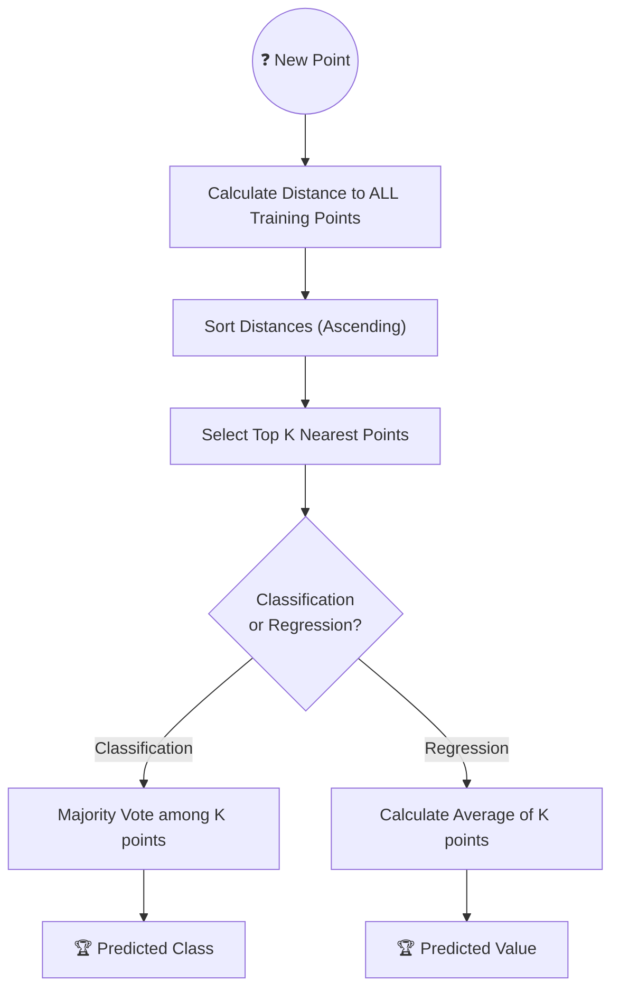

# 📍 K-Nearest Neighbors (KNN)

> **Prerequisites:** Basic Geometry, Distance Metrics
>
> **Difficulty:** ⭐☆☆☆☆
>
> **Estimated Reading Time:** 15 minutes

---

## 📋 Table of Contents
1. [What Problem Does This Solve?](#1-what-problem-does-this-solve)
2. [Intuition](#2-intuition)
3. [Mathematics](#3-mathematics)
4. [Visual Explanation](#4-visual-explanation)
5. [Algorithm Workflow](#5-algorithm-workflow)
6. [From Scratch Implementation](#6-from-scratch-implementation)
7. [NumPy Implementation](#7-numpy-implementation)
8. [Scikit-Learn Implementation](#8-scikit-learn-implementation)
9. [Hyperparameter Deep Dive](#9-hyperparameter-deep-dive)
10. [Visualization Lab](#10-visualization-lab)
11. [Failure Cases](#11-failure-cases)
12. [Industry Applications](#12-industry-applications)

14. [Exercises](#14-exercises)


---

# 1. What Problem Does This Solve?

### 🟢 Beginner
If you want to know how much a 3-bedroom house in a specific neighborhood will sell for, what do you do? You look at the prices of the 3 or 4 houses physically closest to it that recently sold, and you average their prices. That is exactly what K-Nearest Neighbors does. It predicts the future by finding the most similar examples from the past.

### 🟡 Intermediate
KNN is a non-parametric, instance-based learning algorithm used for both Classification and Regression. "Non-parametric" means it makes zero underlying assumptions about the distribution of the data (unlike Linear Regression, which assumes a straight line). "Instance-based" means it doesn't actually "learn" a model equation during training; it simply memorizes the entire dataset and performs calculations at prediction time.

### 🔴 Advanced
KNN is highly prone to the **Curse of Dimensionality**. Because it relies on calculating distance (like Euclidean distance) between points, as the number of features (dimensions) grows beyond 10 or 20, the mathematical distance between *all* points converges to be roughly the same. In high dimensions, the concept of "nearest" breaks down completely, making KNN useless without aggressive PCA or feature selection.

---

# 2. Intuition

Imagine you are dropped into a foreign city and want to know what political party controls the neighborhood you are standing in. You look around and ask the 5 people physically closest to you. 
- If 4 are Democrats and 1 is Republican, you predict the neighborhood is Democrat. 
- You just ran KNN Classification with $K=5$.

Now imagine you want to know the average rent in the neighborhood. You ask those same 5 people what their rent is, and you take the mathematical average of their answers. 
- You just ran KNN Regression with $K=5$.

The algorithm is based purely on the principle that similar data points exist in close proximity to each other.

---

# 3. Mathematics

### Distance Metrics
To find the "nearest" neighbors, we must define what distance means.

1. **Euclidean Distance (L2 Norm)**
The standard "straight line" distance between two points $p$ and $q$ in $n$-dimensional space.
$$ d(p, q) = \sqrt{\sum_{i=1}^n (q_i - p_i)^2} $$

2. **Manhattan Distance (L1 Norm)**
The distance traveling along axes at right angles (like a taxi driving down city blocks). Highly robust to outliers.
$$ d(p, q) = \sum_{i=1}^n |q_i - p_i| $$

3. **Minkowski Distance**
The generalized form. When $p=1$, it is Manhattan. When $p=2$, it is Euclidean.
$$ d(x, y) = \left( \sum_{i=1}^n |x_i - y_i|^p \right)^{1/p} $$

---

# 4. Visual Explanation



---

# 5. Algorithm Workflow

1. **Store Data**: Literally just save the $X$ and $y$ arrays. There is no actual "training" phase.
2. **Predict**: For a new input vector $x$:
   - Calculate the distance between $x$ and every single row in $X_{train}$.
   - Sort the distances in ascending order.
   - Select the $K$ points with the smallest distances.
   - **Classification**: Return the mode (most common class) among the $K$ labels.
   - **Regression**: Return the mean of the $K$ labels.

---

# 6. From Scratch Implementation

```python
import math
from collections import Counter

class KNNScratch:
    def __init__(self, k=3):
        self.k = k
        self.X_train = []
        self.y_train = []
        
    def fit(self, X, y):
        # "Training" is just memorization
        self.X_train = X
        self.y_train = y
        
    def _euclidean_distance(self, p1, p2):
        return math.sqrt(sum((p1[i] - p2[i])**2 for i in range(len(p1))))
        
    def _predict_one(self, x):
        distances = []
        for i in range(len(self.X_train)):
            dist = self._euclidean_distance(x, self.X_train[i])
            distances.append((dist, self.y_train[i]))
            
        # Sort by distance and pick top K
        distances.sort(key=lambda item: item[0])
        k_nearest_labels = [label for _, label in distances[:self.k]]
        
        # Majority vote
        return Counter(k_nearest_labels).most_common(1)[0][0]
        
    def predict(self, X):
        return [self._predict_one(x) for x in X]
```

---

# 7. NumPy Implementation

*Using NumPy broadcasting to calculate distances across the whole matrix at once.*

```python
import numpy as np
from collections import Counter

class KNNVectorized:
    def __init__(self, k=3):
        self.k = k
        
    def fit(self, X, y):
        self.X_train = np.array(X)
        self.y_train = np.array(y)
        
    def predict(self, X):
        X = np.array(X)
        predictions = []
        for x in X:
            # Broadcasting subtraction and distance calc
            distances = np.linalg.norm(self.X_train - x, axis=1)
            
            # np.argsort returns the INDICES that would sort the array
            nearest_indices = np.argsort(distances)[:self.k]
            nearest_labels = self.y_train[nearest_indices]
            
            most_common = Counter(nearest_labels).most_common(1)[0][0]
            predictions.append(most_common)
        return np.array(predictions)
```

---

# 8. Scikit-Learn Implementation

```python
from sklearn.neighbors import KNeighborsClassifier
from sklearn.model_selection import train_test_split
from sklearn.preprocessing import StandardScaler
from sklearn.metrics import accuracy_score
import numpy as np

# 1. Prepare Data
X = np.array([[1, 2], [1.5, 1.8], [5, 8], [8, 8], [1, 0.6], [9, 11]])
y = np.array([0, 0, 1, 1, 0, 1]) # 0=Close to origin, 1=Far from origin

# 2. FEATURE SCALING IS MANDATORY FOR KNN!
scaler = StandardScaler()
X_scaled = scaler.fit_transform(X)

# 3. Train
knn = KNeighborsClassifier(n_neighbors=3, metric='euclidean')
knn.fit(X_scaled, y)

# 4. Predict
new_point = scaler.transform([[2, 2]])
pred = knn.predict(new_point)
print(f"Predicted Class: {pred[0]}")
```

---

# 9. Hyperparameter Deep Dive

- **`n_neighbors` ($K$)**: The number of neighbors to vote.
  - *Too small (e.g., $K=1$)*: Captures massive noise. Extreme overfitting (High Variance).
  - *Too large (e.g., $K=100$)*: Smooths over everything. Extreme underfitting (High Bias). It will just predict the majority class of the entire dataset.
  - *Tip*: Always choose an odd number for binary classification to prevent voting ties.
- **`metric`**: The distance formula. 
  - `'euclidean'` (default): Good for continuous features.
  - `'manhattan'`: Better if you have many outliers or sparse data.
- **`weights`**: 
  - `'uniform'`: All $K$ neighbors get 1 equal vote.
  - `'distance'`: Closer neighbors get stronger votes. Crucial if data is imbalanced.

---

# 10. Visualization Lab

*Visualizing how different values of K create completely different decision boundaries.*

```python
import numpy as np
import matplotlib.pyplot as plt
from sklearn.neighbors import KNeighborsClassifier
from sklearn.datasets import make_moons
from mlxtend.plotting import plot_decision_regions

X, y = make_moons(n_samples=200, noise=0.3, random_state=42)

fig, axes = plt.subplots(1, 3, figsize=(15, 4))
k_values = [1, 15, 100]

for i, k in enumerate(k_values):
    knn = KNeighborsClassifier(n_neighbors=k)
    knn.fit(X, y)
    
    plot_decision_regions(X, y, clf=knn, ax=axes[i])
    axes[i].set_title(f"KNN Boundary (K={k})")

plt.tight_layout()
plt.show()
```

---

# 11. Failure Cases

### Unscaled Data
Because KNN relies entirely on geometric distance, features with larger scales will dominate. If Feature A is "Age" (0-100) and Feature B is "Salary" (0-150,000), the distance calculation will effectively ignore Age completely. 
*Fix: ALWAYS use `StandardScaler` or `MinMaxScaler` before using KNN.*

### Large Datasets
Prediction time is $O(N \times D)$. If you have 1 million rows, predicting a *single* new row requires calculating 1 million distance equations. This makes KNN completely unscalable for production APIs unless approximated (using KD-Trees or Ball-Trees).

### High Dimensionality
In spaces with hundreds of dimensions, the distance between any two points converges. A neighbor that is mathematically "close" in 500 dimensions might not be conceptually similar at all.

---

# 12. Industry Applications

- **Recommender Systems**: Identifying users who gave similar ratings to movies and recommending what those neighbors liked (User-Based Collaborative Filtering).
- **Imputation**: Filling in missing data points in a dataset by finding the nearest neighbors and averaging their values (`KNNImputer`).

---

# 14. Exercises

### Easy
Create a `StandardScaler` and apply it to a dataset of Height (cm) and Weight (kg). Compare a KNN model trained on the unscaled data vs the scaled data.

### Medium
Use `GridSearchCV` to find the optimal $K$ value for the breast cancer dataset, searching `range(1, 31, 2)`.

### Hard
Implement the `'distance'` weight functionality in the from-scratch implementation. Instead of simple majority voting, weight each neighbor's vote by $1 / d$, where $d$ is their distance to the test point.

---

[← Logistic Regression](04-Logistic-Regression.md) | [Back to Index](../README.md) | [Next: Decision Trees →](06-Decision-Trees.md)
