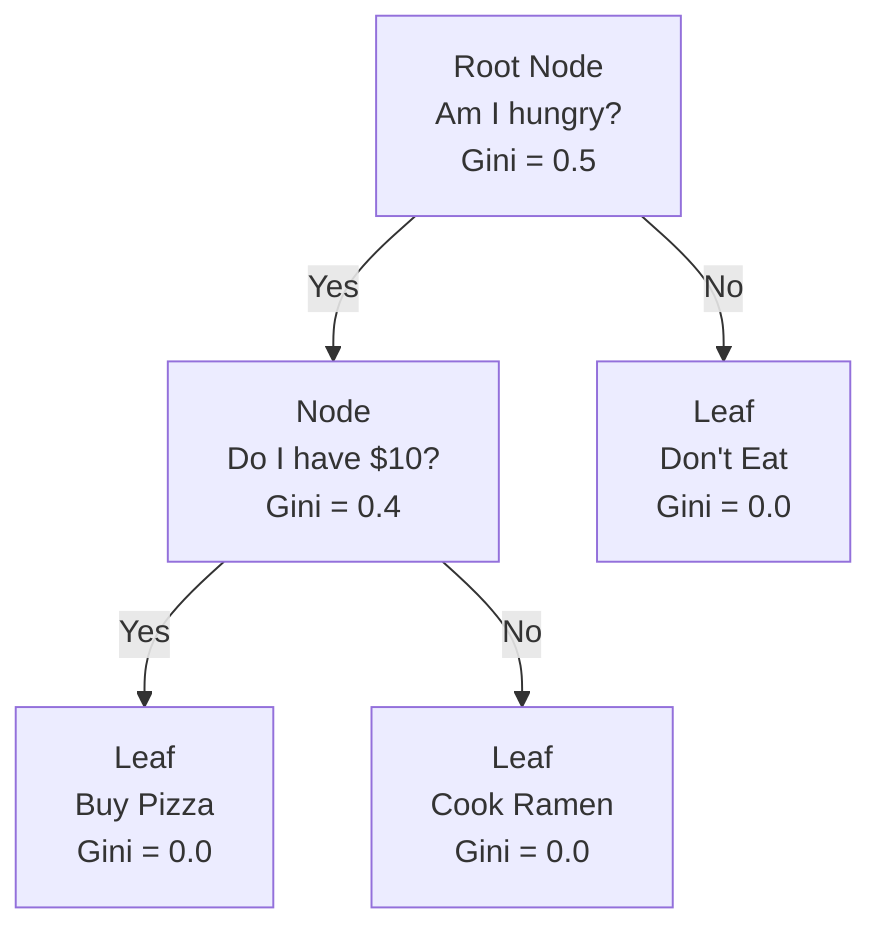

# 🌳 Decision Trees

> **Prerequisites:** Basic Probability
>
> **Difficulty:** ⭐⭐☆☆☆
>
> **Estimated Reading Time:** 25 minutes

---

## 📋 Table of Contents
1. [What Problem Does This Solve?](#1-what-problem-does-this-solve)
2. [Intuition](#2-intuition)
3. [Mathematics](#3-mathematics)
4. [Visual Explanation](#4-visual-explanation)
5. [Algorithm Workflow](#5-algorithm-workflow)
6. [From Scratch Implementation](#6-from-scratch-implementation)
7. [NumPy Implementation](#7-numpy-implementation)
8. [Scikit-Learn Implementation](#8-scikit-learn-implementation)
9. [Hyperparameter Deep Dive](#9-hyperparameter-deep-dive)
10. [Visualization Lab](#10-visualization-lab)
11. [Failure Cases](#11-failure-cases)
12. [Industry Applications](#12-industry-applications)

14. [Exercises](#14-exercises)


---

# 1. What Problem Does This Solve?

### 🟢 Beginner
You are trying to decide if you should play tennis today. You look outside. Is it raining? If yes, you stay inside. If no, is it too windy? If yes, you stay inside. If no, you play! 
A Decision Tree is an algorithm that writes these exact "If/Then" flowcharts automatically by looking at historical data, allowing you to classify new data without writing any manual rules.

### 🟡 Intermediate
Linear models (like Logistic Regression) fail completely when data cannot be separated by a single straight line. Decision Trees are non-linear models that recursively partition the feature space into geometric rectangles. This allows them to perfectly model highly complex, disjointed, and non-linear boundaries.

### 🔴 Advanced
Decision Trees are high-variance, low-bias algorithms. By themselves, they are extremely prone to memorizing the training data (overfitting). However, they serve as the foundational building block (the weak learners) for the most powerful tabular algorithms in existence: Random Forests and Gradient Boosted Trees.

---

# 2. Intuition

Imagine you have a messy room full of Red and Blue balls. You want to sort them into two perfectly pure piles. 
You can only ask Yes/No questions. 

First, you ask: *"Is the ball heavy?"* 
This splits the room into two smaller piles. The "Heavy" pile is mostly Red, and the "Light" pile is mostly Blue. Good, but not perfect.
Then, you look at the "Heavy" pile and ask: *"Is the ball smooth?"* 
This splits the Heavy pile again, resulting in a pile of balls that are *exclusively* Red. 

The algorithm continuously asks the single mathematically best question at every step to purify the piles as quickly as possible.

---

# 3. Mathematics

To know which "question" is the best to ask, the algorithm must quantify "messiness" (impurity).

### 3.1 Gini Impurity (CART Algorithm)
Gini measures how often a randomly chosen element would be incorrectly labeled if it was randomly labeled according to the distribution of labels in the node.
$$ \text{Gini} = 1 - \sum_{i=1}^C (p_i)^2 $$
Where $p_i$ is the probability of an item belonging to class $i$.
- **0.0**: Perfectly pure (all elements are one class).
- **0.5**: Maximum impurity (perfect 50/50 split in binary classification).

### 3.2 Entropy (ID3 / C4.5 Algorithms)
Borrowed from Information Theory, Entropy measures the amount of disorder or uncertainty.
$$ \text{Entropy} = - \sum_{i=1}^C p_i \log_2(p_i) $$

### 3.3 Information Gain
To evaluate a split, we calculate the impurity of the parent node, and subtract the weighted average impurity of the two child nodes. The split that provides the highest "Gain" in purity is chosen.
$$ \text{Gain} = \text{Impurity(Parent)} - \left( \frac{N_{left}}{N_{total}} \text{Impurity(Left)} + \frac{N_{right}}{N_{total}} \text{Impurity(Right)} \right) $$

---

# 4. Visual Explanation



---

# 5. Algorithm Workflow

1. Start with the entire dataset at the Root Node.
2. For every single feature, and for every single value in that feature, calculate what the Information Gain would be if you split the data there.
3. Choose the feature and value that yields the **highest Information Gain**.
4. Split the data into two child nodes.
5. Recursively repeat steps 2-4 on the child nodes.
6. Stop when a node is 100% pure, or a stopping criterion is met (like `max_depth`).

---

# 6. From Scratch Implementation

```python
import numpy as np
from collections import Counter

class SimpleDecisionTree:
    def __init__(self, max_depth=5):
        self.max_depth = max_depth
        self.tree = None
        
    def _gini(self, y):
        counts = np.bincount(y)
        probs = counts / len(y)
        return 1 - np.sum(probs ** 2)
        
    def _best_split(self, X, y):
        best_gain, best_feat, best_thresh = -1, None, None
        parent_gini = self._gini(y)
        
        for feat in range(X.shape[1]):
            thresholds = np.unique(X[:, feat])
            for thresh in thresholds:
                left = y[X[:, feat] <= thresh]
                right = y[X[:, feat] > thresh]
                
                if len(left) == 0 or len(right) == 0:
                    continue
                    
                # Weighted Gini of children
                child_gini = (len(left)/len(y))*self._gini(left) + (len(right)/len(y))*self._gini(right)
                gain = parent_gini - child_gini
                
                if gain > best_gain:
                    best_gain, best_feat, best_thresh = gain, feat, thresh
                    
        return best_feat, best_thresh
        
    def fit(self, X, y, depth=0):
        # Stopping criteria
        if depth == self.max_depth or len(np.unique(y)) == 1:
            return Counter(y).most_common(1)[0][0]
            
        feat, thresh = self._best_split(X, y)
        if feat is None:
            return Counter(y).most_common(1)[0][0]
            
        # Recursive building
        left_mask = X[:, feat] <= thresh
        return {
            'feature': feat,
            'threshold': thresh,
            'left': self.fit(X[left_mask], y[left_mask], depth+1),
            'right': self.fit(X[~left_mask], y[~left_mask], depth+1)
        }
```

---

# 7. NumPy Implementation

*(See section 6 for the NumPy vectorization of the node splits).*

---

# 8. Scikit-Learn Implementation

```python
from sklearn.tree import DecisionTreeClassifier, plot_tree
from sklearn.model_selection import train_test_split
from sklearn.metrics import accuracy_score
from sklearn.datasets import load_iris
import matplotlib.pyplot as plt

# 1. Load Data
data = load_iris()
X_train, X_test, y_train, y_test = train_test_split(data.data, data.target, random_state=42)

# 2. Train Model
# We set max_depth to prevent extreme overfitting
dt = DecisionTreeClassifier(max_depth=3, criterion='gini', random_state=42)
dt.fit(X_train, y_train)

# 3. Predict & Evaluate
preds = dt.predict(X_test)
print(f"Accuracy: {accuracy_score(y_test, preds):.4f}")

# 4. Plot the Tree!
plt.figure(figsize=(12, 8))
plot_tree(dt, feature_names=data.feature_names, class_names=data.target_names, filled=True)
plt.show()
```

---

# 9. Hyperparameter Deep Dive

A Decision Tree left to its own devices will grow until every leaf is 100% pure, resulting in a tree with millions of nodes that perfectly memorizes the training data (Massive Overfitting). We must prune it:

- **`max_depth`**: The maximum number of levels. Setting this to 3-5 is the best defense against overfitting.
- **`min_samples_split`**: The minimum number of samples required to allow a node to split. If set to 10, a node with 9 samples will become a leaf, even if it's impure.
- **`min_samples_leaf`**: The minimum number of samples a leaf must have. Prevents the tree from creating leaves with exactly 1 outlier data point in them.
- **`criterion`**: `gini` or `entropy`. In practice, they perform almost identically, but `gini` is slightly faster to compute because it avoids logarithms.

---

# 10. Visualization Lab

*Visualizing the non-linear, rectangular decision boundaries.*

```python
import numpy as np
import matplotlib.pyplot as plt
from sklearn.tree import DecisionTreeClassifier
from sklearn.datasets import make_moons
from mlxtend.plotting import plot_decision_regions

X, y = make_moons(n_samples=200, noise=0.2, random_state=42)

# Unrestricted Tree (Overfit)
dt_unrestricted = DecisionTreeClassifier(random_state=42).fit(X, y)

# Pruned Tree (Good Fit)
dt_pruned = DecisionTreeClassifier(max_depth=3, random_state=42).fit(X, y)

fig, ax = plt.subplots(1, 2, figsize=(12, 5))

plot_decision_regions(X, y, clf=dt_unrestricted, ax=ax[0])
ax[0].set_title("Unrestricted (Massive Overfitting)")

plot_decision_regions(X, y, clf=dt_pruned, ax=ax[1])
ax[1].set_title("max_depth=3 (Smooth Boundary)")

plt.tight_layout()
plt.show()
```

---

# 11. Failure Cases

### Extrapolation
If you train a Decision Tree on people aged 10 to 50, and then ask it to predict something for an 80-year-old, it will just follow the rule "Is Age > 50? Yes -> Go to Leaf X". It cannot extrapolate trends linearly. It just outputs the constant value of the final leaf.

### Orthogonal Boundaries
Decision Trees can only split data with vertical or horizontal lines (orthogonal to the axes). If the true decision boundary is a perfect 45-degree diagonal line, the tree will be forced to build a massive, jagged, stair-step pattern to approximate it.

---

# 12. Industry Applications

- **Medicine**: A highly pruned, shallow decision tree is completely interpretable. A doctor can look at a 3-deep tree and legally justify why a patient was denied coverage based on exact threshold values.
- **Credit Approval**: Heavily regulated industries require "White Box" models where the logic can be printed on paper and audited.

---

# 14. Exercises

### Easy
Run the Scikit-Learn code block above. Look at the plotted tree and manually trace the logic for a flower with `petal length = 2.0` and `petal width = 0.5`.

### Medium
Plot the feature importances (`dt.feature_importances_`). How does the tree mathematically calculate which feature was most important? (Hint: It relates to Information Gain).

### Hard
Decision trees are inherently unstable. Write a script that trains a tree, calculates accuracy, then changes a *single* random data point's label, and retrains. Observe how drastically the tree structure and accuracy change from a tiny perturbation.

---

[← K-Nearest Neighbors (KNN)](05-KNN.md) | [Back to Index](../README.md) | [Next: Support Vector Machines (SVM) →](07-SVM.md)
