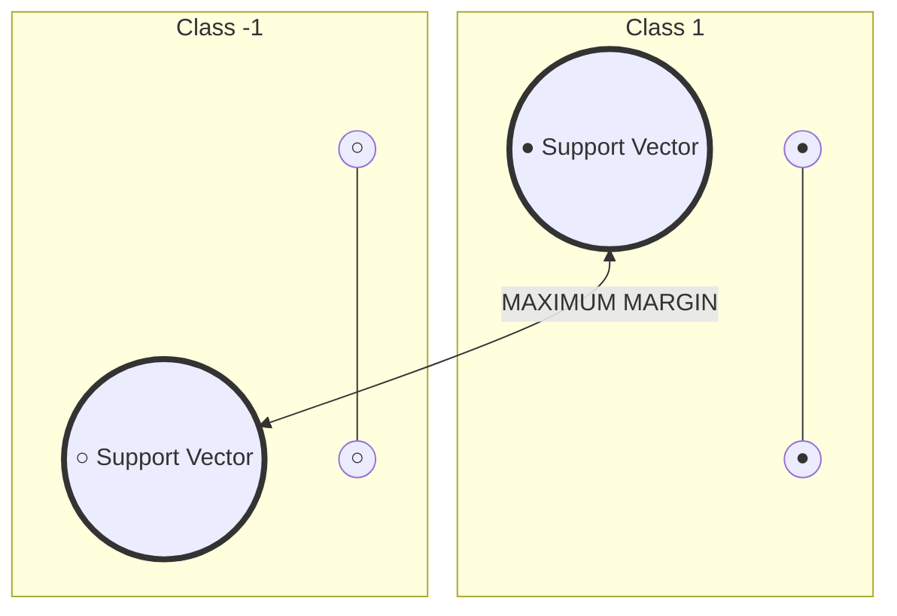

# ⚔️ Support Vector Machines (SVM)

> **Prerequisites**: Linear Algebra, Calculus | **Difficulty**: ⭐⭐⭐☆☆ Intermediate

---

## 📋 Table of Contents
1. [Intuition — Maximum Margin](#1-intuition--maximum-margin)
2. [Hard Margin SVM — The Math](#2-hard-margin-svm--the-math)
3. [Soft Margin SVM](#3-soft-margin-svm)
4. [The Kernel Trick](#4-the-kernel-trick)
5. [Popular Kernels](#5-popular-kernels)
6. [SVM for Regression (SVR)](#6-svm-for-regression-svr)
7. [Implementation from Scratch](#7-implementation-from-scratch)
8. [scikit-learn Implementation](#8-scikit-learn-implementation)
9. [Practical Guide](#9-practical-guide)
10. [Project Ideas & What's Next](#10-project-ideas--whats-next)

---

## 1. Intuition — Maximum Margin

> **🧠 ELI5 Analogy:** Imagine you are trying to build a straight multi-lane highway to separate two different towns (Class +1 and Class -1). You want the highway to be as wide as possible to prevent accidents. 
> - The **Margin** is the total width of the highway.
> - The **Hyperplane** is the exact center painted line dividing the road.
> - The **Support Vectors** are the specific houses sitting *exactly* on the edge of the road. If you move a house far away from the road, the highway doesn't change. But if you move a house closer, you have to shrink the entire highway!

SVM finds the **hyperplane** that separates classes with the **maximum margin** (distance between the hyperplane and the nearest data points).



**Key insight**: Only the **support vectors** (points closest to the boundary) determine the decision boundary. All other points are irrelevant!

---

## 2. Hard Margin SVM — The Math

**Hyperplane**: $\mathbf{w}^T\mathbf{x} + b = 0$

**Decision rule**: $y = \text{sign}(\mathbf{w}^T\mathbf{x} + b)$

**Margin** = $\frac{2}{\|\mathbf{w}\|}$

**Optimization problem**:

$$\min_{\mathbf{w}, b} \frac{1}{2}\|\mathbf{w}\|^2$$

$$\text{subject to: } y_i(\mathbf{w}^T\mathbf{x}_i + b) \geq 1, \quad \forall i$$

This is a **quadratic programming** problem — convex, with a unique global minimum.

### Lagrangian Dual Formulation

Introducing Lagrange multipliers $\alpha_i \geq 0$:

$$L = \frac{1}{2}\|\mathbf{w}\|^2 - \sum_{i=1}^{n} \alpha_i [y_i(\mathbf{w}^T\mathbf{x}_i + b) - 1]$$

Taking derivatives and substituting, we get the **dual problem**:

$$\max_\alpha \sum_{i=1}^{n}\alpha_i - \frac{1}{2}\sum_{i,j}\alpha_i \alpha_j y_i y_j \mathbf{x}_i^T\mathbf{x}_j$$

$$\text{subject to: } \alpha_i \geq 0, \quad \sum_{i=1}^{n}\alpha_i y_i = 0$$

**Key result**: The solution only depends on dot products $\mathbf{x}_i^T\mathbf{x}_j$ → this enables the kernel trick!

---

## 3. Soft Margin SVM

Real data is rarely linearly separable. Soft margin allows **some misclassifications**:

$$\min_{\mathbf{w}, b, \xi} \frac{1}{2}\|\mathbf{w}\|^2 + C\sum_{i=1}^{n}\xi_i$$

$$\text{subject to: } y_i(\mathbf{w}^T\mathbf{x}_i + b) \geq 1 - \xi_i, \quad \xi_i \geq 0$$

- $\xi_i$ = **slack variable** (how much misclassification is allowed for point $i$)
- $C$ = **regularization parameter** (tradeoff between margin size and violations)
  - Large $C$ → narrow margin, fewer violations (risk of overfitting)
  - Small $C$ → wide margin, more violations (risk of underfitting)

```python
import numpy as np
import matplotlib.pyplot as plt
from sklearn.svm import SVC
from sklearn.datasets import make_classification

X, y = make_classification(n_samples=100, n_features=2, n_redundant=0,
                           n_clusters_per_class=1, random_state=42)
y = 2 * y - 1  # Convert to {-1, +1}

fig, axes = plt.subplots(1, 3, figsize=(18, 5))
C_values = [0.01, 1, 100]

for ax, C in zip(axes, C_values):
    model = SVC(kernel='linear', C=C)
    model.fit(X, y)
    
    # Plot decision boundary
    x_min, x_max = X[:, 0].min()-1, X[:, 0].max()+1
    y_min, y_max = X[:, 1].min()-1, X[:, 1].max()+1
    xx, yy = np.meshgrid(np.linspace(x_min, x_max, 200), np.linspace(y_min, y_max, 200))
    Z = model.decision_function(np.c_[xx.ravel(), yy.ravel()]).reshape(xx.shape)
    
    ax.contourf(xx, yy, Z, levels=50, cmap='RdBu', alpha=0.3)
    ax.contour(xx, yy, Z, levels=[-1, 0, 1], colors=['red', 'black', 'blue'], 
               linestyles=['--', '-', '--'], linewidths=[1, 2, 1])
    ax.scatter(X[y==-1, 0], X[y==-1, 1], c='red', edgecolor='black', s=30)
    ax.scatter(X[y==1, 0], X[y==1, 1], c='blue', edgecolor='black', s=30)
    
    # Highlight support vectors
    sv = model.support_vectors_
    ax.scatter(sv[:, 0], sv[:, 1], s=100, facecolors='none', edgecolors='green', linewidths=2)
    ax.set_title(f'C = {C} ({len(sv)} SVs)', fontsize=13, fontweight='bold')

plt.suptitle('Soft Margin SVM — Effect of C', fontsize=16, fontweight='bold')
plt.tight_layout()
plt.savefig('svm_c_values.png', dpi=150)
plt.show()
```

---

## 4. The Kernel Trick

> **🧠 ELI5 Analogy:** Imagine a piece of paper lying flat on a table with red and blue dots mixed in a circle so that no single straight line can separate them. Now, imagine you throw the piece of paper up into the air (adding a 3rd dimension: height), and while it's floating, you slide a flat sheet of cardboard straight through the air, perfectly separating the red dots (higher) from the blue dots (lower). When the paper lands back on the table, that flat cut looks like a complex, curvy circle! 
> The **Kernel Trick** is the mathematical shortcut that allows us to calculate how to slice the points in the air, *without ever having to do the expensive math of actually throwing them up!*

For non-linearly separable data, we **map data to a higher-dimensional space** where it becomes linearly separable.

$$\phi: \mathbb{R}^d \rightarrow \mathbb{R}^D \quad (D \gg d)$$

**The trick**: We never actually compute $\phi(\mathbf{x})$! We use a **kernel function** that computes the dot product in the higher-dimensional space directly:

$$K(\mathbf{x}_i, \mathbf{x}_j) = \phi(\mathbf{x}_i)^T \phi(\mathbf{x}_j)$$

This is computationally efficient because we avoid the expensive transformation.

```python
import numpy as np
import matplotlib.pyplot as plt
from sklearn.svm import SVC
from sklearn.datasets import make_circles

# Non-linearly separable data
X, y = make_circles(n_samples=200, noise=0.1, factor=0.3, random_state=42)

fig, axes = plt.subplots(1, 3, figsize=(18, 5))
kernels = ['linear', 'poly', 'rbf']

for ax, kernel in zip(axes, kernels):
    model = SVC(kernel=kernel, C=1, gamma='auto', degree=3)
    model.fit(X, y)
    
    xx, yy = np.meshgrid(np.linspace(-1.5, 1.5, 200), np.linspace(-1.5, 1.5, 200))
    Z = model.predict(np.c_[xx.ravel(), yy.ravel()]).reshape(xx.shape)
    
    ax.contourf(xx, yy, Z, cmap='RdBu', alpha=0.3)
    ax.scatter(X[y==0, 0], X[y==0, 1], c='red', edgecolor='black', s=30)
    ax.scatter(X[y==1, 0], X[y==1, 1], c='blue', edgecolor='black', s=30)
    ax.set_title(f'{kernel} kernel (acc={model.score(X,y):.0%})', fontsize=13, fontweight='bold')

plt.suptitle('SVM Kernels on Non-Linear Data', fontsize=16, fontweight='bold')
plt.tight_layout()
plt.savefig('svm_kernels.png', dpi=150)
plt.show()
```

---

## 5. Popular Kernels

| Kernel | Formula | Use Case |
|--------|---------|----------|
| **Linear** | $K(\mathbf{x}, \mathbf{y}) = \mathbf{x}^T\mathbf{y}$ | Linearly separable, high-dimensional data |
| **Polynomial** | $K(\mathbf{x}, \mathbf{y}) = (\gamma \mathbf{x}^T\mathbf{y} + r)^d$ | Moderate non-linearity |
| **RBF (Gaussian)** | $K(\mathbf{x}, \mathbf{y}) = \exp(-\gamma \|\mathbf{x}-\mathbf{y}\|^2)$ | Most common, works well generally |
| **Sigmoid** | $K(\mathbf{x}, \mathbf{y}) = \tanh(\gamma \mathbf{x}^T\mathbf{y} + r)$ | Neural network-like |

**RBF kernel** maps data to **infinite-dimensional space** and is the most popular choice.

The $\gamma$ parameter controls the "reach" of each training example:
- Large $\gamma$: Each point only affects nearby points → complex boundary (risk of overfitting)
- Small $\gamma$: Points affect far-away points → smooth boundary (risk of underfitting)

---

## 6. SVM for Regression (SVR)

Instead of finding a margin that separates classes, SVR fits a tube of width $\epsilon$ around the data:

$$\min \frac{1}{2}\|\mathbf{w}\|^2 \quad \text{s.t.} \quad |y_i - (\mathbf{w}^T\mathbf{x}_i + b)| \leq \epsilon + \xi_i$$

```python
from sklearn.svm import SVR
import numpy as np
import matplotlib.pyplot as plt

np.random.seed(42)
X = np.sort(np.random.uniform(0, 5, 100)).reshape(-1, 1)
y = np.sin(X.ravel()) + np.random.randn(100) * 0.2

X_plot = np.linspace(0, 5, 200).reshape(-1, 1)

fig, axes = plt.subplots(1, 3, figsize=(18, 5))
kernels = ['linear', 'poly', 'rbf']

for ax, kernel in zip(axes, kernels):
    model = SVR(kernel=kernel, C=100, epsilon=0.1)
    model.fit(X, y)
    y_pred = model.predict(X_plot)
    
    ax.scatter(X, y, alpha=0.4, s=20, color='#36A2EB')
    ax.plot(X_plot, y_pred, 'r-', linewidth=2, label=f'SVR ({kernel})')
    ax.plot(X_plot, np.sin(X_plot.ravel()), 'g--', alpha=0.5, label='True')
    ax.set_title(f'SVR — {kernel} kernel', fontsize=13, fontweight='bold')
    ax.legend()
    ax.grid(True, alpha=0.3)

plt.suptitle('Support Vector Regression', fontsize=16, fontweight='bold')
plt.tight_layout()
plt.savefig('svr.png', dpi=150)
plt.show()
```

---

## 7. Implementation from Scratch

```python
import numpy as np

class LinearSVMFromScratch:
    """Simple linear SVM using gradient descent on hinge loss."""
    
    def __init__(self, learning_rate=0.001, lambda_param=0.01, n_iterations=1000):
        self.lr = learning_rate
        self.lambda_param = lambda_param
        self.n_iterations = n_iterations
    
    def fit(self, X, y):
        n_samples, n_features = X.shape
        # Convert labels to {-1, +1}
        y_ = np.where(y <= 0, -1, 1)
        
        self.w = np.zeros(n_features)
        self.b = 0
        
        for _ in range(self.n_iterations):
            for idx, x_i in enumerate(X):
                condition = y_[idx] * (np.dot(x_i, self.w) + self.b) >= 1
                if condition:
                    # Correctly classified, just regularize
                    self.w -= self.lr * (2 * self.lambda_param * self.w)
                else:
                    # Misclassified, update with hinge loss gradient
                    self.w -= self.lr * (2 * self.lambda_param * self.w - np.dot(x_i, y_[idx]))
                    self.b -= self.lr * (-y_[idx])
        return self
    
    def predict(self, X):
        output = np.dot(X, self.w) + self.b
        return np.sign(output).astype(int)
    
    def score(self, X, y):
        y_ = np.where(y <= 0, -1, 1)
        return np.mean(self.predict(X) == y_)

# Test
from sklearn.datasets import make_classification
from sklearn.model_selection import train_test_split
from sklearn.preprocessing import StandardScaler

X, y = make_classification(n_samples=200, n_features=2, n_redundant=0, random_state=42)
X_train, X_test, y_train, y_test = train_test_split(X, y, test_size=0.2, random_state=42)

scaler = StandardScaler()
X_train_s = scaler.fit_transform(X_train)
X_test_s = scaler.transform(X_test)

svm = LinearSVMFromScratch(learning_rate=0.001, lambda_param=0.01, n_iterations=1000)
svm.fit(X_train_s, y_train)
print(f"From-scratch accuracy: {svm.score(X_test_s, y_test):.2%}")
```

---

## 8. scikit-learn Implementation

```python
from sklearn.svm import SVC
from sklearn.model_selection import train_test_split, GridSearchCV
from sklearn.preprocessing import StandardScaler
from sklearn.datasets import load_breast_cancer
from sklearn.metrics import classification_report

data = load_breast_cancer()
X_train, X_test, y_train, y_test = train_test_split(data.data, data.target, test_size=0.2, random_state=42)

scaler = StandardScaler()
X_train_s = scaler.fit_transform(X_train)
X_test_s = scaler.transform(X_test)

# Grid search for best parameters
param_grid = {
    'C': [0.1, 1, 10],
    'kernel': ['rbf', 'linear'],
    'gamma': ['scale', 'auto']
}
grid = GridSearchCV(SVC(), param_grid, cv=5, scoring='accuracy')
grid.fit(X_train_s, y_train)

print(f"Best params: {grid.best_params_}")
print(f"Best CV score: {grid.best_score_:.4f}")
print(f"Test score: {grid.score(X_test_s, y_test):.4f}")
```

---

## 9. Practical Guide

### When to Use SVM
- ✅ High-dimensional data (text classification, genomics)
- ✅ Clear margin of separation
- ✅ Small to medium datasets
- ✅ Need for kernel trick

### When NOT to Use
- ❌ Large datasets (>100K samples) — too slow
- ❌ Very noisy data with overlapping classes
- ❌ Need probability outputs (use `probability=True` but it's slower)
- ❌ Need interpretability

---

## 10. Project Ideas & What's Next

### Project Ideas

#### 🟢 Face Recognition (Beginner)
- **Dataset:** Labeled Faces in the Wild (LFW) dataset (available in sklearn).
- **Task:** Identify the person in a given image using an SVM.
- **Skills:** Dealing with image data, exploring the effectiveness of the RBF kernel vs. Linear kernel for high-dimensional visual data.
- **Output:** A classification report showing precision and recall per person, and an image grid showing correct and incorrect classifications.

#### 🟡 Text Classification & Sentiment Analysis (Intermediate)
- **Dataset:** IMDB movie reviews or Twitter sentiment dataset.
- **Task:** Classify text as positive or negative.
- **Skills:** Text vectorization using TF-IDF (Term Frequency-Inverse Document Frequency), pipelining TF-IDF with a Linear SVM.
- **Output:** A robust baseline NLP model. Linear SVMs are notoriously fast and accurate for sparse text data compared to other algorithms.

#### 🔴 Custom Kernel SVM (Advanced)
- **Dataset:** A heavily non-linear synthetic dataset (e.g., sklearn's `make_circles` or `make_moons`).
- **Task:** Use an SVM with a precomputed custom kernel matrix instead of the built-in linear/poly/rbf kernels.
- **Skills:** Understanding the mathematical properties of valid kernels (Mercer's theorem), matrix operations, manipulating Gram matrices.
- **Output:** A visualization of the decision boundary generated by your custom mathematical kernel proving it can separate complex data topologies.

### What's Next

| Next Topic | Why it's Important |
|------------|--------------------|
| [Naive Bayes](./07-Naive-Bayes.md) | Shift from geometric margins to pure probability. Learn how Bayes' Theorem applies to machine learning. |
| [Ensemble Methods](../03-Ensemble-Methods/01-Bagging-And-Random-Forest.md) | You've learned the core standalone algorithms. Now learn how to combine them into "super-models". |
| [Hyperparameter Tuning](../05-Model-Evaluation/03-Hyperparameter-Tuning.md) | SVM performance is highly dependent on `C` and `gamma`. Grid search is mandatory here. |

---

[← Decision Trees](./05-Decision-Trees.md) | [Back to Index](../README.md) | [Next: Naive Bayes →](./07-Naive-Bayes.md)
