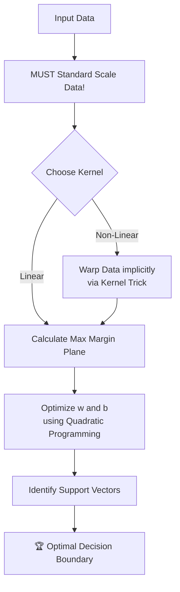

# 🛣️ Support Vector Machines (SVM)

> **Prerequisites:** Linear Algebra, Logistic Regression
>
> **Difficulty:** ⭐⭐⭐⭐☆
>
> **Estimated Reading Time:** 30 minutes

---

## 📋 Table of Contents
1. [What Problem Does This Solve?](#1-what-problem-does-this-solve)
2. [Intuition](#2-intuition)
3. [Mathematics](#3-mathematics)
4. [Visual Explanation](#4-visual-explanation)
5. [Algorithm Workflow](#5-algorithm-workflow)
6. [From Scratch Implementation](#6-from-scratch-implementation)
7. [NumPy Implementation](#7-numpy-implementation)
8. [Scikit-Learn Implementation](#8-scikit-learn-implementation)
9. [Hyperparameter Deep Dive](#9-hyperparameter-deep-dive)
10. [Visualization Lab](#10-visualization-lab)
11. [Failure Cases](#11-failure-cases)
12. [Industry Applications](#12-industry-applications)
13. [Interview Preparation](#13-interview-preparation)
14. [Exercises](#14-exercises)
15. [Further Reading](#15-further-reading)

---

# 1. What Problem Does This Solve?

### 🟢 Beginner
Imagine you have a table with red apples on the left and green apples on the right. You need to put a straight stick on the table to separate them. You could put the stick right next to the red apples, or right next to the green apples. Both technically separate them. But an SVM places the stick exactly in the middle, creating the widest possible "street" between the two groups. It solves the problem of finding the *safest* dividing line.

### 🟡 Intermediate
Logistic Regression finds *a* decision boundary. Support Vector Machines find the **Optimal Margin Classifier**. It guarantees that the decision boundary (hyperplane) it draws maximizes the geometric distance (margin) between the closest data points of both classes. This makes the model inherently highly robust to unseen data.

### 🔴 Advanced
SVMs solve two massive mathematical problems elegantly:
1. **The Maximum Margin Problem**: Solved via Quadratic Programming to guarantee a global minimum.
2. **The Non-Linear Dimensionality Problem**: Solved via the **Kernel Trick**, allowing the algorithm to draw infinitely complex boundaries by implicitly calculating dot products in infinite-dimensional space without the computational cost of actually transforming the data.

---

# 2. Intuition

### The Street Analogy
Think of the decision boundary as a multi-lane highway. The two classes are sitting on the sidewalks on opposite sides of the highway. 
The goal of the SVM is to make the highway as wide as mathematically possible without any data points stepping onto the asphalt. 

The points sitting exactly on the edge of the curb are called the **Support Vectors**. They are the only points that matter! If you delete all the other thousands of data points further back on the sidewalk, the highway wouldn't change at all. The Support Vectors "support" the entire margin.

### The Kernel Trick Intuition
Imagine red and blue dots mixed together on a flat piece of paper. You cannot draw a straight line to separate them. 
Now, imagine picking up the paper and wrapping it around a tennis ball. Suddenly, all the red dots are on the top of the ball, and all the blue dots are on the bottom. Now, you can take a flat sheet of metal (a plane) and slice the ball perfectly in half.
The Kernel Trick mathematically warps the 2D paper into 3D space so a flat cut can separate the classes.

---

# 3. Mathematics

### 3.1 The Hyperplane and Margin
The decision boundary is defined by weights $w$ and bias $b$:
$$ w^T x + b = 0 $$
The edges of the "highway" are $w^T x + b = 1$ and $w^T x + b = -1$.
The geometric width of the highway is precisely $\frac{2}{||w||}$.

### 3.2 The Optimization Objective (Hard Margin)
To make the highway as wide as possible, we must maximize $\frac{2}{||w||}$, which is mathematically equivalent to minimizing $\frac{1}{2}||w||^2$.
$$ \min_{w,b} \frac{1}{2} ||w||^2 $$
*Subject to the constraint:* $y^{(i)}(w^T x^{(i)} + b) \ge 1$ for all points.

### 3.3 Soft Margin (Handling Outliers)
If a single red point is sitting on the blue sidewalk, a Hard Margin SVM crashes (it's impossible to draw a straight street). We introduce a slack variable $\zeta$ to allow margin violations, controlled by hyperparameter $C$.
$$ \min_{w,b,\zeta} \frac{1}{2} ||w||^2 + C \sum_{i=1}^m \zeta^{(i)} $$

### 3.4 The RBF Kernel
The Radial Basis Function (RBF) measures similarity based on exponential distance, effectively projecting data into infinite dimensions:
$$ K(x, y) = e^{-\gamma ||x - y||^2} $$

---

# 4. Visual Explanation



---

# 5. Algorithm Workflow

1. **Scale Data**: Distance calculations will be destroyed by unscaled features.
2. **Choose Kernel**: Decide if you need a linear or non-linear boundary.
3. **Set Hyperparameters**: Choose $C$ (regularization) and $\gamma$ (for non-linear kernels).
4. **Optimization**: The solver finds the weights $w$ that maximize the margin while punishing violations by $C$.
5. **Prediction**: A new point $x$ is projected against the support vectors. If it falls on the positive side of the hyperplane, it's Class 1.

---

# 6. From Scratch Implementation

*Note: True SVMs use complex Quadratic Programming solvers (like SMO). This is a simplified Gradient Descent implementation for a Linear SVM using Hinge Loss.*

```python
import numpy as np

class LinearSVMScratch:
    def __init__(self, learning_rate=0.001, lambda_param=0.01, epochs=1000):
        self.lr = learning_rate
        self.lambda_param = lambda_param # Regularization strength (1/C)
        self.epochs = epochs
        self.w = None
        self.b = None
        
    def fit(self, X, y):
        # SVM requires labels to be -1 and 1
        y_ = np.where(y <= 0, -1, 1)
        
        n_samples, n_features = X.shape
        self.w = np.zeros(n_features)
        self.b = 0
        
        for _ in range(self.epochs):
            for idx, x_i in enumerate(X):
                # Check if point satisfies the margin constraint
                condition = y_[idx] * (np.dot(x_i, self.w) - self.b) >= 1
                
                if condition:
                    # Point is correct and outside margin -> Update only weights for regularization
                    self.w -= self.lr * (2 * self.lambda_param * self.w)
                else:
                    # Point violates margin -> Update weights and bias based on error
                    self.w -= self.lr * (2 * self.lambda_param * self.w - np.dot(x_i, y_[idx]))
                    self.b -= self.lr * y_[idx]
                    
    def predict(self, X):
        approx = np.dot(X, self.w) - self.b
        return np.sign(approx) # Returns -1 or 1
```

---

# 7. NumPy Implementation

*(See section 6. Production implementations of non-linear SVMs never use Gradient Descent; they use highly optimized C libraries like `LIBSVM` via Scikit-Learn).*

---

# 8. Scikit-Learn Implementation

```python
from sklearn.svm import SVC
from sklearn.model_selection import train_test_split
from sklearn.preprocessing import StandardScaler
from sklearn.metrics import accuracy_score
import numpy as np

# 1. Prepare Data
X = np.random.randn(200, 2)
y = np.where(X[:, 0] * X[:, 1] > 0, 1, 0) # XOR-like non-linear dataset

X_train, X_test, y_train, y_test = train_test_split(X, y, test_size=0.2)

# 2. MANDATORY SCALING
scaler = StandardScaler()
X_train_scaled = scaler.fit_transform(X_train)
X_test_scaled = scaler.transform(X_test)

# 3. Initialize & Train (Using non-linear RBF kernel)
model = SVC(kernel='rbf', C=1.0, gamma='scale')
model.fit(X_train_scaled, y_train)

# 4. Predict
preds = model.predict(X_test_scaled)
print(f"Accuracy: {accuracy_score(y_test, preds):.4f}")
print(f"Number of Support Vectors: {len(model.support_vectors_)}")
```

---

# 9. Hyperparameter Deep Dive

- **`kernel`**: `linear` (straight line), `poly` (polynomial curves), or `rbf` (complex blobs).
- **`C`**: The regularization parameter. It acts inversely.
  - *Small $C$ (e.g. 0.01)*: Soft margin. Very tolerant of violations. Creates a wide highway. (Underfitting / High Bias).
  - *Large $C$ (e.g. 100)*: Hard margin. Extremely strict. Will twist the boundary violently to classify one outlier correctly. (Overfitting / High Variance).
- **`gamma`**: Used only for `rbf`, `poly`, and `sigmoid`. Determines how far the influence of a single training example reaches.
  - *Small $\gamma$*: A single point influences a huge area. Smooth boundaries.
  - *Large $\gamma$*: A point only influences its immediate surroundings. Creates tight, jagged "islands" around individual points (Overfitting).

---

# 10. Visualization Lab

*Visualizing how $C$ and $\gamma$ affect the RBF decision boundary.*

```python
import matplotlib.pyplot as plt
from sklearn.svm import SVC
from sklearn.datasets import make_moons
from mlxtend.plotting import plot_decision_regions

X, y = make_moons(n_samples=100, noise=0.15, random_state=42)

# Model 1: Good generalizations
svm_good = SVC(kernel='rbf', C=1, gamma=1).fit(X, y)

# Model 2: Massive Overfitting
svm_overfit = SVC(kernel='rbf', C=1000, gamma=100).fit(X, y)

fig, ax = plt.subplots(1, 2, figsize=(12, 5))

plot_decision_regions(X, y, clf=svm_good, ax=ax[0])
ax[0].set_title("Good Fit (C=1, Gamma=1)")

plot_decision_regions(X, y, clf=svm_overfit, ax=ax[1])
ax[1].set_title("Overfit Islands (C=1000, Gamma=100)")

plt.tight_layout()
plt.show()
```

---

# 11. Failure Cases

### Large Datasets (> 100,000 rows)
The mathematical complexity of the SVM solver is roughly $O(N^2)$ to $O(N^3)$. If you feed an SVM 500,000 rows, it will literally freeze your computer and never finish training.
*Fix: For large datasets, you MUST use `LinearSVC` (which is highly optimized) or switch to a Random Forest/Gradient Boosting model.*

### Unscaled Data
Like KNN, SVM maximizes a geometric margin. If "Salary" is in the 100,000s and "Age" is 0-100, the SVM will entirely ignore Age.

### Noisy Overlapping Classes
If the data is a massive cloud of overlapping red and blue dots, the RBF kernel with a high $C$ will draw a million tiny circles, resulting in catastrophic overfitting.

---

# 12. Industry Applications

Before the Deep Learning era (pre-2012), SVMs were the state-of-the-art for almost everything.
- **Bioinformatics**: Protein classification and cancer detection. SVMs are incredibly powerful when you have more features than samples (e.g., 100 patients, but 10,000 gene expressions per patient).
- **Handwriting Recognition**: The original algorithms for reading postal zip codes.
- **Text Classification**: Document categorization using TF-IDF features.

---

# 13. Interview Preparation

### Beginner Questions
**Q: Do you need to scale data before using an SVM?**
> A: YES. It is absolutely mandatory because SVMs calculate geometric distance to define the margin.

### Intermediate Questions
**Q: Explain the Kernel Trick.**
> A: It allows the SVM to implicitly calculate the dot product of data points in a highly complex, higher-dimensional space without ever actually transforming the raw data into that space. This saves immense computational power while allowing for non-linear boundaries.

### Advanced Questions
**Q: Why are SVMs so effective on high-dimensional data (where $P > N$)?**
> A: Because the decision boundary is determined strictly by the Support Vectors. Even if you have 10,000 features and only 100 samples, the optimization algorithm focuses only on the points lying on the margin, providing inherent regularization against the curse of dimensionality.

---

# 14. Exercises

### Easy
Train an `SVC(kernel='linear')` on the Iris dataset. Use the `.support_vectors_` attribute to find exactly how many data points are acting as support vectors.

### Medium
Use `GridSearchCV` to find the optimal $C \in [0.1, 1, 10, 100]$ and $\gamma \in [0.01, 0.1, 1, 10]$ on a noisy dataset. Plot the best estimator.

### Hard
The Hinge Loss function is defined as $\max(0, 1 - y_i(w^T x_i + b))$. Plot this function on a graph where the x-axis is the raw model output $y_i(w^T x_i + b)$ and the y-axis is the loss. Compare it visually to the Log Loss curve used in Logistic Regression.

---

# 15. Further Reading

- *Hands-On Machine Learning* - Chapter 5 (Support Vector Machines)
- *Pattern Recognition and Machine Learning* - Chapter 7 (Sparse Kernel Machines)
- Scikit-Learn Documentation: `sklearn.svm.SVC`
