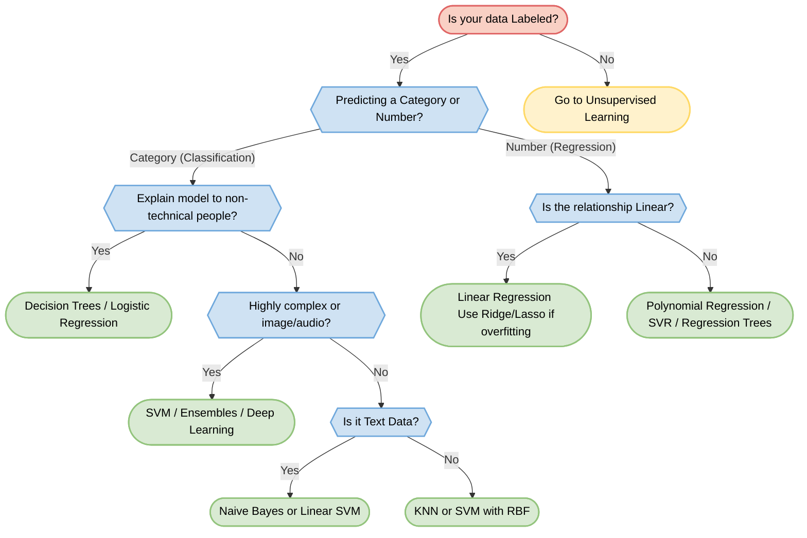

# 🏆 Supervised Learning: Model Selection Guide

> **Prerequisites**: Completed 01 through 07 in Supervised Learning | **Difficulty**: ⭐⭐☆☆☆ Elementary

---

## 📋 Table of Contents
1. [The Golden Rule](#1-the-golden-rule)
2. [Quick Reference Flowchart](#2-quick-reference-flowchart)
3. [Model Cheat Sheet](#3-model-cheat-sheet)
4. [When to use WHICH model?](#4-when-to-use-which-model)
5. [Summary Checklist](#5-summary-checklist)

---

## 1. The Golden Rule

**"There is no Free Lunch in Machine Learning."**
No single algorithm works best for every problem. The "best" model depends entirely on:
- The size and shape of your data.
- Whether you need interpretability (can you explain it to your boss?).
- How much training time you have.
- How much noise or outliers are in the data.

Always start simple, establish a baseline, and then get complex only if necessary!

---

## 2. Quick Reference Flowchart

---

## 3. Model Cheat Sheet

| Algorithm | Pros 🟢 | Cons 🔴 | Best For 🎯 |
|-----------|---------|---------|-------------|
| **Linear / Logistic Regression** | Fast, easily interpretable, great baselines. | Assumes linear relationships, prone to underfitting. | Baselines, simple structured data, when explainability is key. |
| **Ridge / Lasso (Regularized)** | Prevents overfitting, handles multicollinearity (Lasso selects features). | Requires tuning the $\alpha$ penalty parameter. | High-dimensional data where you suspect many useless features. |
| **K-Nearest Neighbors (KNN)** | Intuitive, no training time, captures non-linear boundaries. | Very slow to predict on large datasets, Curse of Dimensionality. | Small to medium datasets, recommendation systems. |
| **Decision Trees** | Highly interpretable, requires no data scaling, handles categorical data well. | Extremely prone to overfitting (high variance). | Medical diagnosis, business rule generation, mixed data types. |
| **Support Vector Machines (SVM)** | Powerful for non-linear data (Kernel Trick), effective in high dimensions. | Slow to train on large data, sensitive to scale, black-box. | Face recognition, text classification, complex boundary problems. |
| **Naive Bayes** | Lightning fast, works great with small data, handles high dimensions. | Assumes features are independent (which is rarely true). | Spam filtering, sentiment analysis, document classification. |

---

## 4. When to use WHICH model?

### 📈 "I need to predict a continuous number (Price, Salary, Temperature)"
1. **Start with:** Linear Regression. It's the ultimate baseline.
2. **If it underfits:** Try Polynomial Regression or a Decision Tree Regressor.
3. **If it overfits (too many features):** Use Ridge (L2) or Lasso (L1) Regression.
4. **If it's highly non-linear:** Use Support Vector Regression (SVR) with an RBF kernel.

### 🏷️ "I need to categorize text or documents (Spam, Sentiment, Topics)"
1. **Start with:** Naive Bayes (MultinomialNB). It is incredibly fast and the standard for text.
2. **Next best:** Linear SVM. Often beats Naive Bayes slightly in accuracy for text.
3. **Advanced:** If these fail, you'll need Deep Learning (NLP / Transformers).

### 🗣️ "My boss needs to understand exactly WHY the model made its decision"
1. **Start with:** Decision Trees. You can literally print the tree and show them the IF/THEN rules.
2. **Next best:** Logistic Regression. You can look at the feature coefficients to see exactly how much each feature pushes the probability up or down.
3. **Avoid:** SVMs (with non-linear kernels) and complex KNNs. They are "black boxes."

### ⏱️ "I have millions of rows of data and need it to train/predict fast"
1. **Start with:** Logistic Regression or Naive Bayes.
2. **Avoid:** KNN (prediction takes forever as it compares distance to *every* point) and SVM (training scales horribly with dataset size: $O(n^3)$).

### 🧩 "I have a small dataset, but the patterns are highly complex/curvy"
1. **Start with:** Support Vector Machines (SVM) with an RBF Kernel.
2. **Next best:** K-Nearest Neighbors (KNN).

---

## 5. Summary Checklist

Before you train *any* of these models, make sure you have:
- [x] Handled missing values.
- [x] Encoded categorical variables (One-Hot, Label Encoding).
- [x] SCALED your data (Mandatory for KNN, SVM, Lasso/Ridge).
- [x] Split your data into Train and Test sets!

**Congratulations on completing the Core Supervised Learning module!**

[← Naive Bayes](./07-Naive-Bayes.md) | [Back to Index](../README.md) | [Next: Ensemble Methods →](../03-Ensemble-Methods/01-Bagging-And-Random-Forest.md)
