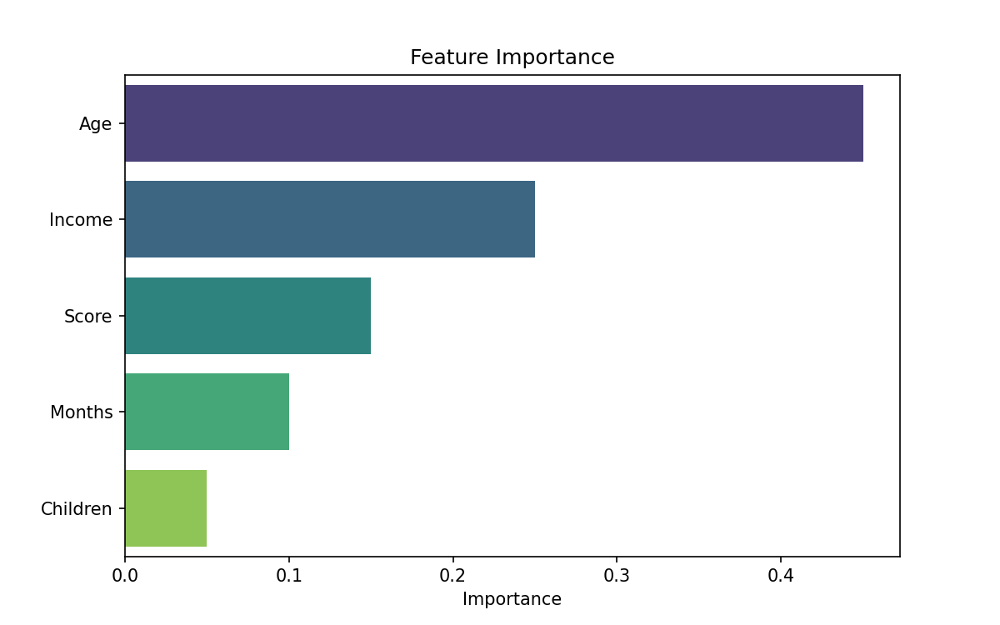

# 🛠️ Feature Engineering for Supervised Learning

> **Prerequisites**: Pandas | **Difficulty**: ⭐⭐☆☆☆ Intermediate

---

## 1. Encoding, Scaling & Selection

### 🟢 Beginner
**Simple Explanation**: ML models only understand numbers. Feature engineering is the art of translating text ("Red"), categories, and messy data into clean numbers that the model can easily digest.

**Visual Intuition**: 

### 🟡 Intermediate
**Workflow**: 
1. Categorical Encoding (One-Hot, Label Encoding)
2. Feature Scaling (StandardScaler, MinMaxScaler)
3. Handling Missing Values (Imputation)

### 🔴 Advanced
**Mathematics & Industry context**:
Using `TargetEncoding` for high-cardinality categorical variables incorporates label smoothing to prevent data leakage. Selecting features using L1 Regularization (Lasso) or Recursive Feature Elimination (RFE) is vital for high-dimensional genomics or finance data.
