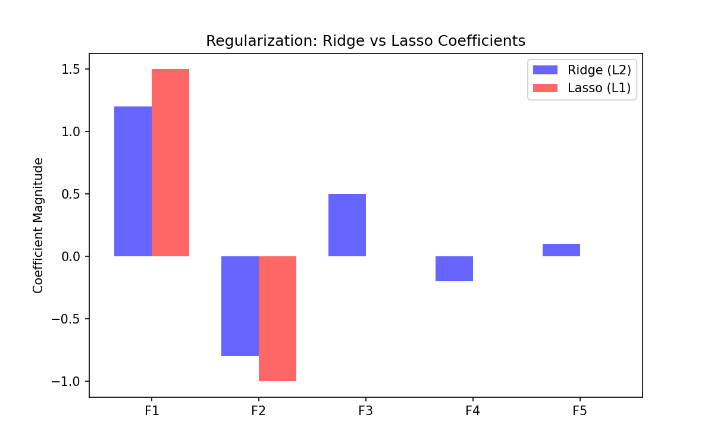

# 🛡️ Regularization (Ridge, Lasso, ElasticNet)

> **Prerequisites**: Linear Regression | **Difficulty**: ⭐⭐⭐☆☆ Advanced

---

## 1. Overfitting & Penalties

### 🟢 Beginner
**Simple Explanation**: Regularization is like placing speed limits on your model's parameters so it doesn't overreact to noise in the training data.

**Visual Intuition**: 

### 🟡 Intermediate
**Working Mechanism**: 
- **Ridge (L2)**: Shrinks coefficients towards zero, but rarely exactly zero.
- **Lasso (L1)**: Shrinks some coefficients exactly to zero (performs feature selection).
- **ElasticNet**: Combines L1 and L2.

### 🔴 Advanced
**Mathematics**:
Ridge Cost: $J(\theta) = MSE(\theta) + \alpha \sum_{i=1}^n \theta_i^2$
Lasso Cost: $J(\theta) = MSE(\theta) + \alpha \sum_{i=1}^n |\theta_i|$
L1 regularization yields sparse solutions due to its diamond-shaped constraint region intersecting the loss contours at the axes.

---

[← Feature Engineering for Supervised Learning](09-Feature-Engineering-For-Supervised-Learning.md) | [Back to Index](../README.md) | [Next: Model Building Pipeline →](11-Model-Building-Pipeline.md)
