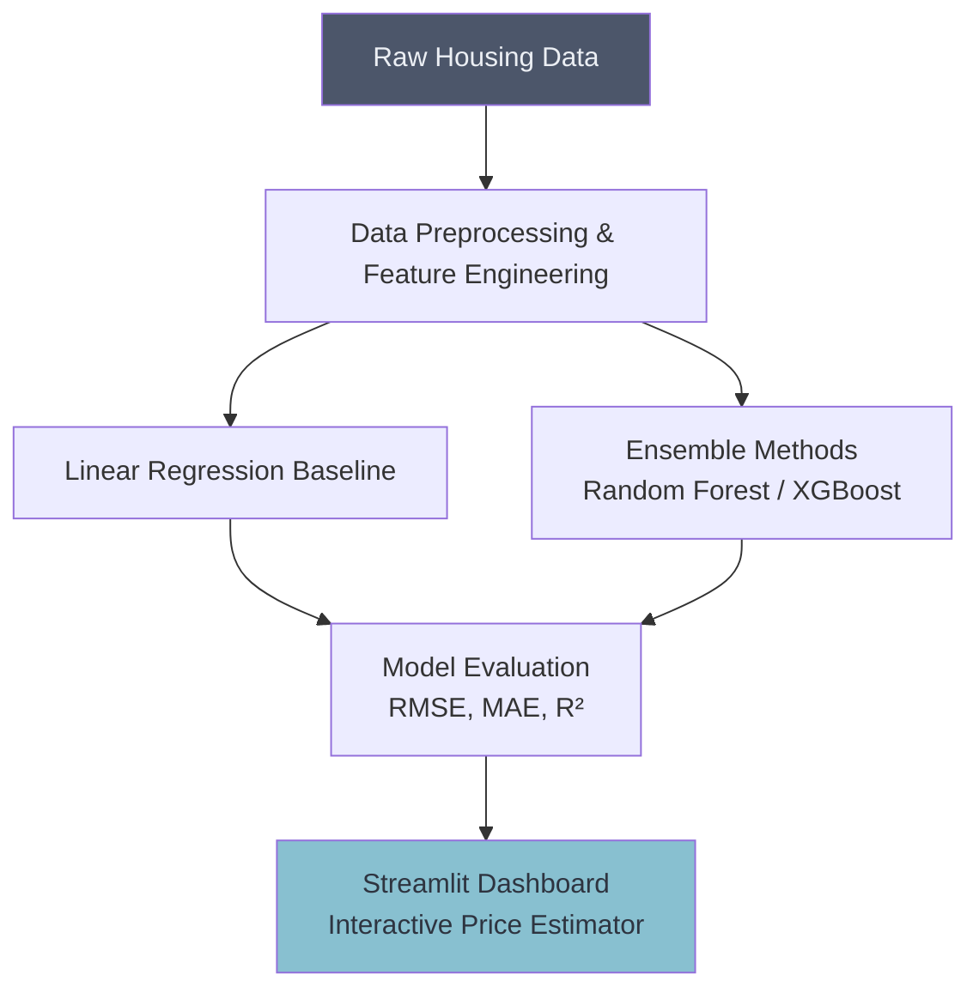

# 🏠 House Price Prediction System

## Overview
This project applies Supervised Learning regression techniques (such as Linear Regression, Random Forest, and Gradient Boosting) to predict the price of houses based on various features like square footage, number of bedrooms, and location.

## Architecture

## Project Structure
*   `data/`: Contains the housing datasets (e.g., Ames Housing, Boston Housing).
*   `notebooks/`: Jupyter notebooks detailing EDA, feature selection, and model training.
*   `src/`: Python scripts for data processing pipelines and model inference.
*   `app.py`: Streamlit dashboard for interactive predictions.

## How to Run
1. Install dependencies: `pip install streamlit scikit-learn pandas numpy matplotlib seaborn`
2. Navigate to the project directory.
3. Run the dashboard: `streamlit run app.py`
