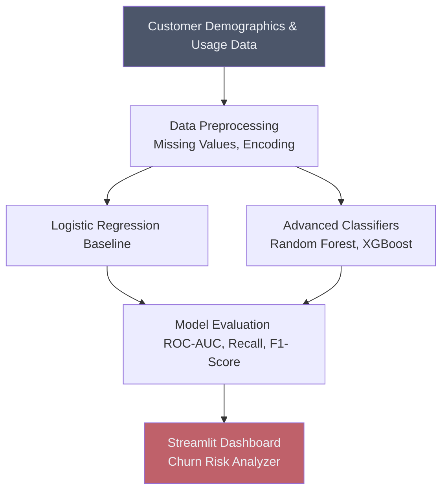

# 🏃 Customer Churn Prediction

## Overview
This project utilizes Supervised classification algorithms (such as Logistic Regression, Decision Trees, and Random Forests) to predict which customers are at high risk of churning (canceling their subscription/service). This allows businesses to proactively offer retention incentives.

## Architecture

## Project Structure
*   `data/`: Contains the customer datasets (e.g., Telco Customer Churn).
*   `notebooks/`: Jupyter notebooks with EDA, data balancing techniques (SMOTE), and model training.
*   `src/`: Python scripts for data processing and model evaluation functions.
*   `app.py`: Streamlit dashboard for interactive churn analysis.

## How to Run
1. Install dependencies: `pip install streamlit scikit-learn pandas matplotlib seaborn imbalanced-learn`
2. Navigate to the project directory.
3. Run the dashboard: `streamlit run app.py`
