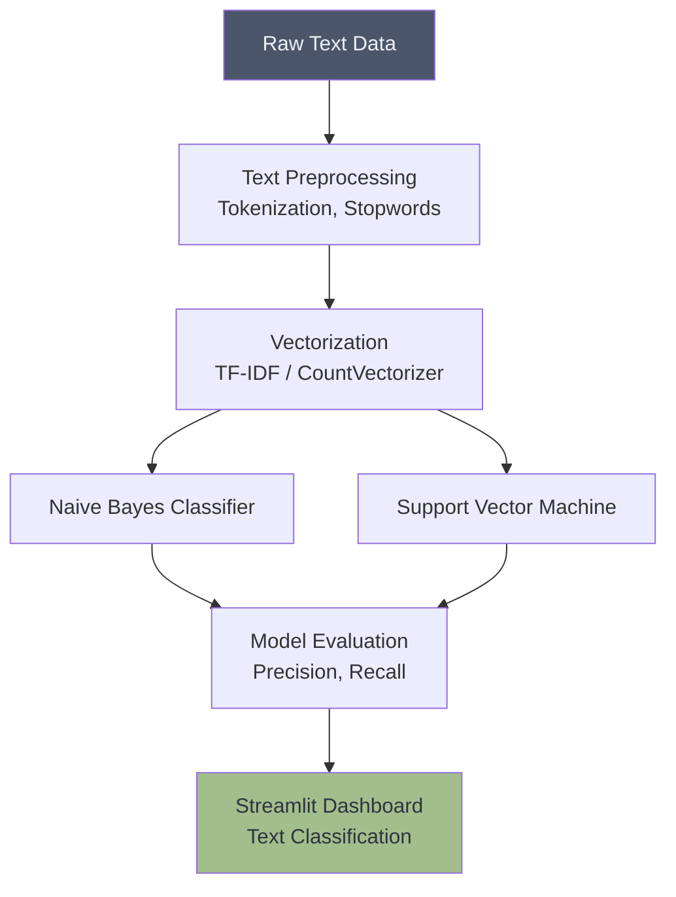

# 📧 Spam Detection System

## Overview
This project uses Supervised Learning Natural Language Processing (NLP) techniques to classify text messages or emails as either 'Spam' or 'Ham' (Not Spam). 

## Architecture

## Project Structure
*   `data/`: Contains the text datasets (e.g., SMS Spam Collection).
*   `notebooks/`: Jupyter notebooks with text EDA and model training.
*   `src/`: Python scripts for text cleaning and vectorization pipelines.
*   `app.py`: Streamlit dashboard for real-time message testing.

## How to Run
1. Install dependencies: `pip install streamlit scikit-learn pandas numpy nltk`
2. Navigate to the project directory.
3. Run the dashboard: `streamlit run app.py`
