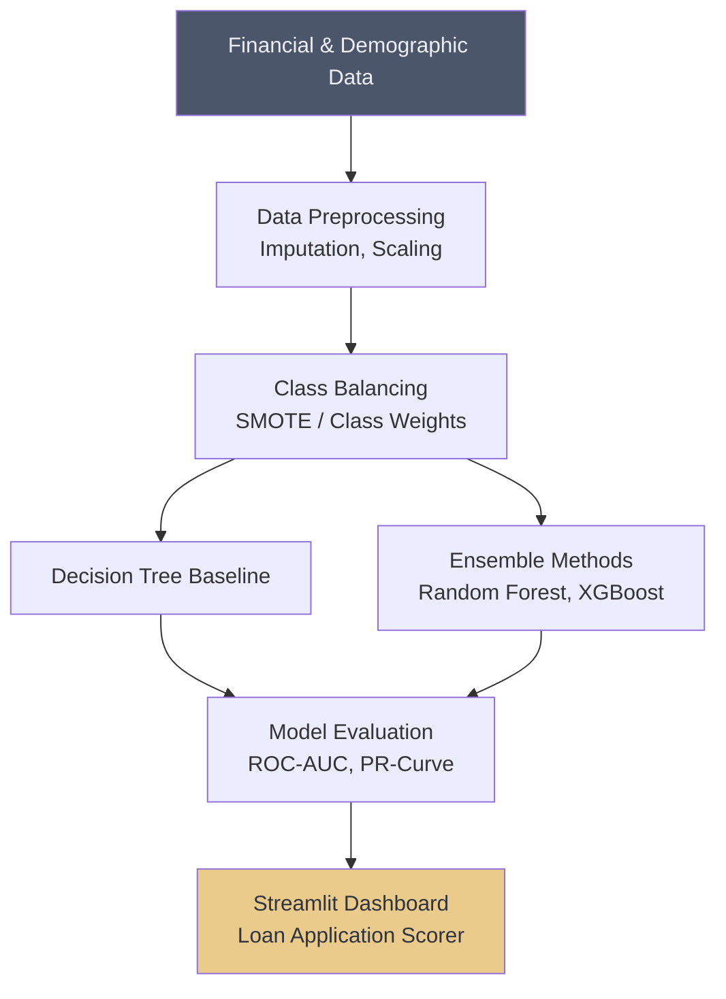

# 💸 Loan Default Prediction

## Overview
This project builds a classification model to predict whether a borrower will default on a loan. It handles highly imbalanced data and uses robust tree-based ensembles to ensure high recall for detecting defaults.

## Architecture

## Project Structure
*   `data/`: Contains the financial datasets.
*   `notebooks/`: Jupyter notebooks with EDA and hyperparameter tuning.
*   `src/`: Python scripts for feature engineering and model pipelines.
*   `app.py`: Streamlit dashboard for interactive loan scoring.

## How to Run
1. Install dependencies: `pip install streamlit scikit-learn pandas matplotlib seaborn xgboost`
2. Navigate to the project directory.
3. Run the dashboard: `streamlit run app.py`
