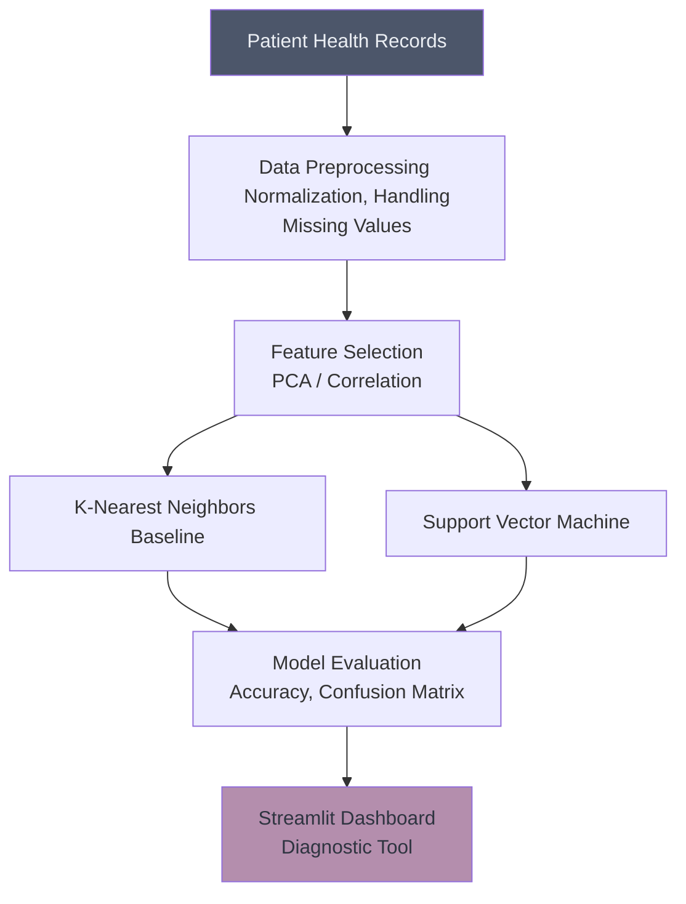

# 🩺 Disease Prediction

## Overview
This project applies Supervised Learning classification techniques (such as K-Nearest Neighbors, Support Vector Machines, and Logistic Regression) to predict the presence or absence of a disease based on patient health metrics.

## Architecture

## Project Structure
*   `data/`: Contains the health datasets (e.g., Heart Disease UCI).
*   `notebooks/`: Jupyter notebooks with EDA and pipeline construction.
*   `src/`: Python scripts for data processing and inference.
*   `app.py`: Streamlit dashboard for a user-friendly diagnostic interface.

## How to Run
1. Install dependencies: `pip install streamlit scikit-learn pandas numpy matplotlib`
2. Navigate to the project directory.
3. Run the dashboard: `streamlit run app.py`
