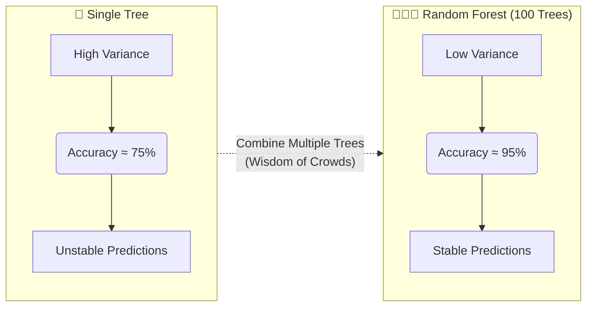
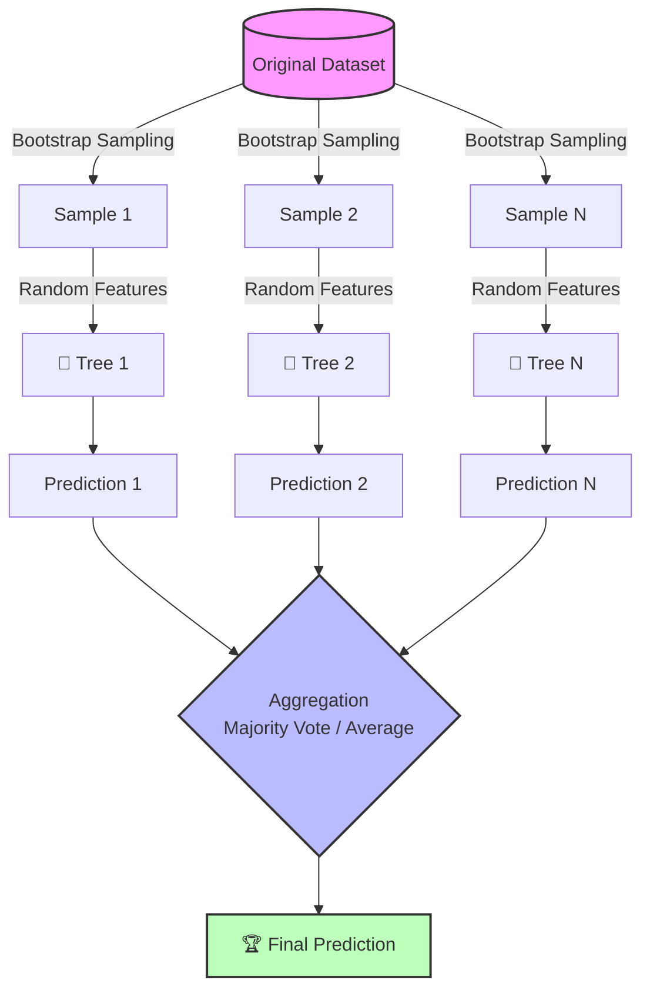

# 🌲 Bagging & Random Forest

> **Prerequisites**: Decision Trees | **Difficulty**: ⭐⭐☆☆☆ Elementary

---

## 📋 Table of Contents
1. [Ensemble Learning Intuition](#1-ensemble-learning-intuition)
2. [Bootstrap Aggregating (Bagging)](#2-bootstrap-aggregating-bagging)
3. [Random Forest](#3-random-forest)
4. [The Mathematics](#4-the-mathematics)
5. [Feature Importance](#5-feature-importance)
6. [Implementation from Scratch](#6-implementation-from-scratch)
7. [scikit-learn Implementation](#7-scikit-learn-implementation)
8. [Out-of-Bag (OOB) Evaluation](#8-out-of-bag-oob-evaluation)
9. [Hyperparameter Tuning](#9-hyperparameter-tuning)
10. [Project Ideas & What's Next](#10-project-ideas--whats-next)

---

## 1. Ensemble Learning Intuition

> **"The wisdom of crowds."** — Many weak models combined are stronger than one strong model.

**Why ensembles work**: Individual models make different errors. When we combine them, errors cancel out while correct predictions reinforce each other.



Three main ensemble strategies:
- **Bagging** (parallel): Train independent models, average predictions → Reduces **variance**
- **Boosting** (sequential): Train models that fix previous errors → Reduces **bias**
- **Stacking**: Train a meta-model on predictions of base models

---

## 2. Bootstrap Aggregating (Bagging)

### Algorithm:

1. Create $B$ **bootstrap samples** (random samples with replacement from training data)
2. Train a separate model on each bootstrap sample
3. **Aggregate** predictions:
   - Classification: Majority vote
   - Regression: Average

$$\hat{f}_{bag}(\mathbf{x}) = \frac{1}{B}\sum_{b=1}^{B} \hat{f}_b(\mathbf{x})$$

### Why Bootstrap Works

Each bootstrap sample:
- Contains ~63.2% of the original data (some points appear multiple times)
- Leaves ~36.8% out (the **out-of-bag** samples)
- Creates diversity among the models

```python
import numpy as np
import matplotlib.pyplot as plt

# Demonstrate bootstrap sampling
np.random.seed(42)
original_data = np.arange(10)
print(f"Original data: {original_data}")

fig, axes = plt.subplots(2, 3, figsize=(15, 8))
for i, ax in enumerate(axes.flat):
    bootstrap = np.random.choice(original_data, size=len(original_data), replace=True)
    oob = np.setdiff1d(original_data, bootstrap)
    
    # Visualize
    ax.bar(range(10), np.bincount(bootstrap, minlength=10), color='#36A2EB', edgecolor='white')
    ax.set_title(f'Bootstrap {i+1}\nOOB: {oob}', fontsize=10)
    ax.set_xticks(range(10))
    ax.set_xlabel('Data Index')
    ax.set_ylabel('Count')

plt.suptitle('Bootstrap Samples (with replacement)', fontsize=14, fontweight='bold')
plt.tight_layout()
plt.savefig('bootstrap_samples.png', dpi=150)
plt.show()

# Show that ~63.2% of data appears in each bootstrap
fractions = []
for _ in range(10000):
    sample = np.random.choice(100, size=100, replace=True)
    fractions.append(len(np.unique(sample)) / 100)
print(f"\nAverage fraction of unique samples: {np.mean(fractions):.4f} (expected: 0.632)")
```

---

## 3. Random Forest

Random Forest = Bagging + **Random Feature Selection** at each split.

**Key innovation**: At each split, only consider a random subset of $m$ features (out of $p$ total).

- Classification: $m = \sqrt{p}$ (default)
- Regression: $m = p/3$ (default)

This creates **more diverse trees**, which reduces correlation between trees and improves the ensemble.



---

## 4. The Mathematics

### Variance Reduction

For $B$ independent models with variance $\sigma^2$:

$$\text{Var}\left(\frac{1}{B}\sum_{b=1}^{B} f_b\right) = \frac{\sigma^2}{B}$$

But trees from bagging are **correlated** (correlation $\rho$):

$$\text{Var}_{bagging} = \rho\sigma^2 + \frac{1-\rho}{B}\sigma^2$$

Random Forest **reduces $\rho$** by randomizing features → lower variance!

As $B \to \infty$: Variance approaches $\rho\sigma^2$ (irreducible).

---

## 5. Feature Importance

### 5.1 Mean Decrease in Impurity (MDI)

For each feature, sum up the impurity decrease it provides across all trees:

$$\text{Importance}(f) = \frac{1}{B}\sum_{b=1}^{B}\sum_{t \in T_b} \Delta I(t) \cdot \mathbb{1}[\text{feature at } t = f]$$

### 5.2 Permutation Importance

More reliable. For each feature:
1. Compute baseline score
2. Shuffle the feature column
3. Recompute score
4. Importance = drop in score

```python
from sklearn.ensemble import RandomForestClassifier
from sklearn.inspection import permutation_importance
from sklearn.datasets import load_breast_cancer
from sklearn.model_selection import train_test_split
import matplotlib.pyplot as plt
import numpy as np

data = load_breast_cancer()
X_train, X_test, y_train, y_test = train_test_split(data.data, data.target, test_size=0.2, random_state=42)

rf = RandomForestClassifier(n_estimators=100, random_state=42)
rf.fit(X_train, y_train)

# MDI importance
mdi_importance = rf.feature_importances_

# Permutation importance
perm_importance = permutation_importance(rf, X_test, y_test, n_repeats=10, random_state=42)

fig, axes = plt.subplots(1, 2, figsize=(16, 8))

# MDI
top_n = 10
idx = np.argsort(mdi_importance)[-top_n:]
axes[0].barh(range(top_n), mdi_importance[idx], color='#36A2EB')
axes[0].set_yticks(range(top_n))
axes[0].set_yticklabels([data.feature_names[i] for i in idx])
axes[0].set_title('MDI Feature Importance', fontsize=13, fontweight='bold')

# Permutation
idx = np.argsort(perm_importance.importances_mean)[-top_n:]
axes[1].barh(range(top_n), perm_importance.importances_mean[idx], color='#4CAF50')
axes[1].set_yticks(range(top_n))
axes[1].set_yticklabels([data.feature_names[i] for i in idx])
axes[1].set_title('Permutation Feature Importance', fontsize=13, fontweight='bold')

plt.tight_layout()
plt.savefig('rf_importance.png', dpi=150)
plt.show()
```

---

## 6. Implementation from Scratch

```python
import numpy as np
from collections import Counter

class SimpleDecisionTree:
    """Minimal decision tree for the Random Forest."""
    def __init__(self, max_depth=10, max_features=None):
        self.max_depth = max_depth
        self.max_features = max_features
        self.tree = None
    
    def _gini(self, y):
        counts = np.bincount(y)
        probs = counts / len(y)
        return 1 - np.sum(probs ** 2)
    
    def _best_split(self, X, y):
        n_features = X.shape[1]
        # Random feature selection!
        if self.max_features:
            feature_indices = np.random.choice(n_features, self.max_features, replace=False)
        else:
            feature_indices = range(n_features)
        
        best_gain, best_feat, best_thresh = -1, None, None
        parent_gini = self._gini(y)
        
        for feat in feature_indices:
            thresholds = np.unique(X[:, feat])
            for thresh in thresholds:
                left = y[X[:, feat] <= thresh]
                right = y[X[:, feat] > thresh]
                if len(left) == 0 or len(right) == 0:
                    continue
                gain = parent_gini - (len(left)/len(y)*self._gini(left) + len(right)/len(y)*self._gini(right))
                if gain > best_gain:
                    best_gain, best_feat, best_thresh = gain, feat, thresh
        
        return best_feat, best_thresh
    
    def _build(self, X, y, depth=0):
        if depth >= self.max_depth or len(np.unique(y)) == 1 or len(y) < 2:
            return Counter(y).most_common(1)[0][0]
        
        feat, thresh = self._best_split(X, y)
        if feat is None:
            return Counter(y).most_common(1)[0][0]
        
        left = X[:, feat] <= thresh
        return {
            'feature': feat, 'threshold': thresh,
            'left': self._build(X[left], y[left], depth+1),
            'right': self._build(X[~left], y[~left], depth+1)
        }
    
    def fit(self, X, y):
        self.tree = self._build(X, y)
        return self
    
    def _predict_one(self, x, node):
        if not isinstance(node, dict):
            return node
        if x[node['feature']] <= node['threshold']:
            return self._predict_one(x, node['left'])
        return self._predict_one(x, node['right'])
    
    def predict(self, X):
        return np.array([self._predict_one(x, self.tree) for x in X])


class RandomForestFromScratch:
    def __init__(self, n_estimators=10, max_depth=10, max_features='sqrt'):
        self.n_estimators = n_estimators
        self.max_depth = max_depth
        self.max_features = max_features
        self.trees = []
    
    def fit(self, X, y):
        n_samples, n_features = X.shape
        
        if self.max_features == 'sqrt':
            max_feat = int(np.sqrt(n_features))
        else:
            max_feat = n_features
        
        self.trees = []
        for _ in range(self.n_estimators):
            # Bootstrap sample
            indices = np.random.choice(n_samples, n_samples, replace=True)
            X_boot, y_boot = X[indices], y[indices]
            
            # Train tree with random feature selection
            tree = SimpleDecisionTree(max_depth=self.max_depth, max_features=max_feat)
            tree.fit(X_boot, y_boot)
            self.trees.append(tree)
        
        return self
    
    def predict(self, X):
        # Get predictions from all trees
        predictions = np.array([tree.predict(X) for tree in self.trees])
        # Majority vote
        return np.array([Counter(predictions[:, i]).most_common(1)[0][0] 
                         for i in range(X.shape[0])])
    
    def score(self, X, y):
        return np.mean(self.predict(X) == y)

# Test
from sklearn.datasets import load_iris
from sklearn.model_selection import train_test_split

iris = load_iris()
X_train, X_test, y_train, y_test = train_test_split(iris.data, iris.target, test_size=0.2, random_state=42)

rf = RandomForestFromScratch(n_estimators=50, max_depth=5)
rf.fit(X_train, y_train)
print(f"From-scratch RF accuracy: {rf.score(X_test, y_test):.2%}")
```

---

## 7. scikit-learn Implementation

```python
from sklearn.ensemble import RandomForestClassifier, RandomForestRegressor
from sklearn.datasets import load_breast_cancer
from sklearn.model_selection import train_test_split
from sklearn.metrics import classification_report
import numpy as np

data = load_breast_cancer()
X_train, X_test, y_train, y_test = train_test_split(data.data, data.target, test_size=0.2, random_state=42)

# Classification
rf = RandomForestClassifier(
    n_estimators=100,       # Number of trees
    max_depth=None,          # Grow full trees
    max_features='sqrt',     # √p features per split
    min_samples_split=2,
    min_samples_leaf=1,
    bootstrap=True,
    oob_score=True,          # Out-of-bag evaluation
    random_state=42,
    n_jobs=-1                # Use all CPU cores
)
rf.fit(X_train, y_train)

print(f"Training accuracy: {rf.score(X_train, y_train):.4f}")
print(f"Test accuracy:     {rf.score(X_test, y_test):.4f}")
print(f"OOB score:         {rf.oob_score_:.4f}")
```

---

## 8. Out-of-Bag (OOB) Evaluation

Each tree was trained on ~63.2% of data. Use the remaining ~36.8% for free validation!

```python
# OOB is already computed above with oob_score=True
print(f"OOB score (free validation!): {rf.oob_score_:.4f}")
# This is equivalent to ~3-fold cross-validation, without the computational cost!
```

---

## 9. Hyperparameter Tuning

| Parameter | Description | Typical Values |
|-----------|-------------|---------------|
| `n_estimators` | Number of trees | 100-1000 |
| `max_depth` | Max tree depth | None (full), 5-50 |
| `max_features` | Features per split | 'sqrt', 'log2', 0.3-0.8 |
| `min_samples_split` | Min samples to split | 2-20 |
| `min_samples_leaf` | Min samples in leaf | 1-10 |

```python
from sklearn.model_selection import RandomizedSearchCV
from scipy.stats import randint

param_distributions = {
    'n_estimators': randint(50, 500),
    'max_depth': [None, 5, 10, 20, 30],
    'max_features': ['sqrt', 'log2', 0.3, 0.5],
    'min_samples_split': randint(2, 20),
    'min_samples_leaf': randint(1, 10)
}

search = RandomizedSearchCV(
    RandomForestClassifier(random_state=42),
    param_distributions, n_iter=50, cv=5,
    scoring='accuracy', random_state=42, n_jobs=-1
)
search.fit(X_train, y_train)

print(f"Best params: {search.best_params_}")
print(f"Best CV score: {search.best_score_:.4f}")
print(f"Test score: {search.score(X_test, y_test):.4f}")
```

---

## 10. Project Ideas & What's Next

### Project Ideas
- 🟢 **Credit Risk Prediction:** Build a Random Forest classifier using historical banking data to predict loan defaults. Focus on interpreting the results using feature importance to explain why certain clients are denied credit.
- 🟡 **Kaggle House Pricing Competition:** Participate in the classic Kaggle competition by using Random Forest as a robust baseline regression model. Practice handling missing values and categorical encoding before feeding the data into the ensemble.
- 🔴 **Custom Bagging Framework from Scratch:** Build a Python class that replicates `BaggingClassifier`. Your class should be able to accept *any* scikit-learn base estimator (e.g., Logistic Regression, SVM) and perform bootstrap sampling and aggregation manually.

### What's Next
Now that you understand Bagging (which primarily reduces *variance*), it's time to explore the other primary ensemble techniques:

| Next Topic | Why You Should Learn It |
|------------|-------------------------|
| [**Boosting**](./02-Boosting.md) | While Bagging builds models independently, Boosting builds them sequentially, focusing on reducing *bias* by learning from previous mistakes. Essential for Kaggle! |
| [**Stacking & Voting**](./03-Stacking-And-Voting.md) | Learn how to combine entirely different types of models (e.g., mixing Trees, SVMs, and Linear Models) into a single, highly powerful meta-model. |

---

[← Model Selection Guide](../02-Supervised-Learning/08-Model-Selection-Guide.md) | [Back to Index](../README.md) | [Next: Boosting →](./02-Boosting.md)
