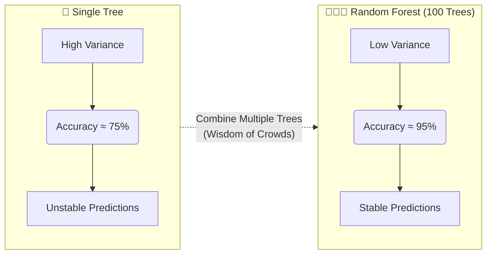

# 🤝 Introduction To Ensemble Learning

> **Difficulty**: ⭐☆☆☆☆ Beginner | **Prerequisites**: Decision Trees, Basic ML Concepts

---

## 📋 Table of Contents
1. [What Problem Does This Solve?](#1-what-problem-does-this-solve)
2. [Intuition](#2-intuition)
3. [Core Mathematics](#3-core-mathematics)
4. [Visual Explanation](#4-visual-explanation)
5. [Ensemble Strategies Overview](#5-ensemble-strategies-overview)

---

## 1. What Problem Does This Solve?

### 🟢 Beginner
Imagine asking one person to guess the exact weight of a cow. They might be very wrong. But if you ask 1,000 people and take the average of their guesses, the result is often incredibly accurate! Ensemble Learning combines multiple "weak" machine learning models into one "strong" master model.

### 🟡 Intermediate
An ensemble aggregates the predictions of a group of base estimators to improve generalizability and robustness over a single estimator. Single estimators often suffer from high variance (overfitting) or high bias (underfitting). By combining them correctly, we can reduce these errors.

### 🔴 Advanced
Kaggle competitions have proven that almost all winning tabular models are ensembles. They are the go-to architecture for risk assessment, click-through rate prediction, and search engines because of their unparalleled performance on structured data.

---

## 2. Intuition

Any machine learning model's prediction error can be decomposed into:
1. **Bias**: Error from erroneous assumptions in the learning algorithm (underfitting).
2. **Variance**: Error from sensitivity to small fluctuations in the training set (overfitting).
3. **Irreducible Error**: Noise in the data itself.

Ensembles help optimize the Bias-Variance tradeoff:
- **Bagging** primarily reduces **variance** by averaging independent predictions.
- **Boosting** primarily reduces **bias** by sequentially training models to fix errors.

---

## 3. Core Mathematics

### Condorcet's Jury Theorem
If each classifier $h_i$ has a probability $p > 0.5$ of being correct, the probability that the majority vote is correct approaches $1$ as the number of classifiers $N \rightarrow \infty$, assuming errors are independent.

Specifically, if we have $N$ independent classifiers, each with accuracy $p$, the probability $P$ that the majority vote is correct is:

$$P = \sum_{k=\lfloor N/2 \rfloor + 1}^{N} \binom{N}{k} p^k (1-p)^{N-k}$$

As $N \to \infty$:
- If $p > 0.5$, then $P \to 1$.
- If $p < 0.5$, then $P \to 0$.

This shows why combining models works, but *only* if the individual models are better than random guessing ($p > 0.5$) and their errors are uncorrelated (independent).

---

## 4. Visual Explanation

---

## 5. Ensemble Strategies Overview

Three main ensemble strategies:
- **Bagging** (parallel): Train independent models, average predictions $\rightarrow$ Reduces **variance** (e.g., Random Forest).
- **Boosting** (sequential): Train models that fix previous errors $\rightarrow$ Reduces **bias** (e.g., Gradient Boosting, XGBoost).
- **Stacking / Blending**: Train a meta-model on predictions of base models to optimize combination weights.

---

[← Model Selection Guide](../02-Supervised-Learning/12-Model-Selection-Guide.md) | [Back to Index](../README.md) | [Next: Bagging (Bootstrap Aggregating) →](02-Bagging.md)
