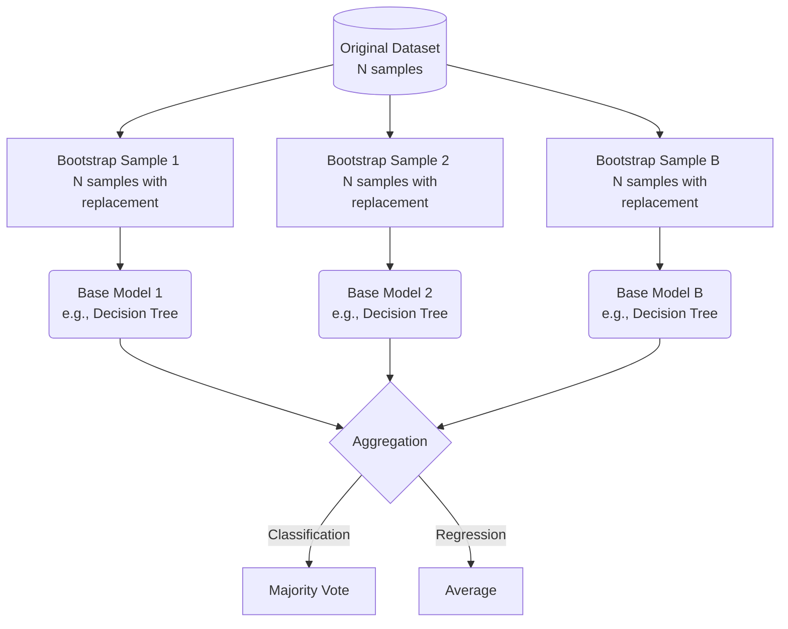

# 🎒 Bagging (Bootstrap Aggregating)

> **Prerequisites:** Decision Trees, Bias-Variance Tradeoff, Basic Probability
>
> **Difficulty:** ⭐⭐☆☆☆
>
> **Estimated Reading Time:** 25 minutes

---

## 📋 Table of Contents

1. [What Problem Does This Solve?](#1-what-problem-does-this-solve)
2. [Intuition](#2-intuition)
3. [Core Mathematics](#3-core-mathematics)
4. [Visual Explanation](#4-visual-explanation)
5. [Algorithm Workflow](#5-algorithm-workflow)
6. [From Scratch Implementation](#6-from-scratch-implementation)
7. [NumPy Implementation](#7-numpy-implementation)
8. [Scikit-Learn / Library Implementation](#8-scikit-learn--library-implementation)
9. [Hyperparameter Deep Dive](#9-hyperparameter-deep-dive)
10. [Visualization Lab](#10-visualization-lab)
11. [Failure Cases](#11-failure-cases)
12. [Industry Applications](#12-industry-applications)
13. [Interview Preparation](#13-interview-preparation)
14. [Exercises](#14-exercises)
15. [Further Reading](#15-further-reading)

---

## 1. What Problem Does This Solve?

### 🟢 Beginner
Single machine learning models, especially deep decision trees, tend to memorize the training data. This means they perform perfectly on the data they were trained on, but terribly on new, unseen data. This is called **overfitting**. Bagging solves this by training many different models and averaging their predictions, which "smooths out" the overconfident mistakes of any single model.

### 🟡 Intermediate
In the context of the Bias-Variance tradeoff, unpruned decision trees have low bias but **high variance**. Small changes in the training data can lead to drastically different tree structures and predictions. Bagging reduces this variance without increasing the bias. It achieves this by introducing randomness into the training process through dataset sampling.

### 🔴 Advanced
Bagging exploits the statistical property that averaging independent models reduces their variance by a factor of $N$ (the number of models). While models trained on the same data are not perfectly independent, Bagging uses bootstrap sampling (sampling with replacement) to create slightly different datasets. This decorrelates the base learners just enough so that their aggregated prediction is significantly more robust and generalized than any individual estimator.

---

## 2. Intuition

Imagine you have a jar of jelly beans and you need to guess the exact number.

If you ask one person, their guess might be completely wrong. They might overestimate or underestimate heavily based on their limited perspective.

However, if you ask 1,000 independent people to guess, and you take the average of all their guesses, the final aggregated number will be shockingly close to the true amount. This is the **"Wisdom of the Crowds."**

Bagging applies this to machine learning:
1. **The Crowd:** A large number of models (typically Decision Trees).
2. **Different Perspectives:** We give each model a slightly different slice of the dataset (Bootstrap Sampling).
3. **The Final Answer:** We let all models vote on the final prediction (Aggregation).

---

## 3. Core Mathematics

### Variance Reduction
If we have $B$ perfectly independent models, each with variance $\sigma^2$, the variance of their average is:

$$\text{Var}\left(\frac{1}{B}\sum_{b=1}^{B} f_b(x)\right) = \frac{\sigma^2}{B}$$

However, in Bagging, the models are trained on variations of the same dataset, so they are somewhat correlated. If the correlation between any two models is $\rho$, the variance of the ensemble is:

$$\text{Var}_{bagging} = \rho\sigma^2 + \frac{1-\rho}{B}\sigma^2$$

As the number of models $B \to \infty$, the second term approaches 0, leaving the variance bounded by $\rho\sigma^2$. This shows why minimizing correlation between models (which Random Forests take even further) is critical.

### Out-of-Bag (OOB) Estimation
Because we sample *with replacement*, some rows of data are picked multiple times, and some are never picked. 

For a dataset of size $N$, the probability of a specific point *not* being chosen in a single draw is $1 - \frac{1}{N}$. For $N$ draws, the probability that it is never chosen is:

$$\lim_{N \to \infty} \left(1 - \frac{1}{N}\right)^N = \frac{1}{e} \approx 0.368$$

This means ~36.8% of the data is left out of the training set for any given tree. These "Out-of-Bag" samples act as a built-in validation set, allowing us to evaluate the ensemble's performance without needing a separate hold-out test set!

---

## 4. Visual Explanation



---

## 5. Algorithm Workflow

1. **Bootstrap Sampling:** Given a dataset $D$ of size $N$, create $B$ bootstrap samples by randomly drawing $N$ elements from $D$ *with replacement*.
2. **Model Training:** Train a separate base model (usually an unpruned decision tree) on each of the $B$ bootstrap samples. These models are trained completely independently and in parallel.
3. **Prediction (Classification):** For a new instance, pass it through all $B$ models. Each model casts a "vote" for a class. The ensemble returns the class with the most votes (Majority Voting).
4. **Prediction (Regression):** For a new instance, pass it through all $B$ models. The ensemble returns the mathematical average of all $B$ predictions.

---

## 6. From Scratch Implementation

Here is a simple, educational implementation of a Bagging classifier using Python.

```python
import numpy as np
from collections import Counter

class DummyTree:
    """A simple dummy model to act as our base learner."""
    def fit(self, X, y):
        # In reality, this would build a tree.
        # Here we just memorize the most common class.
        self.prediction = Counter(y).most_common(1)[0][0]
        
    def predict(self, X):
        return [self.prediction] * len(X)

class BaggingClassifierFromScratch:
    def __init__(self, n_estimators=10):
        self.n_estimators = n_estimators
        self.models = []
        
    def fit(self, X, y):
        n_samples = len(X)
        self.models = []
        
        for _ in range(self.n_estimators):
            # Bootstrap sample: random indices with replacement
            indices = np.random.choice(n_samples, size=n_samples, replace=True)
            X_sample, y_sample = X[indices], y[indices]
            
            # Train and store base model
            model = DummyTree() # Replace with real DecisionTree
            model.fit(X_sample, y_sample)
            self.models.append(model)
            
    def predict(self, X):
        # Get predictions from all models
        # Shape: (n_estimators, n_samples)
        predictions = np.array([model.predict(X) for model in self.models])
        
        # Aggregate via majority vote
        final_preds = []
        for i in range(len(X)):
            votes = predictions[:, i]
            majority = Counter(votes).most_common(1)[0][0]
            final_preds.append(majority)
            
        return np.array(final_preds)
```

---

## 7. NumPy Implementation

To optimize the sampling process and predictions for performance using vectorized operations:

```python
import numpy as np
from sklearn.tree import DecisionTreeClassifier

class VectorizedBagging:
    def __init__(self, n_estimators=50):
        self.n_estimators = n_estimators
        self.trees = []
        
    def fit(self, X, y):
        n_samples = len(X)
        
        # Generate all bootstrap indices at once (Vectorized)
        bootstrap_indices = np.random.randint(0, n_samples, size=(self.n_estimators, n_samples))
        
        for idx in bootstrap_indices:
            tree = DecisionTreeClassifier(max_depth=None) # Unpruned tree
            tree.fit(X[idx], y[idx])
            self.trees.append(tree)
            
    def predict(self, X):
        # Get predictions for all trees (n_estimators x n_samples)
        tree_preds = np.array([tree.predict(X) for tree in self.trees])
        
        # Scipy mode is fast for finding the most frequent value along an axis
        from scipy.stats import mode
        final_preds, _ = mode(tree_preds, axis=0, keepdims=False)
        return final_preds
```

---

## 8. Scikit-Learn / Library Implementation

In production, you should rely on `sklearn.ensemble.BaggingClassifier` or `BaggingRegressor`.

```python
from sklearn.ensemble import BaggingClassifier
from sklearn.tree import DecisionTreeClassifier
from sklearn.datasets import make_classification
from sklearn.model_selection import train_test_split
from sklearn.metrics import accuracy_score

# 1. Create dataset
X, y = make_classification(n_samples=1000, n_features=20, random_state=42)
X_train, X_test, y_train, y_test = train_test_split(X, y, test_size=0.2)

# 2. Initialize Bagging Classifier
# oob_score=True allows us to use Out-of-Bag samples for validation
bagging_clf = BaggingClassifier(
    estimator=DecisionTreeClassifier(), # Base estimator
    n_estimators=100,                   # Number of trees
    max_samples=1.0,                    # Size of bootstrap sample (1.0 = N)
    bootstrap=True,                     # Use replacement
    n_jobs=-1,                          # Use all CPU cores (parallel training)
    oob_score=True,                     # Compute OOB error
    random_state=42
)

# 3. Train
bagging_clf.fit(X_train, y_train)

# 4. Evaluate
print(f"OOB Score: {bagging_clf.oob_score_:.4f}")

y_pred = bagging_clf.predict(X_test)
print(f"Test Accuracy: {accuracy_score(y_test, y_pred):.4f}")
```

---

## 9. Hyperparameter Deep Dive

| Parameter | What it does | Default | Best Practices |
|-----------|--------------|---------|----------------|
| `n_estimators` | Number of base models in the ensemble. | 10 | Higher is better for variance reduction, but diminishing returns occur after ~100. It increases computational cost. |
| `max_samples` | Proportion of data to draw for each bootstrap sample. | 1.0 (100%) | Keep at 1.0. Lowering it reduces correlation between trees but sacrifices individual tree strength. |
| `max_features`| Proportion of features to use per model (Feature Bagging). | 1.0 (100%) | Useful if you have many features. This effectively moves the algorithm closer to Random Forests. |
| `bootstrap` | Whether to sample with replacement. | `True` | Keep `True` for standard Bagging. Setting to `False` creates "Pasting" (training on sub-samples without replacement). |
| `oob_score` | Calculate validation score on Out-of-Bag samples. | `False` | Set to `True` to get a free validation metric without sacrificing training data. |
| `n_jobs` | Number of CPU cores to use. | `None` (1) | Set to `-1` to use all cores. Bagging is embarrassingly parallel! |

---

## 10. Visualization Lab

Visualizing the difference in Decision Boundaries between a Single Tree and Bagging.

```python
import matplotlib.pyplot as plt
from sklearn.datasets import make_moons
from sklearn.tree import DecisionTreeClassifier
from sklearn.ensemble import BaggingClassifier
from matplotlib.colors import ListedColormap

# Generate complex, noisy data
X, y = make_moons(n_samples=300, noise=0.3, random_state=42)

# Train models
tree = DecisionTreeClassifier(random_state=42).fit(X, y)
bag = BaggingClassifier(estimator=DecisionTreeClassifier(), n_estimators=100, random_state=42).fit(X, y)

# Plotting function
def plot_boundary(clf, X, y, ax, title):
    x_min, x_max = X[:, 0].min() - 1, X[:, 0].max() + 1
    y_min, y_max = X[:, 1].min() - 1, X[:, 1].max() + 1
    xx, yy = np.meshgrid(np.arange(x_min, x_max, 0.01),
                         np.arange(y_min, y_max, 0.01))
    
    Z = clf.predict(np.c_[xx.ravel(), yy.ravel()])
    Z = Z.reshape(xx.shape)
    
    cmap = ListedColormap(['#FFAAAA', '#AAAAFF'])
    ax.contourf(xx, yy, Z, alpha=0.3, cmap=cmap)
    ax.scatter(X[:, 0], X[:, 1], c=y, edgecolors='k', cmap=ListedColormap(['red', 'blue']), s=20)
    ax.set_title(title)

fig, axes = plt.subplots(1, 2, figsize=(12, 5))
plot_boundary(tree, X, y, axes[0], "Single Decision Tree (Overfitting, jagged)")
plot_boundary(bag, X, y, axes[1], "Bagging Classifier (Smoother, generalized)")
plt.tight_layout()
plt.show()
```

---

## 11. Failure Cases

Bagging is powerful, but it has specific scenarios where it fails:

1. **High Bias Base Models:** Bagging reduces variance, NOT bias. If your base model is too simple (like a Linear Regression or a Tree with `max_depth=1`), Bagging will not improve the performance significantly. It requires strong, complex base learners (like deep trees) to work.
2. **Highly Correlated Features:** If a dataset has one massively dominant feature, every single bootstrap tree will split on that feature first. As a result, all the trees will look very similar (high correlation $\rho$). When trees are highly correlated, Bagging's variance reduction fails. (This is exactly the problem Random Forests were invented to solve).
3. **Loss of Interpretability:** A single Decision Tree is easily interpreted by plotting its rules. An ensemble of 500 bagged trees is effectively a black box.

---

## 12. Industry Applications

While standard Bagging is often superseded by Random Forests or Boosting in modern applications, its principles are still widely used:

* **Customer Retention:** Aggregating predictions from different subsets of customer history to predict churn likelihood with high stability.
* **Credit Scoring:** Using Bagging to ensure that small fluctuations in a user's financial data don't lead to wild swings in their credit approval status.
* **Medical Diagnosis:** Reducing the variance of diagnostic models on small clinical trial datasets where standard hold-out testing is impossible (using OOB evaluations instead).

---

## 13. Interview Preparation

### Beginner Questions
* **What does "Bagging" stand for?** 
  * *Answer:* Bootstrap Aggregating.
* **Does Bagging reduce Bias or Variance?** 
  * *Answer:* It primarily reduces Variance by averaging multiple independent predictions.

### Intermediate Questions
* **What is Bootstrap Sampling?**
  * *Answer:* Randomly selecting samples from a dataset with replacement, meaning the same data point can be chosen multiple times.
* **What is the Out-of-Bag (OOB) error?**
  * *Answer:* Because bootstrap uses replacement, about 36.8% of the data is left out of each model's training set. These left-out samples are passed through the model to calculate a built-in validation error called OOB error.

### Advanced Questions
* **Why do we use unpruned decision trees in Bagging?**
  * *Answer:* Unpruned trees have low bias but high variance. Since Bagging's mechanism explicitly reduces variance, combining high-variance/low-bias models results in an ensemble with both low bias and low variance.
* **If Bagging is so good, why do we need Random Forests?**
  * *Answer:* In standard Bagging, if there's a very strong feature in the dataset, most trees will use it as the top split, causing the trees to be highly correlated. The variance reduction formula ($\rho\sigma^2$) shows that correlated trees ($\rho > 0$) limit the effectiveness of the ensemble. Random Forests add feature subsetting to force trees to be decorrelated.

---

## 14. Exercises

* **Easy:** Load the Iris dataset. Train a single Decision Tree and a Bagging Classifier. Compare their accuracies using `train_test_split`.
* **Medium:** Recreate the OOB error calculation manually without using the `oob_score=True` flag in sklearn.
* **Hard:** Modify the "From Scratch" implementation to handle regression tasks instead of classification. 
* **Challenge:** Prove empirically (via a Python simulation) that exactly ~36.8% of data is left out in a bootstrap sample as $N$ grows large.

---

## 15. Further Reading

* [Scikit-Learn Bagging Documentation](https://scikit-learn.org/stable/modules/ensemble.html#bagging)
* *The Elements of Statistical Learning* (Hastie, Tibshirani, Friedman) - Chapter 8.7 (Bagging)
* Breiman, L. (1996). Bagging predictors. *Machine Learning*, 24(2), 123-140.

---

[← Introduction To Ensemble Learning](01-Introduction-To-Ensemble-Learning.md) | [Back to Index](../README.md) | [Next: Random Forest →](03-Random-Forest.md)
