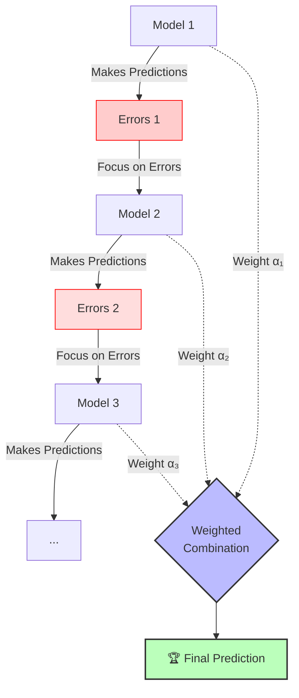
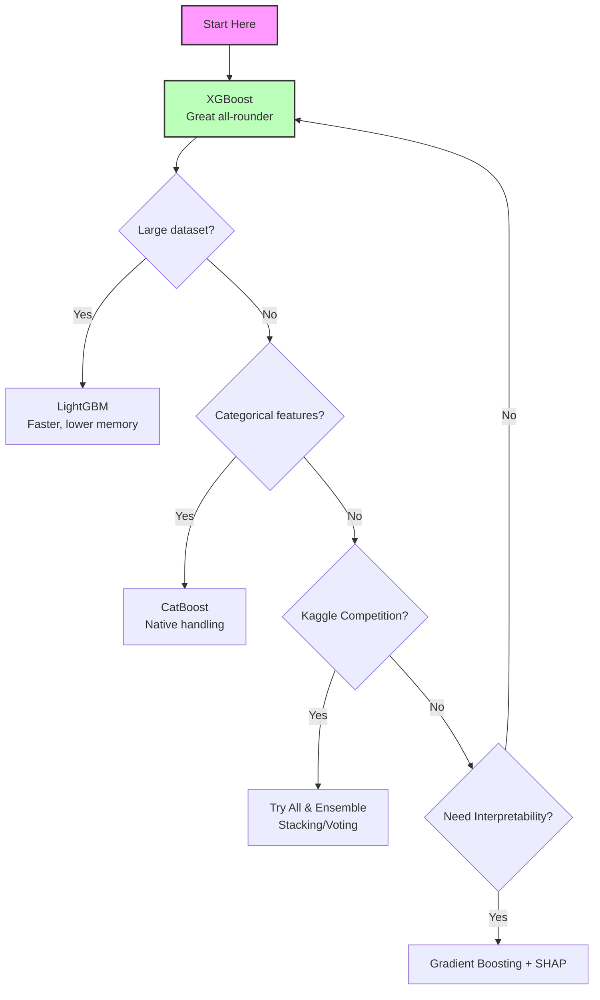

# 🚀 Boosting — AdaBoost, Gradient Boosting, XGBoost, LightGBM, CatBoost

> **Prerequisites**: Decision Trees, Random Forest | **Difficulty**: ⭐⭐⭐☆☆ Intermediate

---

## 📋 Table of Contents
1. [Boosting Intuition](#1-boosting-intuition)
2. [AdaBoost](#2-adaboost)
3. [Gradient Boosting](#3-gradient-boosting)
4. [XGBoost](#4-xgboost)
5. [LightGBM](#5-lightgbm)
6. [CatBoost](#6-catboost)
7. [Comparison](#7-comparison)
8. [Implementation](#8-implementation)
9. [Project Ideas & What's Next](#9-project-ideas--whats-next)

---

## 1. Boosting Intuition

Boosting builds models **sequentially**, where each new model tries to fix the errors of the previous one.



**Key difference from Bagging**:
- Bagging: Parallel, independent models → Reduces **variance**
- Boosting: Sequential, dependent models → Reduces **bias**

---

## 2. AdaBoost

### Algorithm (Adaptive Boosting)

1. Initialize sample weights: $w_i = \frac{1}{n}$ for all samples
2. For $t = 1, 2, \ldots, T$:
   a. Train weak learner $h_t$ on weighted data
   b. Compute weighted error: $\epsilon_t = \sum_{i: h_t(x_i) \neq y_i} w_i$
   c. Compute model weight: $\alpha_t = \frac{1}{2}\ln\frac{1-\epsilon_t}{\epsilon_t}$
   d. Update sample weights: $w_i \leftarrow w_i \cdot \exp(-\alpha_t y_i h_t(x_i))$
   e. Normalize weights: $w_i \leftarrow \frac{w_i}{\sum w_j}$
3. Final model: $H(\mathbf{x}) = \text{sign}\left(\sum_{t=1}^{T} \alpha_t h_t(\mathbf{x})\right)$

**Key idea**: Misclassified samples get **higher weights** → next model focuses on them.

```python
import numpy as np
import matplotlib.pyplot as plt
from sklearn.ensemble import AdaBoostClassifier
from sklearn.tree import DecisionTreeClassifier
from sklearn.datasets import make_classification
from sklearn.model_selection import train_test_split

X, y = make_classification(n_samples=500, n_features=2, n_redundant=0,
                           n_clusters_per_class=2, random_state=42)
X_train, X_test, y_train, y_test = train_test_split(X, y, test_size=0.2, random_state=42)

# AdaBoost with decision stumps
ada = AdaBoostClassifier(
    estimator=DecisionTreeClassifier(max_depth=1),  # Weak learner: decision stump
    n_estimators=100,
    learning_rate=0.5,
    random_state=42
)
ada.fit(X_train, y_train)

# Show how accuracy improves with more estimators
staged_scores = list(ada.staged_score(X_test, y_test))

fig, axes = plt.subplots(1, 2, figsize=(14, 5))

# Learning curve
axes[0].plot(range(1, len(staged_scores)+1), staged_scores, 'b-', linewidth=2)
axes[0].set_xlabel('Number of Estimators')
axes[0].set_ylabel('Test Accuracy')
axes[0].set_title('AdaBoost Learning Curve', fontsize=13, fontweight='bold')
axes[0].grid(True, alpha=0.3)

# Decision boundary
xx, yy = np.meshgrid(np.linspace(X[:, 0].min()-1, X[:, 0].max()+1, 200),
                      np.linspace(X[:, 1].min()-1, X[:, 1].max()+1, 200))
Z = ada.predict(np.c_[xx.ravel(), yy.ravel()]).reshape(xx.shape)
axes[1].contourf(xx, yy, Z, cmap='RdBu', alpha=0.3)
axes[1].scatter(X_test[y_test==0, 0], X_test[y_test==0, 1], c='red', edgecolor='black', s=30)
axes[1].scatter(X_test[y_test==1, 0], X_test[y_test==1, 1], c='blue', edgecolor='black', s=30)
axes[1].set_title(f'AdaBoost Decision Boundary (acc={ada.score(X_test, y_test):.2%})', fontsize=13, fontweight='bold')

plt.tight_layout()
plt.savefig('adaboost.png', dpi=150)
plt.show()
```

---

## 3. Gradient Boosting

### The Key Idea

Instead of re-weighting samples, Gradient Boosting fits each new model to the **residuals** (errors) of the previous model.

$$F_0(\mathbf{x}) = \arg\min_\gamma \sum L(y_i, \gamma)$$

For $m = 1, 2, \ldots, M$:

$$r_{im} = -\frac{\partial L(y_i, F_{m-1}(\mathbf{x}_i))}{\partial F_{m-1}(\mathbf{x}_i)} \quad \text{(pseudo-residuals)}$$

$$h_m(\mathbf{x}) = \text{tree fitted to } \{(\mathbf{x}_i, r_{im})\}$$

$$F_m(\mathbf{x}) = F_{m-1}(\mathbf{x}) + \eta \cdot h_m(\mathbf{x})$$

where $\eta$ is the **learning rate** (shrinkage).

**For MSE loss**: $r_{im} = y_i - F_{m-1}(\mathbf{x}_i)$ — literally the residual!

```python
import numpy as np
import matplotlib.pyplot as plt

# Gradient Boosting from scratch (for regression)
np.random.seed(42)
X = np.sort(np.random.uniform(0, 5, 100)).reshape(-1, 1)
y = np.sin(X.ravel()) + np.random.randn(100) * 0.2

from sklearn.tree import DecisionTreeRegressor

n_estimators = 5
learning_rate = 0.5
trees = []
predictions = np.zeros(len(y))
residuals_history = [y.copy()]

fig, axes = plt.subplots(2, 3, figsize=(18, 10))
X_plot = np.linspace(0, 5, 200).reshape(-1, 1)

for i in range(n_estimators):
    # Compute residuals
    residuals = y - predictions
    residuals_history.append(residuals.copy())
    
    # Fit tree to residuals
    tree = DecisionTreeRegressor(max_depth=2)
    tree.fit(X, residuals)
    trees.append(tree)
    
    # Update predictions
    predictions += learning_rate * tree.predict(X)
    
    # Plot
    ax = axes.flat[i]
    ax.scatter(X, y, alpha=0.3, s=15, color='#36A2EB')
    ax.plot(X_plot, sum(learning_rate * t.predict(X_plot) for t in trees), 
            'r-', linewidth=2, label='Model')
    ax.plot(X_plot, np.sin(X_plot.ravel()), 'g--', alpha=0.5, label='True')
    mse = np.mean((y - predictions)**2)
    ax.set_title(f'Step {i+1} (MSE: {mse:.4f})', fontsize=12, fontweight='bold')
    ax.legend(fontsize=8)
    ax.grid(True, alpha=0.3)

# Show residuals in last panel
ax = axes.flat[5]
for i, res in enumerate(residuals_history[:5]):
    ax.plot(np.sort(X.ravel()), res[np.argsort(X.ravel())], alpha=0.7, label=f'Step {i}')
ax.set_title('Residuals Shrinking Over Steps', fontsize=12, fontweight='bold')
ax.legend(fontsize=8)
ax.grid(True, alpha=0.3)

plt.suptitle('Gradient Boosting: Fitting Residuals', fontsize=16, fontweight='bold')
plt.tight_layout()
plt.savefig('gradient_boosting.png', dpi=150)
plt.show()
```

### scikit-learn Gradient Boosting

```python
from sklearn.ensemble import GradientBoostingClassifier
from sklearn.datasets import load_breast_cancer
from sklearn.model_selection import train_test_split

data = load_breast_cancer()
X_train, X_test, y_train, y_test = train_test_split(data.data, data.target, test_size=0.2, random_state=42)

gb = GradientBoostingClassifier(
    n_estimators=100,
    max_depth=3,
    learning_rate=0.1,
    subsample=0.8,      # Stochastic GB: use 80% of samples
    random_state=42
)
gb.fit(X_train, y_train)
print(f"Test accuracy: {gb.score(X_test, y_test):.4f}")
```

---

## 4. XGBoost

**XGBoost** (Extreme Gradient Boosting) adds:
- **Regularization**: L1 and L2 on leaf weights
- **Pruning**: Built-in, more sophisticated
- **Parallel processing**: Column-block structure
- **Missing value handling**: Learns optimal direction
- **Custom loss functions**: Any differentiable loss

**Objective**:
$$\text{Obj}^{(t)} = \sum_{i=1}^{n} L(y_i, \hat{y}_i^{(t-1)} + f_t(\mathbf{x}_i)) + \Omega(f_t)$$

XGBoost approximates this objective using a **second-order Taylor expansion**:
$$\text{Obj}^{(t)} \approx \sum_{i=1}^{n} \left[ L(y_i, \hat{y}_i^{(t-1)}) + g_i f_t(\mathbf{x}_i) + \frac{1}{2} h_i f_t^2(\mathbf{x}_i) \right] + \Omega(f_t)$$

where:
- $g_i = \partial_{\hat{y}^{(t-1)}} L(y_i, \hat{y}^{(t-1)})$ is the first-order gradient.
- $h_i = \partial^2_{\hat{y}^{(t-1)}} L(y_i, \hat{y}^{(t-1)})$ is the second-order gradient (Hessian).

The complexity penalty $\Omega(f_t)$ is defined as:
$$\Omega(f_t) = \gamma T + \frac{1}{2}\lambda\sum_{j=1}^{T} w_j^2$$

- $T$ = number of leaves in the tree
- $w_j$ = weight (score) of leaf $j$
- $\gamma$ = minimum loss reduction required to make a further partition (controls pruning)
- $\lambda$ = L2 regularization on leaf weights

By calculating the optimal weight $w_j^*$ for each leaf, XGBoost derives the exact "Similarity Score" used to evaluate splits:
$$\text{Gain} = \frac{1}{2} \left[ \frac{G_L^2}{H_L + \lambda} + \frac{G_R^2}{H_R + \lambda} - \frac{(G_L + G_R)^2}{H_L + H_R + \lambda} \right] - \gamma$$
Where $G$ and $H$ are the sums of $g_i$ and $h_i$ in the left and right child nodes. If Gain is negative, the split is pruned.

```python
# pip install xgboost
import xgboost as xgb
from sklearn.datasets import load_breast_cancer
from sklearn.model_selection import train_test_split

data = load_breast_cancer()
X_train, X_test, y_train, y_test = train_test_split(data.data, data.target, test_size=0.2, random_state=42)

model = xgb.XGBClassifier(
    n_estimators=100,
    max_depth=6,
    learning_rate=0.1,
    subsample=0.8,
    colsample_bytree=0.8,
    reg_alpha=0.1,          # L1 regularization
    reg_lambda=1.0,          # L2 regularization
    eval_metric='logloss',
    random_state=42,
    use_label_encoder=False
)

model.fit(X_train, y_train, eval_set=[(X_test, y_test)], verbose=False)
print(f"XGBoost accuracy: {model.score(X_test, y_test):.4f}")

# Feature importance
import matplotlib.pyplot as plt
xgb.plot_importance(model, max_num_features=15, importance_type='gain', height=0.5)
plt.title('XGBoost Feature Importance', fontsize=14, fontweight='bold')
plt.tight_layout()
plt.savefig('xgboost_importance.png', dpi=150)
plt.show()
```

---

## 5. LightGBM

**LightGBM** is optimized for **speed and memory**, tackling the two main bottlenecks of traditional GBDT:

### 1. Leaf-Wise Growth (Best-First)
Unlike XGBoost which typically grows trees level-by-level (depth-wise), LightGBM grows trees **leaf-wise**. It chooses the leaf with the maximum delta loss to grow. This results in faster convergence and lower loss, but requires strict `max_depth` or `num_leaves` tuning to prevent overfitting.

### 2. Histogram-Based Splitting
Instead of sorting continuous features to find split points (which is $O(\#\text{data} \times \#\text{features})$), LightGBM bins continuous features into discrete bins (e.g., 255 bins). This reduces the split finding complexity to $O(\#\text{bins} \times \#\text{features})$.

### 3. Gradient-based One-Side Sampling (GOSS)
In GBDT, instances with small gradients are well-trained. GOSS keeps all instances with large gradients and performs random sampling on the instances with small gradients. It introduces a constant multiplier for the sampled data with small gradients to preserve the original data distribution. This significantly accelerates training without sacrificing accuracy.

### 4. Exclusive Feature Bundling (EFB)
In high-dimensional sparse datasets, many features are mutually exclusive (they rarely take non-zero values simultaneously). EFB safely bundles these exclusive features into a single feature, drastically reducing the feature dimension.

```python
# pip install lightgbm
import lightgbm as lgb
from sklearn.datasets import load_breast_cancer
from sklearn.model_selection import train_test_split

data = load_breast_cancer()
X_train, X_test, y_train, y_test = train_test_split(data.data, data.target, test_size=0.2, random_state=42)

model = lgb.LGBMClassifier(
    n_estimators=100,
    max_depth=-1,          # No limit (leaf-wise growth controls this)
    num_leaves=31,
    learning_rate=0.1,
    subsample=0.8,
    colsample_bytree=0.8,
    reg_alpha=0.1,
    reg_lambda=1.0,
    random_state=42,
    verbose=-1
)

model.fit(X_train, y_train)
print(f"LightGBM accuracy: {model.score(X_test, y_test):.4f}")
```

---

## 6. CatBoost

**CatBoost** excels at:
- **Categorical features**: Handles them natively (no encoding needed!)
- **Ordered boosting**: Reduces prediction shift (target leakage)
- **Symmetric trees**: Fast prediction

```python
# pip install catboost
from catboost import CatBoostClassifier
from sklearn.datasets import load_breast_cancer
from sklearn.model_selection import train_test_split

data = load_breast_cancer()
X_train, X_test, y_train, y_test = train_test_split(data.data, data.target, test_size=0.2, random_state=42)

model = CatBoostClassifier(
    iterations=100,
    depth=6,
    learning_rate=0.1,
    l2_leaf_reg=3,
    random_state=42,
    verbose=0
)

model.fit(X_train, y_train)
print(f"CatBoost accuracy: {model.score(X_test, y_test):.4f}")
```

---

## 7. Comparison

| Feature | GBM | XGBoost | LightGBM | CatBoost |
|---------|-----|---------|----------|----------|
| Speed | Slow | Medium | **Fastest** | Fast |
| Accuracy | Good | **Great** | **Great** | **Great** |
| Memory | High | Medium | **Low** | Medium |
| Categorical features | Encoding needed | Encoding needed | Basic support | **Native** |
| Missing values | Error | Handled | Handled | Handled |
| GPU support | No | Yes | Yes | **Best** |
| Overfitting risk | High | Low (regularized) | Low | **Lowest** |
| Tree growth | Level-wise | Level-wise | **Leaf-wise** | Symmetric |
| Best for | Baseline | Competitions | Large data | Mixed data types |

### When to Use What



---

## 8. Implementation

### Full Comparison Pipeline

```python
from sklearn.ensemble import GradientBoostingClassifier, RandomForestClassifier
from sklearn.model_selection import cross_val_score
from sklearn.datasets import load_breast_cancer
import numpy as np

data = load_breast_cancer()
X, y = data.data, data.target

models = {
    'Random Forest': RandomForestClassifier(n_estimators=100, random_state=42),
    'Gradient Boosting': GradientBoostingClassifier(n_estimators=100, random_state=42),
}

# Try to import optional libraries
try:
    import xgboost as xgb
    models['XGBoost'] = xgb.XGBClassifier(n_estimators=100, eval_metric='logloss',
                                           use_label_encoder=False, random_state=42, verbosity=0)
except ImportError:
    pass

try:
    import lightgbm as lgb
    models['LightGBM'] = lgb.LGBMClassifier(n_estimators=100, random_state=42, verbose=-1)
except ImportError:
    pass

print(f"{'Model':<25} {'Mean CV Score':>15} {'Std':>10}")
print("-" * 55)
for name, model in models.items():
    scores = cross_val_score(model, X, y, cv=5, scoring='accuracy')
    print(f"{name:<25} {scores.mean():>15.4f} {scores.std():>10.4f}")
```

---

## 9. Project Ideas & What's Next

### Project Ideas
- 🟢 **Kaggle Tabular Competition:** Jump into any ongoing or past Kaggle tabular data competition (like Titanic or House Prices) and build a robust XGBoost or LightGBM model. Focus on getting a feel for hyperparameter tuning.
- 🟡 **Customer Churn Prediction:** Use a telecommunications dataset to predict which customers will leave. Train models using XGBoost, LightGBM, and CatBoost, and compare their training times, evaluation metrics, and feature importances.
- 🔴 **Gradient Boosting from Scratch:** Implement a basic Gradient Boosting Machine (GBM) for regression from scratch using `numpy` and standard Decision Trees as base learners. This will solidify your understanding of fitting trees to residuals.

### What's Next
Boosting is often the pinnacle of tabular data performance, but what if you combine it with other techniques?

| Next Topic | Why You Should Learn It |
|------------|-------------------------|
| [**Stacking & Voting**](./03-Stacking-And-Voting.md) | Why choose between Random Forest, SVM, and XGBoost when you can use all of them together? Learn how to stack models for ultimate predictive power. |
| [**Hyperparameter Tuning**](../05-Model-Evaluation/03-Hyperparameter-Tuning.md) | Boosting algorithms have many delicate hyperparameters (learning rate, depth, regularization). Learn systematic ways to tune them effectively. |

---

[← Bagging And Random Forest](./01-Bagging-And-Random-Forest.md) | [Back to Index](../README.md) | [Next: Stacking And Voting →](./03-Stacking-And-Voting.md)
