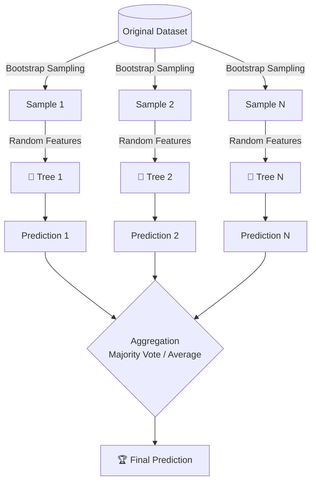

# 🌲 Random Forest

> **Prerequisites**: Bagging, Decision Trees | **Difficulty**: ⭐⭐☆☆☆ Intermediate

---

## 📋 Table of Contents
1. [Random Forests vs Bagged Trees](#1-random-forests-vs-bagged-trees)
2. [Mathematics: De-correlating Trees](#2-mathematics-de-correlating-trees)
3. [Feature Importance (MDI vs Permutation)](#3-feature-importance-mdi-vs-permutation)
4. [Implementation from Scratch](#4-implementation-from-scratch)
5. [scikit-learn Implementation & Hyperparameter Tuning](#5-scikit-learn-implementation--hyperparameter-tuning)

---

## 1. Random Forests vs Bagged Trees

### 🟢 Beginner
**Simple Explanation**: A Random Forest is a forest of Decision Trees. But instead of letting every tree look at all the features (like age, income, city), it forces each tree to only look at a *random subset* of features. This ensures the trees are very different from each other.

### 🟡 Intermediate
**Working Mechanism**: 
Extends bagging by adding **Feature Randomness**. When splitting a node in a tree, the split is chosen from a random subset of $m$ features (typically $m = \sqrt{p}$ for classification, and $m = p/3$ for regression, where $p$ is the total number of features).



---

## 2. Mathematics: De-correlating Trees

### 🔴 Advanced
Recall that the variance of the average of $B$ bagged trees (each with variance $\sigma^2$ and pairwise correlation $\rho$) is:

$$\text{Var}_{bagging} = \rho\sigma^2 + \frac{1-\rho}{B}\sigma^2$$

As $B \to \infty$, the variance approaches $\rho\sigma^2$. To minimize the variance of our forest, we must reduce the correlation $\rho$ between the trees. By restricting the features available for split selection at each node, Random Forest forces trees to look at different features, reducing their pairwise correlation $\rho$ significantly!

---

## 3. Feature Importance (MDI vs Permutation)

### 3.1 Mean Decrease in Impurity (MDI)
For each feature, we sum up the impurity decrease it provides across all trees:

$$\text{Importance}(f) = \frac{1}{B}\sum_{b=1}^{B}\sum_{t \in T_b} \Delta I(t) \cdot \mathbb{1}[\text{feature at } t = f]$$

*Note: MDI tends to favor continuous features or categorical features with high cardinality.*

### 3.2 Permutation Importance
A more reliable method:
1. Compute the baseline score of the model on validation data.
2. Shuffle the values of feature $f$ to corrupt its relationship with the target.
3. Recompute the score.
4. The drop in score is the feature's importance.

```python
from sklearn.ensemble import RandomForestClassifier
from sklearn.inspection import permutation_importance
from sklearn.datasets import load_breast_cancer
from sklearn.model_selection import train_test_split
import matplotlib.pyplot as plt
import numpy as np

data = load_breast_cancer()
X_train, X_test, y_train, y_test = train_test_split(data.data, data.target, test_size=0.2, random_state=42)

rf = RandomForestClassifier(n_estimators=100, random_state=42)
rf.fit(X_train, y_train)

# MDI importance
mdi_importance = rf.feature_importances_

# Permutation importance
perm_importance = permutation_importance(rf, X_test, y_test, n_repeats=10, random_state=42)
```

---

## 4. Implementation from Scratch

Here is a simple implementation of a Random Forest from scratch using NumPy:

```python
import numpy as np
from collections import Counter

class SimpleDecisionTree:
    def __init__(self, max_depth=10, max_features=None):
        self.max_depth = max_depth
        self.max_features = max_features
        self.tree = None
    
    def _gini(self, y):
        counts = np.bincount(y)
        probs = counts / len(y)
        return 1 - np.sum(probs ** 2)
    
    def _best_split(self, X, y):
        n_features = X.shape[1]
        if self.max_features:
            feature_indices = np.random.choice(n_features, self.max_features, replace=False)
        else:
            feature_indices = range(n_features)
        
        best_gain, best_feat, best_thresh = -1, None, None
        parent_gini = self._gini(y)
        
        for feat in feature_indices:
            thresholds = np.unique(X[:, feat])
            for thresh in thresholds:
                left = y[X[:, feat] <= thresh]
                right = y[X[:, feat] > thresh]
                if len(left) == 0 or len(right) == 0:
                    continue
                gain = parent_gini - (len(left)/len(y)*self._gini(left) + len(right)/len(y)*self._gini(right))
                if gain > best_gain:
                    best_gain, best_feat, best_thresh = gain, feat, thresh
        
        return best_feat, best_thresh
    
    def _build(self, X, y, depth=0):
        if depth >= self.max_depth or len(np.unique(y)) == 1 or len(y) < 2:
            return Counter(y).most_common(1)[0][0]
        
        feat, thresh = self._best_split(X, y)
        if feat is None:
            return Counter(y).most_common(1)[0][0]
        
        left = X[:, feat] <= thresh
        return {
            'feature': feat, 'threshold': thresh,
            'left': self._build(X[left], y[left], depth+1),
            'right': self._build(X[~left], y[~left], depth+1)
        }
    
    def fit(self, X, y):
        self.tree = self._build(X, y)
        return self
    
    def _predict_one(self, x, node):
        if not isinstance(node, dict):
            return node
        if x[node['feature']] <= node['threshold']:
            return self._predict_one(x, node['left'])
        return self._predict_one(x, node['right'])
    
    def predict(self, X):
        return np.array([self._predict_one(x, self.tree) for x in X])


class RandomForestFromScratch:
    def __init__(self, n_estimators=10, max_depth=10, max_features='sqrt'):
        self.n_estimators = n_estimators
        self.max_depth = max_depth
        self.max_features = max_features
        self.trees = []
    
    def fit(self, X, y):
        n_samples, n_features = X.shape
        if self.max_features == 'sqrt':
            max_feat = int(np.sqrt(n_features))
        else:
            max_feat = n_features
        
        self.trees = []
        for _ in range(self.n_estimators):
            indices = np.random.choice(n_samples, n_samples, replace=True)
            X_boot, y_boot = X[indices], y[indices]
            
            tree = SimpleDecisionTree(max_depth=self.max_depth, max_features=max_feat)
            tree.fit(X_boot, y_boot)
            self.trees.append(tree)
        return self
    
    def predict(self, X):
        predictions = np.array([tree.predict(X) for tree in self.trees])
        return np.array([Counter(predictions[:, i]).most_common(1)[0][0] 
                         for i in range(X.shape[0])])
```

---

## 5. scikit-learn Implementation & Hyperparameter Tuning

```python
from sklearn.ensemble import RandomForestClassifier
from sklearn.model_selection import RandomizedSearchCV
from scipy.stats import randint

rf = RandomForestClassifier(
    n_estimators=100,
    max_depth=None,
    max_features='sqrt',
    bootstrap=True,
    oob_score=True,
    n_jobs=-1,
    random_state=42
)
rf.fit(X_train, y_train)

# Hyperparameter search space
param_distributions = {
    'n_estimators': randint(50, 500),
    'max_depth': [None, 5, 10, 20, 30],
    'max_features': ['sqrt', 'log2', 0.3, 0.5],
    'min_samples_split': randint(2, 20),
    'min_samples_leaf': randint(1, 10)
}
```

---

[← Bagging](./02-Bagging.md) | [Back to Index](../README.md) | [Next: Extra Trees →](./04-Extra-Trees.md)
