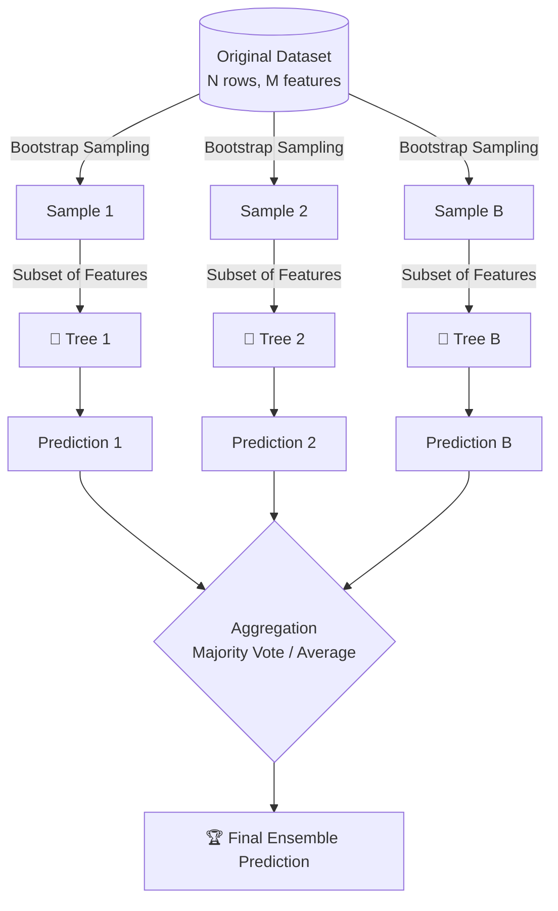

# 🌲 Random Forest

> **Difficulty**: ⭐⭐☆☆☆ Intermediate | **Prerequisites**: Decision Trees, Bagging | **Estimated Reading Time**: 25 Minutes

---

## 📋 Table of Contents
1. [What Problem Does This Solve?](#1-what-problem-does-this-solve)
2. [Intuition](#2-intuition)
3. [Core Mathematics](#3-core-mathematics)
4. [Visual Explanation](#4-visual-explanation)
5. [Algorithm Workflow](#5-algorithm-workflow)
6. [From Scratch Implementation](#6-from-scratch-implementation)
7. [NumPy Implementation](#7-numpy-implementation)
8. [Scikit-Learn Implementation](#8-scikit-learn-implementation)
9. [Hyperparameter Deep Dive](#9-hyperparameter-deep-dive)
10. [Visualization Lab](#10-visualization-lab)
11. [Failure Cases](#11-failure-cases)
12. [Industry Applications](#12-industry-applications)
13. [Interview Preparation](#13-interview-preparation)
14. [Hands-On Exercises](#14-hands-on-exercises)
15. [Further Reading](#15-further-reading)

---

## 1. What Problem Does This Solve?

Decision Trees are fantastic, but they suffer from one massive flaw: **Overfitting**. A deep decision tree will memorize the training data, leading to high variance and poor performance on unseen data.

Random Forest solves this by combining the predictions of hundreds of different, slightly randomized decision trees into one ultimate prediction. 

**Use Cases:**
- Fraud detection in banking
- Churn prediction in SaaS
- Medical diagnosis

**When NOT to use:**
- Extremely sparse data (e.g., text data with TF-IDF), where linear models or Neural Networks perform better.
- Applications requiring extreme interpretability (a single tree is easier to explain than 500 trees).

---

## 2. Intuition

### 🟢 Beginner
Imagine you have to guess how many jelly beans are in a jar. If you guess alone, you might be wildly off. But if you ask 100 people and take the average of their guesses, the final answer will be surprisingly accurate. Random Forest applies the "Wisdom of the Crowds" to Machine Learning. 

### 🟡 Intermediate
Random Forest is a **Bagging (Bootstrap Aggregating)** ensemble method. It trains many decision trees independently. 
To ensure the trees don't all learn the exact same rules, Random Forest introduces two layers of randomness:
1. **Bootstrapping**: Each tree is trained on a random sample of the data (with replacement).
2. **Feature Randomness**: At each split in the tree, only a random subset of features is considered.

### 🔴 Advanced
By decorrelating the individual trees through feature sub-sampling, Random Forest effectively reduces the variance of the final prediction without significantly increasing bias. The variance of the average of $B$ bagged trees (each with variance $\sigma^2$ and pairwise correlation $\rho$) is:
$$\text{Var} \approx \rho\sigma^2 + \frac{1-\rho}{B}\sigma^2$$
Feature randomness reduces $\rho$, which pulls down the overall variance dramatically.

---

## 3. Core Mathematics

### Variance Reduction
The core mathematical driver of Random Forest is the reduction in variance. 

### Splitting Criteria (Gini Impurity)
Even inside a Random Forest, individual trees must decide how to split. For classification, the standard metric is Gini Impurity:
$$ Gini = 1 - \sum_{i=1}^{C} (p_i)^2 $$
Where $p_i$ is the probability of an item belonging to class $i$.

### Out-Of-Bag (OOB) Error
Because each tree uses a bootstrapped sample, roughly 36.8% of the data is left out for each tree. This "Out-Of-Bag" data acts as a free, built-in validation set, allowing us to estimate the model's test error without needing a separate validation split.

---

## 4. Visual Explanation



---

## 5. Algorithm Workflow

**Training:**
1. Given a dataset with $N$ rows and $M$ features, specify $B$ (number of trees).
2. For $b = 1$ to $B$:
   - Sample $N$ rows with replacement (Bootstrap).
   - Grow a decision tree on this sample.
   - At every node split, randomly select $m \approx \sqrt{M}$ features and find the best split only among them.
   - Grow the tree to maximum depth (no pruning).

**Prediction:**
1. Pass the test instance down all $B$ trees.
2. Classification: Take the majority vote. Regression: Take the mean of predictions.

---

## 6. From Scratch Implementation

*Educational Python implementation highlighting the logic.*

```python
import numpy as np
from collections import Counter

class RandomForestScratch:
    def __init__(self, n_estimators=10, max_features='sqrt'):
        self.n_estimators = n_estimators
        self.max_features = max_features
        self.trees = []
    
    def fit(self, X, y):
        n_samples, n_features = X.shape
        if self.max_features == 'sqrt':
            max_feat = int(np.sqrt(n_features))
        else:
            max_feat = n_features
            
        self.trees = []
        for _ in range(self.n_estimators):
            # 1. Bootstrapping
            indices = np.random.choice(n_samples, n_samples, replace=True)
            X_boot, y_boot = X[indices], y[indices]
            
            # 2. Train Tree (Pseudo-code for Tree builder)
            # tree = DecisionTree(max_features=max_feat)
            # tree.fit(X_boot, y_boot)
            # self.trees.append(tree)
        return self

    def predict(self, X):
        # Aggregate predictions (Majority Vote)
        # tree_preds = np.array([tree.predict(X) for tree in self.trees])
        # return mode(tree_preds, axis=0)
        pass
```

---

## 7. NumPy Implementation

Vectorized feature selection during tree building:

```python
# During the node split evaluation:
feature_indices = np.random.choice(total_features, max_feat_subset, replace=False)
best_gain = 0
for feat in feature_indices:
    # Compute Gini/Entropy gain purely on this subset of features
    pass
```

---

## 8. Scikit-Learn Implementation

The industry standard workflow.

```python
from sklearn.ensemble import RandomForestClassifier
from sklearn.model_selection import train_test_split
from sklearn.metrics import accuracy_score

# 1. Split Data
X_train, X_test, y_train, y_test = train_test_split(X, y, test_size=0.2)

# 2. Initialize Model
rf = RandomForestClassifier(
    n_estimators=100,
    max_depth=None,
    n_jobs=-1,        # Use all CPU cores
    oob_score=True,   # Track OOB error
    random_state=42
)

# 3. Train
rf.fit(X_train, y_train)

# 4. Predict & Evaluate
preds = rf.predict(X_test)
print(f"Accuracy: {accuracy_score(y_test, preds):.4f}")
print(f"OOB Score: {rf.oob_score_:.4f}")
```

---

## 9. Hyperparameter Deep Dive

- **`n_estimators`**: Number of trees. More is usually better, but returns diminish. (Start: 100-500)
- **`max_depth`**: Maximum depth of each tree. Leave as `None` usually, but limit it if overfitting heavily.
- **`max_features`**: Features considered at each split.
  - Classification default: `sqrt(n_features)`
  - Regression default: `1.0` (all features, though `0.3` is often better)
- **`min_samples_split`**: Minimum samples required to split an internal node. Increase to prevent overfitting.
- **`n_jobs`**: ALWAYS set to `-1` to train trees in parallel across CPU cores.

---

## 10. Visualization Lab

Runnable snippet to visualize Feature Importances:

```python
import pandas as pd
import matplotlib.pyplot as plt
import seaborn as sns

# Assuming 'rf' is trained and 'feature_names' exists
importances = rf.feature_importances_
df_imp = pd.DataFrame({'Feature': feature_names, 'Importance': importances})
df_imp = df_imp.sort_values(by='Importance', ascending=False)

plt.figure(figsize=(10, 6))
sns.barplot(x='Importance', y='Feature', data=df_imp, palette='viridis')
plt.title('Random Forest Feature Importance (MDI)')
plt.tight_layout()
plt.show()
```

---

## 11. Failure Cases

**The Danger of Correlated Features**
If two features A and B are identical, Random Forest will split its importance randomly between them. This dilutes the perceived importance of both features, misleading the Data Scientist. 

*Fix:* Use Permutation Importance instead of Mean Decrease in Impurity (MDI) for feature ranking.

**Extrapolation Failures**
Random Forest is a set of step-functions. It **cannot extrapolate** beyond the bounds of its training data. If you train it on house sizes from 1,000 to 3,000 sq ft, and ask it to predict the price for a 10,000 sq ft mansion, it will just output the price of the 3,000 sq ft house.

---

## 12. Industry Applications

- **Credit Scoring**: High interpretability via feature importance combined with excellent default resistance to outliers.
- **E-Commerce**: Product recommendation engines and customer segmentation based on purchase behavior.

---

## 13. Interview Preparation

### Beginner
**Q: Why is it called a "Random" Forest?**
> A: Because it introduces randomness in two places: bootstrapping the data rows, and randomly subsampling the features at each node split.

### Intermediate
**Q: Does increasing `n_estimators` cause overfitting?**
> A: No. Adding more trees simply averages out the variance. However, adding more trees takes more memory and computational time with diminishing returns.

### Advanced
**Q: How does Random Forest calculate Feature Importance (MDI)?**
> A: It calculates the total decrease in node impurity (e.g., Gini impurity) weighted by the probability of reaching that node (proportional to sample size at that node), averaged over all trees.

---

## 14. Hands-On Exercises

**Easy**: Train a Random Forest on the Titanic dataset and output the OOB score.
**Medium**: Plot the `validation curve` showing how `max_depth` affects training vs testing accuracy.
**Hard**: Implement permutation importance manually and compare the top features to the built-in `feature_importances_` attribute.

---

## 15. Further Reading

- *Hands-On Machine Learning* - Chapter 7 (Ensemble Learning and Random Forests)
- *Elements of Statistical Learning* - Chapter 15 (Random Forests)
- Scikit-Learn Documentation: `sklearn.ensemble.RandomForestClassifier`

---

[← Bagging](02-Bagging.md) | [Return to Ensemble Index](../README.md) | [Next: Extra Trees →](04-Extra-Trees.md)
