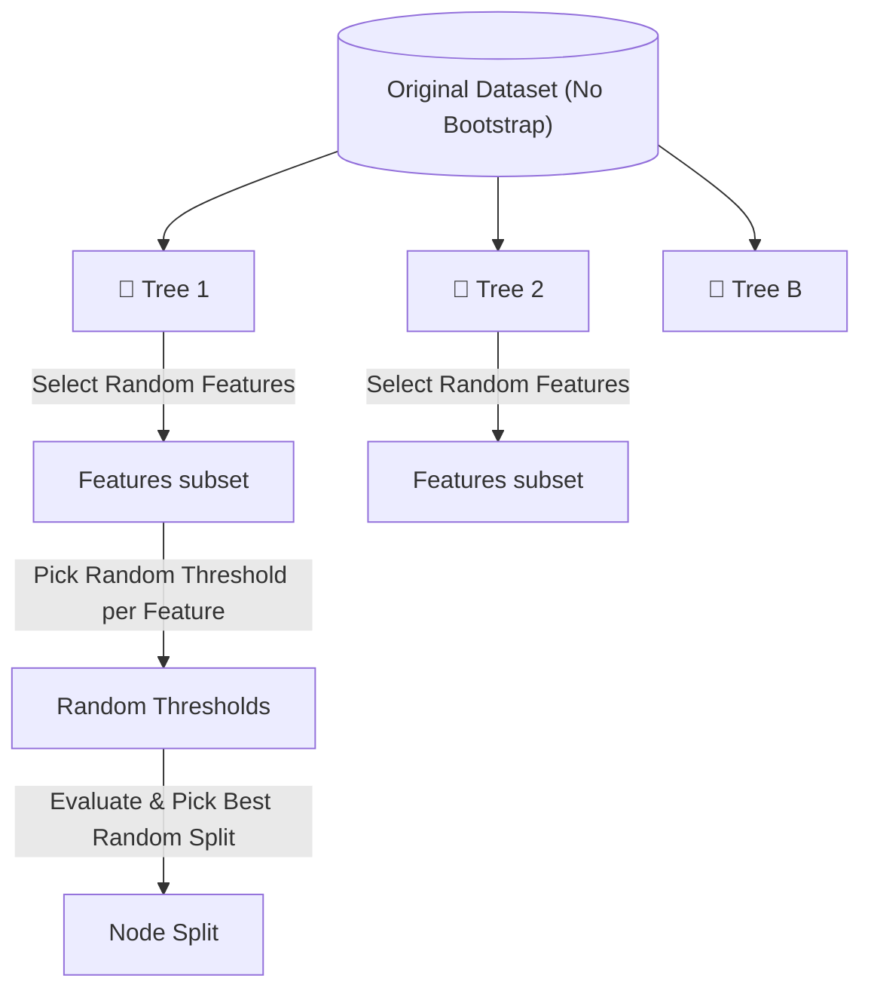

# 🌳 Extra Trees (Extremely Randomized Trees)

> **Difficulty**: ⭐⭐☆☆☆ Intermediate | **Prerequisites**: Random Forest, Decision Trees | **Estimated Reading Time**: 15 Minutes

---

## 📋 Table of Contents
1. [What Problem Does This Solve?](#1-what-problem-does-this-solve)
2. [Intuition](#2-intuition)
3. [Core Mathematics](#3-core-mathematics)
4. [Visual Explanation](#4-visual-explanation)
5. [Algorithm Workflow](#5-algorithm-workflow)
6. [Scikit-Learn Implementation](#6-scikit-learn-implementation)
7. [Hyperparameter Deep Dive](#7-hyperparameter-deep-dive)
8. [Failure Cases](#8-failure-cases)
9. [Industry Applications](#9-industry-applications)

---

## 1. What Problem Does This Solve?

Random Forests reduce variance by bagging and feature sub-sampling. However, finding the absolute *best* split threshold for every feature at every node is highly computationally expensive.

**Extra Trees (Extremely Randomized Trees)** solves two problems simultaneously:
1. **Computational Cost**: It drastically speeds up training by picking random thresholds instead of searching for the optimal one.
2. **Variance Reduction**: The extreme randomness acts as an additional regularizer, often yielding even lower variance (and slightly higher bias) than a Random Forest.

**Use Cases:**
- Real-time or highly time-sensitive model training.
- Datasets where Random Forest slightly overfits.
- Noisy data where strict decision boundaries are detrimental.

---

## 2. Intuition

### 🟢 Beginner
If a Random Forest is a group of experts where each only looks at a few clues to make a guess, an Extra Trees ensemble is a group of experts who look at a few clues and then just pick a *completely random dividing line* for that clue! Amazingly, because there are so many of them, their random mistakes cancel out, and they often perform just as well as the careful experts, but finish their work ten times faster!

### 🟡 Intermediate
In standard Decision Trees and Random Forests, the algorithm calculates the Gini/Entropy gain for *every possible threshold* of a continuous feature to find the best split. 
In Extra Trees, the algorithm selects a single random threshold for each chosen feature, calculates the Gini/Entropy gain for those random splits, and picks the best of those random options.

### 🔴 Advanced
Extra Trees abandons **Bootstrapping** by default. It uses the entire original dataset to train each tree. The diversity among trees is driven entirely by the random feature selection and the random threshold selection. Because it doesn't bootstrap, the trees are trained faster (no need to sample), and it leverages the full dataset.

---

## 3. Core Mathematics

### Random Threshold Generation
For a selected feature $j$, its values range between $x_{min}^j$ and $x_{max}^j$. 
Instead of testing all unique values of $x^j$, Extra Trees draws a threshold $t$ from a uniform distribution:
$$ t \sim \text{Uniform}(x_{min}^j, x_{max}^j) $$

The split $S$ is then defined as:
$$ S_{left} = \{ x | x^j \le t \} $$
$$ S_{right} = \{ x | x^j > t \} $$

This makes the computational complexity of finding a split $O(1)$ per feature, rather than $O(N \log N)$ (since sorting is no longer required).

---

## 4. Visual Explanation



---

## 5. Algorithm Workflow

1. Use the full original dataset (no bootstrapping by default).
2. At each node:
   - Randomly select a subset of $K$ features.
   - For each of those $K$ features, pick a single random threshold between its min and max values.
   - Evaluate the Gini/Entropy gain of those $K$ random splits.
   - Choose the split with the highest gain.
3. Repeat until leaves are pure or `max_depth` is reached.

---

## 6. Scikit-Learn Implementation

```python
from sklearn.ensemble import ExtraTreesClassifier
from sklearn.model_selection import cross_val_score

et = ExtraTreesClassifier(
    n_estimators=100,
    max_features='sqrt',
    bootstrap=False,     # Default is False for Extra Trees!
    n_jobs=-1,
    random_state=42
)

scores = cross_val_score(et, X, y, cv=5, scoring='accuracy')
print(f"Mean Accuracy: {scores.mean():.4f}")
```

---

## 7. Hyperparameter Deep Dive

- **`bootstrap`**: By default `False`. If set to `True`, it behaves closer to a Random Forest but with random splits.
- **`max_features`**: Controls variance. Lower values = more variance reduction.
- **`min_samples_leaf`**: Because thresholds are random, trees can get extremely deep. Increasing this slightly (e.g., to 2 or 5) can smooth decision boundaries.

---

## 8. Failure Cases

**High Bias Scenarios:**
Because Extra Trees adds so much randomization, it increases bias. If you have an extremely complex deterministic relationship with very little noise, the random thresholds might fail to capture the precise, sharp boundaries needed, leading to underfitting compared to a heavily tuned XGBoost model.

---

## 9. Industry Applications

- **Insurance Claim Prediction**: Works well on extremely noisy, tabular data with lots of features where strict splits lead to overfitting.
- **Image Pixel Classification**: Used heavily in early computer vision (e.g., Microsoft Kinect body tracking) because of its blazing fast evaluation speed compared to Random Forest.

---

[← Random Forest](03-Random-Forest.md) | [Return to Ensemble Index](../README.md) | [Next: AdaBoost →](07-AdaBoost.md)
