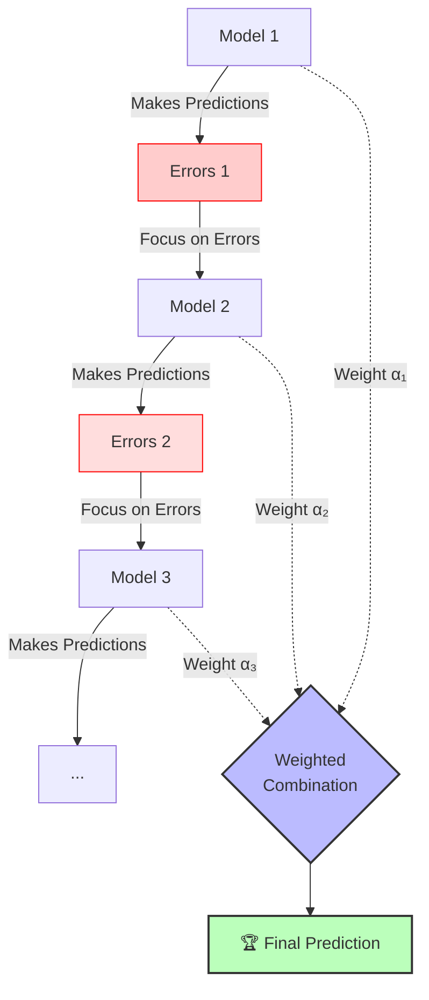

# 🚀 Introduction to Boosting

> **Difficulty**: ⭐⭐☆☆☆ Intermediate | **Prerequisites**: Bagging

---

## 📋 Table of Contents
1. [What Problem Does This Solve?](#1-what-problem-does-this-solve)
2. [Intuition](#2-intuition)
3. [Core Mathematics](#3-core-mathematics)
4. [Visual Explanation](#4-visual-explanation)
5. [Bagging vs Boosting](#5-bagging-vs-boosting)

---

## 1. What Problem Does This Solve?

### 🟢 Beginner
Bagging techniques (like Random Forest) are excellent at reducing variance (preventing overfitting) by averaging many strong, independent models. But what if your model suffers from high bias (underfitting)? It just can't seem to learn the complex patterns in the data. Boosting solves this by aggressively attacking the bias. 

### 🟡 Intermediate
Boosting algorithms train models sequentially. Each new model (typically a shallow, weak decision tree) is trained specifically to predict the instances that were poorly predicted by the predecessor models. It forces the ensemble to focus on the hardest parts of the dataset.

### 🔴 Advanced
Boosting mathematically converts a family of "weak learners" (models that perform only slightly better than random chance) into a single "strong learner". It achieves this by iteratively minimizing a loss function, effectively performing gradient descent in function space.

---

## 2. Intuition

Unlike Bagging (where multiple models are trained independently in parallel), Boosting is like a student learning step-by-step. The student takes a practice test, checks their errors, and then studies *only* those specific wrong answers. On the next practice test, they build on what they already know but focus strictly on correcting their past mistakes. 

---

## 3. Core Mathematics

At each step, we update the ensemble model:

$$ F_m(x) = F_{m-1}(x) + \nu h_m(x) $$

where:
- $F_{m-1}(x)$ is the ensemble prediction from the previous step.
- $h_m(x)$ is the new weak learner trained in step $m$.
- $\nu$ is the learning rate (or shrinkage factor), controlling the contribution of each model.

Boosting can be seen as performing gradient descent in function space. The goal is to find a function $F(x)$ that minimizes the empirical risk:

$$ \min_{F} \sum_{i=1}^{n} L(y_i, F(x_i)) $$

We iteratively add a new weak learner $h_m$ that points in the direction of the negative gradient of the loss function.

---

## 4. Visual Explanation

---

## 5. Bagging vs Boosting

| Feature | Bagging (e.g. Random Forest) | Boosting (e.g. XGBoost) |
| :--- | :--- | :--- |
| **Training Style** | Parallel (independent models) | Sequential (dependent models) |
| **Main Objective** | Reduces **Variance** | Reduces **Bias** |
| **Base Estimator** | Deep, unpruned trees (low bias, high var) | Shallow trees/stumps (high bias, low var) |
| **Overfitting Risk** | Low (adding trees does not overfit) | High (requires early stopping & tuning) |
| **Inference Speed** | Very fast (can be parallelized) | Slower (must run sequentially) |

---

[← Voting Classifiers](05-Voting-Classifiers.md) | [Back to Index](../README.md) | [Next: AdaBoost (Adaptive Boosting) →](07-AdaBoost.md)
