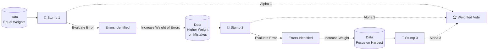

# 🚀 AdaBoost (Adaptive Boosting)

> **Difficulty**: ⭐⭐⭐☆☆ Advanced | **Prerequisites**: Decision Stumps, Boosting Intuition | **Estimated Reading Time**: 20 Minutes

---

## 📋 Table of Contents
1. [What Problem Does This Solve?](#1-what-problem-does-this-solve)
2. [Intuition](#2-intuition)
3. [Core Mathematics](#3-core-mathematics)
4. [Visual Explanation](#4-visual-explanation)
5. [Algorithm Workflow](#5-algorithm-workflow)
6. [From Scratch Implementation](#6-from-scratch-implementation)
7. [NumPy Implementation](#7-numpy-implementation)
8. [Scikit-Learn Implementation](#8-scikit-learn-implementation)
9. [Hyperparameter Deep Dive](#9-hyperparameter-deep-dive)
10. [Visualization Lab](#10-visualization-lab)
11. [Failure Cases](#11-failure-cases)
12. [Industry Applications](#12-industry-applications)
13. [Interview Preparation](#13-interview-preparation)
14. [Hands-On Exercises](#14-hands-on-exercises)
15. [Further Reading](#15-further-reading)

---

## 1. What Problem Does This Solve?

Bagging methods (Random Forest, Extra Trees) rely on independent, strong models (deep trees) to reduce variance. 
**Boosting** takes the opposite approach: it uses a sequence of **weak learners** (models that are only slightly better than random guessing) and forces them to work together to create one incredibly strong model, dramatically reducing **bias**.

AdaBoost was the first highly successful Boosting algorithm. It solves the problem of high bias models underfitting complex data.

**Use Cases:**
- Binary classification problems.
- Face detection (Viola-Jones algorithm).
- Tabular data where you only want to use shallow trees (stumps).

---

## 2. Intuition

### 🟢 Beginner
Imagine you are studying for a difficult exam with a group of friends. 
- Friend 1 takes a practice test and fails questions about History. 
- Because Friend 1 failed History, Friend 2 decides to *study History twice as hard* before taking the test. 
- Friend 2 passes History, but fails Science. 
- Friend 3 now studies Science incredibly hard.
By the end, you combine all your friends' answers, giving more weight to the friends who scored the highest overall. This sequential learning from mistakes is AdaBoost.

### 🟡 Intermediate
AdaBoost uses **Decision Stumps** (a decision tree with a depth of exactly 1). 
After the first stump makes predictions, AdaBoost looks at which data points it misclassified. It then mathematically increases the "weight" (importance) of those specific data points. The next stump is forced to focus specifically on those high-weight, difficult points.

### 🔴 Advanced
AdaBoost is technically performing Forward Stagewise Additive Modeling using an Exponential Loss function. It iteratively builds an ensemble by adding classifiers one at a time, calculating the optimal weight for the new classifier, and updating the sample distribution to aggressively penalize misclassifications.

---

## 3. Core Mathematics

### 3.1 Sample Weights
Initially, all $N$ data points have a weight of $w_i = \frac{1}{N}$.

### 3.2 Classifier Error
For a weak classifier $m$, its weighted error rate is:
$$ \epsilon_m = \frac{\sum_{i=1}^N w_i \cdot I(y_i \neq \hat{y}_i)}{\sum_{i=1}^N w_i} $$

### 3.3 Classifier Weight (Amount of Say)
The weight (voting power) given to classifier $m$ in the final ensemble is $\alpha_m$:
$$ \alpha_m = \frac{1}{2} \ln \left( \frac{1 - \epsilon_m}{\epsilon_m} \right) $$
*If the error is 0, $\alpha \to \infty$. If the error is 0.5 (random guess), $\alpha = 0$.*

### 3.4 Weight Update
The weights of the training samples are updated for the next round:
$$ w_i^{(m+1)} = w_i^{(m)} \cdot e^{\alpha_m \cdot I(y_i \neq \hat{y}_i)} $$
If the prediction was wrong, we multiply the weight by $e^{\alpha_m}$ (which is $> 1$, increasing the weight). If correct, the weight decreases relative to the rest.

---

## 4. Visual Explanation



---

## 5. Algorithm Workflow

1. Initialize sample weights $w_i = 1/N$.
2. For $m = 1$ to $M$ (number of stumps):
   - Train a weak learner on the data using weights $w_i$.
   - Calculate the weighted error $\epsilon_m$.
   - Calculate the learner's voting weight $\alpha_m$.
   - Update all sample weights $w_i$.
   - Normalize sample weights so they sum to 1.
3. Final Prediction: Output the sign of the sum of the weighted predictions: $\hat{y} = \text{sign}(\sum_{m=1}^M \alpha_m \hat{y}_m(x))$

---

## 6. From Scratch Implementation

```python
import numpy as np

class DecisionStump:
    def __init__(self):
        self.polarity = 1
        self.feature_idx = None
        self.threshold = None
        self.alpha = None

    def predict(self, X):
        n_samples = X.shape[0]
        X_column = X[:, self.feature_idx]
        predictions = np.ones(n_samples)
        
        if self.polarity == 1:
            predictions[X_column < self.threshold] = -1
        else:
            predictions[X_column > self.threshold] = -1
        return predictions

class AdaBoostScratch:
    def __init__(self, n_clf=50):
        self.n_clf = n_clf
        self.clfs = []
        
    def fit(self, X, y):
        n_samples, n_features = X.shape
        w = np.full(n_samples, (1 / n_samples)) # Initialize weights
        
        for _ in range(self.n_clf):
            clf = DecisionStump()
            min_error = float('inf')
            
            # Find best stump
            for feature_i in range(n_features):
                X_column = X[:, feature_i]
                thresholds = np.unique(X_column)
                for threshold in thresholds:
                    for p in [1, -1]:
                        predictions = np.ones(n_samples)
                        if p == 1:
                            predictions[X_column < threshold] = -1
                        else:
                            predictions[X_column > threshold] = -1

                        error = sum(w[y != predictions])
                        
                        if error < min_error:
                            min_error = error
                            clf.polarity = p
                            clf.threshold = threshold
                            clf.feature_idx = feature_i
                            
            # Calculate Alpha
            EPS = 1e-10 # prevent division by zero
            clf.alpha = 0.5 * np.log((1.0 - min_error + EPS) / (min_error + EPS))
            
            # Update weights
            predictions = clf.predict(X)
            w *= np.exp(-clf.alpha * y * predictions)
            w /= np.sum(w) # Normalize
            
            self.clfs.append(clf)

    def predict(self, X):
        clf_preds = [clf.alpha * clf.predict(X) for clf in self.clfs]
        y_pred = np.sum(clf_preds, axis=0)
        return np.sign(y_pred)
```

---

## 7. NumPy Implementation

*(See section 6 for the full NumPy array vectorized implementation of AdaBoost).*

---

## 8. Scikit-Learn Implementation

```python
from sklearn.ensemble import AdaBoostClassifier
from sklearn.tree import DecisionTreeClassifier

# AdaBoost defaults to using a Decision Tree with max_depth=1 (A Stump)
ada = AdaBoostClassifier(
    estimator=DecisionTreeClassifier(max_depth=1),
    n_estimators=100,
    learning_rate=1.0,
    random_state=42
)

ada.fit(X_train, y_train)
preds = ada.predict(X_test)
```

---

## 9. Hyperparameter Deep Dive

- **`n_estimators`**: The maximum number of estimators to train. Unlike Random Forest, increasing this too high *can* lead to overfitting (though AdaBoost is surprisingly robust to it).
- **`learning_rate`**: Shrinks the contribution of each classifier by `learning_rate`. There is a strong trade-off between `learning_rate` and `n_estimators`. A lower learning rate requires more estimators.
- **`estimator`**: You can theoretically boost any model (e.g., Logistic Regression), but Decision Stumps are the gold standard because they are fast and strictly weak.

---

## 10. Visualization Lab

*Visualizing how AdaBoost constructs a complex boundary from simple horizontal and vertical lines.*

```python
from sklearn.datasets import make_circles
import matplotlib.pyplot as plt
from sklearn.ensemble import AdaBoostClassifier
from mlxtend.plotting import plot_decision_regions

X, y = make_circles(n_samples=300, noise=0.15, factor=0.5, random_state=42)

ada = AdaBoostClassifier(n_estimators=50, random_state=42).fit(X, y)

plt.figure(figsize=(8, 6))
plot_decision_regions(X, y, clf=ada)
plt.title("AdaBoost Decision Boundary on Non-Linear Data")
plt.show()
```

---

## 11. Failure Cases

**Extreme Sensitivity to Outliers**
Because AdaBoost aggressively increases the weight of misclassified points, a single noisy outlier (a mislabeled point) will cause AdaBoost to become obsessed with it. It will pour all its energy into trying to classify that one outlier correctly, ruining the decision boundary for everything else.

*Fix:* If your data is highly noisy, Gradient Boosting or XGBoost are far superior to AdaBoost.

---

## 12. Industry Applications

- **Viola-Jones Object Detection**: For over a decade, digital cameras used AdaBoost combined with Haar cascades to detect human faces in real-time.
- **Customer Churn**: Excellent for tabular data classification where finding the specific boundary between leaving and staying is critical.

---

## 13. Interview Preparation

### Beginner
**Q: What is a Decision Stump?**
> A: A decision tree with only one split (max depth of 1). It looks at exactly one feature to make a decision.

### Intermediate
**Q: How does AdaBoost decide how much "vote" a weak learner gets?**
> A: Based on its weighted error rate. A classifier with 0% error gets infinite weight. A classifier with 50% error (guessing) gets 0 weight.

### Advanced
**Q: Does AdaBoost minimize an objective function like Neural Networks?**
> A: Yes! It can be mathematically shown that AdaBoost is performing stage-wise optimization minimizing the **Exponential Loss** function.

---

## 14. Hands-On Exercises

**Easy**: Train an `AdaBoostClassifier` on a dataset. Print out the `estimator_weights_` attribute. Notice how earlier trees generally have higher weights.
**Medium**: Test the robustness to outliers. Add 5 completely mislabeled outlier points to a dataset and plot the AdaBoost decision boundary. Watch it distort.
**Hard**: Change the base estimator from a Decision Stump to a Logistic Regression model. Compare the performance.

---

## 15. Further Reading

- *A Short Introduction to Boosting* - Yoav Freund and Robert Schapire (The creators of AdaBoost).
- Scikit-Learn Documentation: `sklearn.ensemble.AdaBoostClassifier`

---

[← Extra Trees](04-Extra-Trees.md) | [Return to Ensemble Index](../README.md) | [Next: Gradient Boosting →](08-Gradient-Boosting.md)
