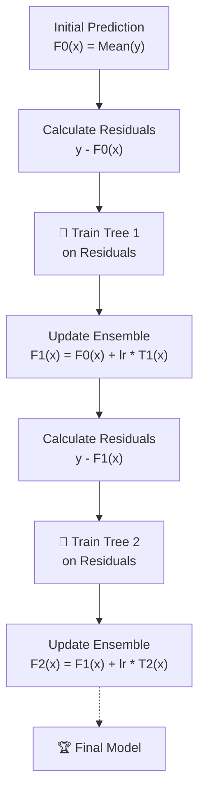

# 📉 Gradient Boosting

> **Difficulty**: ⭐⭐⭐⭐☆ Advanced | **Prerequisites**: AdaBoost, Calculus (Gradients) | **Estimated Reading Time**: 25 Minutes

---

## 📋 Table of Contents
1. [What Problem Does This Solve?](#1-what-problem-does-this-solve)
2. [Intuition](#2-intuition)
3. [Core Mathematics](#3-core-mathematics)
4. [Visual Explanation](#4-visual-explanation)
5. [Algorithm Workflow](#5-algorithm-workflow)
6. [Scikit-Learn Implementation](#6-scikit-learn-implementation)
7. [Hyperparameter Deep Dive](#7-hyperparameter-deep-dive)
8. [Failure Cases](#8-failure-cases)
9. [Industry Applications](#9-industry-applications)

---

## 1. What Problem Does This Solve?

AdaBoost is great, but it has a fundamental flaw: it is completely rigid. It only minimizes the Exponential Loss function, which makes it extremely sensitive to outliers. 

**Gradient Boosting** solves this by generalizing the boosting process. It allows you to optimize **any differentiable loss function** (MSE, Log-Loss, Huber, etc.). It shifted boosting from a specific algorithmic trick into a universal optimization framework.

**Use Cases:**
- The foundation for all modern, Kaggle-winning tabular data models (XGBoost, LightGBM, CatBoost).
- Regression tasks with complex noise (using robust loss functions).
- Web Search Ranking (Learning to Rank).

---

## 2. Intuition

### 🟢 Beginner
Instead of punishing the data points that we got wrong (like AdaBoost), Gradient Boosting trains a new model to predict the **mistakes** (the residuals) of the previous model.
If the real price is \$100, and Model 1 predicts \$80, the mistake is +\$20. 
Model 2 is then trained, not to predict the price, but to output exactly "+$20". If Model 2 predicts +\$15, the remaining mistake is +\$5. Model 3 is trained to predict +\$5. 
You sum them all up: $80 + 15 + 5 = 100$.

### 🟡 Intermediate
Gradient Boosting builds an ensemble of shallow trees (usually depth 3 to 8). Each tree is fit to the **residuals** of the ensemble so far. To prevent the model from immediately overfitting the residuals, we scale the contribution of each tree by a `learning_rate` (e.g., 0.1). This forces the algorithm to take many tiny steps toward the truth.

### 🔴 Advanced
Why is it called *Gradient* Boosting? Because the residuals we are fitting are actually the **negative gradients** of the Mean Squared Error loss function! 
By training a tree on the residuals, the tree is essentially a mathematical vector pointing in the direction of steepest descent. Adding that tree to our ensemble is performing **Gradient Descent in Function Space**.

---

## 3. Core Mathematics

### 3.1 Initialization
Initialize the model with a constant value $F_0(x)$ that minimizes the initial loss. For MSE, this is simply the mean of the target $y$.
$$ F_0(x) = \frac{1}{N} \sum y_i $$

### 3.2 Pseudo-Residuals (Gradients)
For iteration $m$, calculate the pseudo-residuals $r_{im}$. This is the negative derivative of the Loss function $L$ with respect to the current model's predictions.
$$ r_{im} = - \left[ \frac{\partial L(y_i, F(x_i))}{\partial F(x_i)} \right]_{F(x) = F_{m-1}(x)} $$
*If the loss function is MSE $\frac{1}{2}(y-F(x))^2$, the derivative is just $(F(x) - y)$, so the negative gradient is exactly the residual $(y - F(x))$!*

### 3.3 Fit a Weak Learner
Train a decision tree $h_m(x)$ to predict the pseudo-residuals $r_{im}$.

### 3.4 Multiplier / Step Size
Find the optimal multiplier $\gamma_m$ (how far to step in that direction) to minimize the loss.
$$ \gamma_m = \arg\min_\gamma \sum_{i=1}^N L(y_i, F_{m-1}(x_i) + \gamma h_m(x_i)) $$

### 3.5 Update the Model
Update the ensemble with the scaled tree (using learning rate $\nu$):
$$ F_m(x) = F_{m-1}(x) + \nu \gamma_m h_m(x) $$

---

## 4. Visual Explanation



---

## 5. Algorithm Workflow

1. Calculate the average of the target. This is your initial prediction.
2. Calculate the difference between the true target and your prediction (the residual).
3. Train a small Decision Tree (e.g., depth 3) where the $X$ is your original features, but the $y$ is the **residuals**.
4. Multiply the new tree's predictions by a small learning rate (e.g., 0.1).
5. Add this scaled prediction to your previous overall prediction.
6. Repeat steps 2-5 for hundreds of iterations.

---

## 6. Scikit-Learn Implementation

```python
from sklearn.ensemble import GradientBoostingClassifier
from sklearn.metrics import log_loss

gb = GradientBoostingClassifier(
    n_estimators=200,
    learning_rate=0.1,
    max_depth=3,
    subsample=0.8,     # Introduces Stochastic Gradient Boosting (Bagging)
    random_state=42
)

gb.fit(X_train, y_train)
probs = gb.predict_proba(X_test)
print(f"Log Loss: {log_loss(y_test, probs):.4f}")
```

---

## 7. Hyperparameter Deep Dive

- **`learning_rate`**: The most critical parameter. Lower is better, but requires more `n_estimators`. (0.01 to 0.1 is standard).
- **`n_estimators`**: Number of trees. Must be tuned in tandem with `learning_rate` via Early Stopping to prevent overfitting.
- **`max_depth`**: Usually kept small (3 to 8). We want weak learners, not deep memorizers.
- **`subsample`**: The fraction of data to use for each tree. Setting this $< 1.0$ (e.g. 0.8) leads to **Stochastic Gradient Boosting**, which lowers variance and speeds up training.

---

## 8. Failure Cases

**Overfitting via Too Many Trees**
Unlike Random Forest, Gradient Boosting *will* overfit if you add too many trees. It will eventually start modeling the absolute pure noise in the dataset perfectly. 

*Fix:* You must use **Early Stopping**. Split a validation set, track the validation error as trees are added, and stop training the moment validation error starts rising.

---

## 9. Industry Applications

- **Any highly competitive tabular data task**: Before deep learning got good at tabular data, Gradient Boosting (and its variants) won almost every single Kaggle competition.
- **Anomaly Detection**: By switching the loss function to Huber Loss, the model becomes robust against anomalies while still learning the main distribution.

---

[← AdaBoost](07-AdaBoost.md) | [Return to Ensemble Index](../README.md) | [Next: XGBoost Concepts →](09-XGBoost-Concepts.md)
