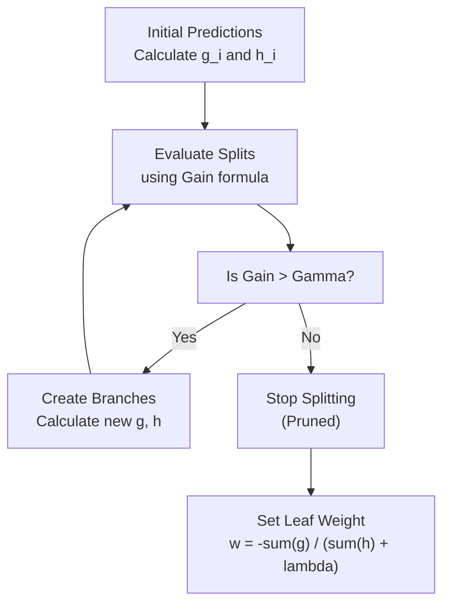

# 🏆 XGBoost (eXtreme Gradient Boosting)

> **Difficulty**: ⭐⭐⭐⭐⭐ Expert | **Prerequisites**: Gradient Boosting, Advanced Calculus | **Estimated Reading Time**: 30 Minutes

---

## 📋 Table of Contents
1. [What Problem Does This Solve?](#1-what-problem-does-this-solve)
2. [Intuition](#2-intuition)
3. [Core Mathematics](#3-core-mathematics)
4. [Visual Explanation](#4-visual-explanation)
5. [Algorithm Workflow](#5-algorithm-workflow)
6. [Scikit-Learn Implementation](#6-scikit-learn-implementation)
7. [Hyperparameter Deep Dive](#7-hyperparameter-deep-dive)
8. [Failure Cases](#8-failure-cases)
9. [Industry Applications](#9-industry-applications)

---

## 1. What Problem Does This Solve?

Standard Gradient Boosting (GBM) is incredibly powerful, but its original implementation was painfully slow and prone to overfitting without massive hyperparameter tuning. 

**XGBoost** (created by Tianqi Chen in 2014) solved this by completely re-engineering the math and the software systems behind Gradient Boosting. It introduced:
1. **Second-Order Gradients**: Using the Hessian to make much more accurate jumps down the loss curve.
2. **Explicit Regularization**: Adding $L1$ and $L2$ penalties directly into the tree-building objective function.
3. **Hardware Optimization**: Cache awareness, out-of-core computing, and parallelized tree building.

**Use Cases:**
- The undisputed king of Kaggle tabular data competitions.
- Click-through rate prediction.
- High-stakes, high-accuracy financial modeling.

---

## 2. Intuition

### 🟢 Beginner
If standard Gradient Boosting is a person hiking down a foggy mountain by feeling the slope of the ground with their foot (First-order derivative), XGBoost is a person doing the same thing, but they also have a radar that tells them the *curvature* of the mountain (Second-order derivative). This allows them to take massive, safe jumps down the mountain, reaching the bottom faster and more reliably. 

### 🟡 Intermediate
XGBoost builds trees differently than traditional Decision Trees. Instead of using Gini or Entropy, XGBoost calculates a "Similarity Score" for the data going into a node, and calculates the "Gain" of a split based on how much the Similarity Score increases. It also inherently penalizes trees for having too many leaves, trimming them back automatically (pruning).

### 🔴 Advanced
XGBoost uses a Taylor expansion up to the second order to approximate the objective function. It calculates both the Gradient ($g_i$) and the Hessian ($h_i$) for every single data point at every iteration. This allows it to find the exact optimal leaf weight analytically, rather than having to use a line search like standard GBM.

---

## 3. Core Mathematics

### 3.1 The Objective Function
At iteration $t$, the objective is to minimize the loss $L$ plus a regularization term $\Omega$:
$$ \text{Obj}^{(t)} = \sum_{i=1}^n l(y_i, \hat{y}_i^{(t-1)} + f_t(x_i)) + \Omega(f_t) $$

Where regularization $\Omega$ is defined as:
$$ \Omega(f) = \gamma T + \frac{1}{2} \lambda \sum_{j=1}^T w_j^2 $$
*(Where $T$ is the number of leaves, $w$ are the leaf weights, $\gamma$ is the penalty for adding a leaf, and $\lambda$ is $L2$ regularization).*

### 3.2 Second-Order Taylor Approximation
XGBoost expands the loss function using Taylor series:
$$ \text{Obj}^{(t)} \approx \sum_{i=1}^n \left[ l(y_i, \hat{y}_i^{(t-1)}) + g_i f_t(x_i) + \frac{1}{2} h_i f_t^2(x_i) \right] + \Omega(f_t) $$
Where:
- $g_i = \frac{\partial l(y_i, \hat{y}^{(t-1)})}{\partial \hat{y}^{(t-1)}}$ (Gradient)
- $h_i = \frac{\partial^2 l(y_i, \hat{y}^{(t-1)})}{\partial (\hat{y}^{(t-1)})^2}$ (Hessian)

### 3.3 Optimal Leaf Weight
Because the equation is now a simple quadratic, we can take the derivative with respect to the leaf weight $w_j$ and set it to 0 to find the exact optimal prediction for that leaf:
$$ w_j^* = -\frac{\sum g_i}{\sum h_i + \lambda} $$

### 3.4 Similarity Score & Split Gain
To decide how to split a node, we calculate the gain:
$$ \text{Gain} = \frac{1}{2} \left[ \frac{(\sum_L g_i)^2}{\sum_L h_i + \lambda} + \frac{(\sum_R g_i)^2}{\sum_R h_i + \lambda} - \frac{(\sum g_i)^2}{\sum h_i + \lambda} \right] - \gamma $$

If the Gain is negative (less than $\gamma$), we don't split!

---

## 4. Visual Explanation



---

## 5. Algorithm Workflow

1. Initialize predictions (usually 0.5).
2. Calculate $g_i$ and $h_i$ for all samples.
3. Grow a tree:
   - Sort features (or use the approximate Histogram method for speed).
   - Evaluate splits using the Gain formula (which utilizes $g$, $h$, $\lambda$, and $\gamma$).
   - Prune branches that have negative Gain.
4. Calculate optimal weights for the leaves.
5. Update the ensemble predictions: $F(x) = F(x) + \eta \cdot f_t(x)$ (where $\eta$ is learning rate).
6. Repeat for $N$ iterations.

---

## 6. Scikit-Learn Implementation

*Note: You must `pip install xgboost`*

```python
import xgboost as xgb
from sklearn.model_selection import train_test_split
from sklearn.metrics import mean_squared_error

X_train, X_test, y_train, y_test = train_test_split(X, y, test_size=0.2)

# Using the Scikit-Learn wrapper interface
model = xgb.XGBRegressor(
    n_estimators=1000,
    learning_rate=0.05,
    max_depth=6,
    subsample=0.8,
    colsample_bytree=0.8, # Feature bagging
    gamma=0.1,            # Minimum loss reduction
    reg_lambda=1.0,       # L2 regularization
    tree_method='hist',   # Use histogram-based algorithm (FASTER!)
    early_stopping_rounds=50
)

# Pass eval_set for early stopping
model.fit(X_train, y_train, 
          eval_set=[(X_test, y_test)], 
          verbose=100)

preds = model.predict(X_test)
print(f"MSE: {mean_squared_error(y_test, preds):.4f}")
```

---

## 7. Hyperparameter Deep Dive

XGBoost has dozens of hyperparameters. These are the most important to tune:

**To Control Overfitting:**
- **`learning_rate` (eta)**: Lower is better (0.01 - 0.1), but requires more estimators.
- **`max_depth`**: Keep between 3 and 10.
- **`gamma` (min_split_loss)**: The minimum loss reduction required to make a split. Increase this to force the tree to be conservative.
- **`subsample`**: Row sampling (0.5 - 0.8).
- **`colsample_bytree`**: Feature sampling (0.5 - 0.8).
- **`reg_lambda` & `reg_alpha`**: L2 and L1 regularization on leaf weights.

---

## 8. Failure Cases

**Extrapolation**
Like all tree-based models, XGBoost cannot extrapolate. If a continuous target trends upwards over time, and you forecast into the future where the target is higher than anything in the training set, XGBoost will flatline at the maximum known value.

**Unstructured Data**
Do not use XGBoost for raw images, audio, or raw text. Deep Learning is far superior there.

---

## 9. Industry Applications

- **Kaggle**: Almost synonymous with winning structured data competitions.
- **High-Frequency Trading**: The C++ implementation allows for extremely low-latency predictions suitable for algorithmic trading.

---

[← Gradient Boosting](08-Gradient-Boosting.md) | [Return to Ensemble Index](../README.md) | [Next: LightGBM Concepts →](10-LightGBM-Concepts.md)
