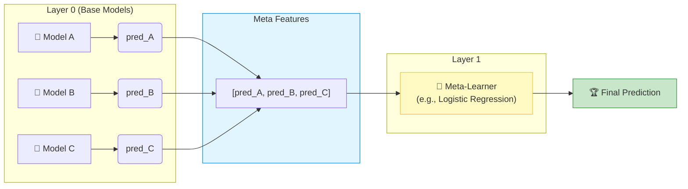

# 🥞 Stacking (Stacked Generalization)

> **Prerequisites**: Voting Classifiers | **Difficulty**: ⭐⭐⭐⭐☆ Advanced

---

## 📋 Table of Contents
1. [What is Stacking?](#1-what-is-stacking)
2. [Stacking Architecture](#2-stacking-architecture)
3. [The Cross-Validation Strategy (Out-of-Fold Predictions)](#3-the-cross-validation-strategy-out-of-fold-predictions)
4. [scikit-learn Implementation](#4-scikit-learn-implementation)

---

## 1. What is Stacking?

### 🟢 Beginner
**Simple Explanation**: Instead of just taking a simple average of the predictions of your base models (like Voting), what if we trained a *new* machine learning model to learn *how* to combine their predictions? The base models make predictions, and the meta-model decides which base model is more trustworthy in different situations.

---

## 2. Stacking Architecture

### 🟡 Intermediate
- **Layer 0 (Base Models)**: Multiple diverse algorithms (e.g. Random Forest, SVM, KNN) trained directly on the original features.
- **Layer 1 (Meta-Learner)**: A simple model (typically a Logistic Regression for classification or Ridge for regression) trained on the *predictions* of the Layer 0 models.



---

## 3. The Cross-Validation Strategy (Out-of-Fold Predictions)

### 🔴 Advanced
A naive implementation of stacking would train the base models on the training set, predict on the same training set, and train the meta-learner on those predictions. This causes **severe data leakage and overfitting** because base models are highly confident on points they were trained on.

To prevent leakage, stacking uses **Out-of-Fold (OOF)** predictions:
1. Split the training data into $K$ folds.
2. For each base model $m$:
   - For $k = 1, \dots, K$:
     - Train model $m$ on $K-1$ folds.
     - Predict on fold $k$ (the holdout fold).
3. Assemble the predictions of all folds. This yields an "out-of-fold" prediction vector for the entire dataset, where each prediction was generated by a model that did not see that sample during training.
4. Train the meta-learner on these OOF predictions.
5. Finally, retrain the base models on the *entire* training set so they are ready for inference on unseen test data.

---

## 4. scikit-learn Implementation

```python
from sklearn.ensemble import StackingClassifier, RandomForestClassifier, GradientBoostingClassifier
from sklearn.linear_model import LogisticRegression
from sklearn.svm import SVC
from sklearn.neighbors import KNeighborsClassifier
from sklearn.datasets import load_breast_cancer
from sklearn.model_selection import train_test_split

# Load dataset
data = load_breast_cancer()
X_train, X_test, y_train, y_test = train_test_split(data.data, data.target, test_size=0.2, random_state=42)

# Define Base Models (Layer 0)
base_estimators = [
    ('rf', RandomForestClassifier(n_estimators=100, random_state=42)),
    ('gb', GradientBoostingClassifier(n_estimators=100, random_state=42)),
    ('knn', KNeighborsClassifier(n_neighbors=5)),
    ('svm', SVC(probability=True, random_state=42))
]

# Stacking with Logistic Regression as Meta-Learner (Layer 1)
stacking = StackingClassifier(
    estimators=base_estimators,
    final_estimator=LogisticRegression(max_iter=1000),
    cv=5,                          # 5-fold CV for Out-of-Fold predictions
    stack_method='predict_proba',  # Use predicted probabilities as meta-features
    n_jobs=-1
)

stacking.fit(X_train, y_train)
print(f"Stacking Test Accuracy: {stacking.score(X_test, y_test):.4f}")

# Compare with individual model scores
print("\nIndividual base model scores on Test Set:")
for name, model in base_estimators:
    model.fit(X_train, y_train)
    print(f"  {name}: {model.score(X_test, y_test):.4f}")
```

---

[← CatBoost Concepts](./11-CatBoost-Concepts.md) | [Back to Index](../README.md) | [Next: Blending →](./13-Blending.md)
