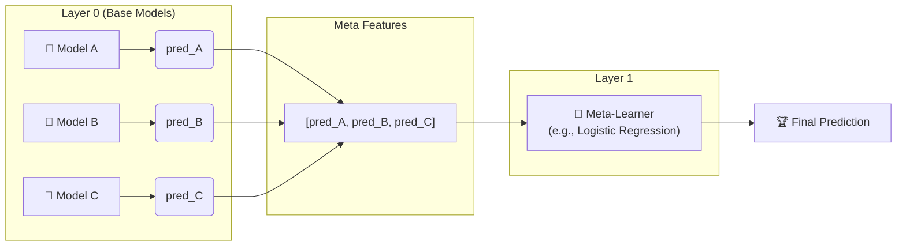

# 🥞 Stacking (Stacked Generalization)

> **Difficulty**: ⭐⭐⭐⭐☆ Advanced | **Prerequisites**: Voting Classifiers

---

## 📋 Table of Contents
1. [What Problem Does This Solve?](#1-what-problem-does-this-solve)
2. [Intuition](#2-intuition)
3. [Core Architecture](#3-core-architecture)
4. [Visual Explanation](#4-visual-explanation)
5. [Algorithm Workflow](#5-algorithm-workflow)
6. [Scikit-Learn Implementation](#6-scikit-learn-implementation)
7. [Failure Cases](#7-failure-cases)
8. [Industry Applications](#8-industry-applications)

---

## 1. What Problem Does This Solve?

### 🟢 Beginner
Instead of just taking a simple average of the predictions of your base models (like Voting), what if we trained a *new* machine learning model to learn *how* to combine their predictions? 

### 🟡 Intermediate
Voting assumes all models are equally good, or requires manual weighting. Stacking solves this by using a "meta-learner" model. The base models make predictions, and the meta-learner learns which base models are more trustworthy in different situations (e.g., "Model A is great for high values, but Model B is better for low values").

### 🔴 Advanced
Stacking generalizes the ensemble combination step. Instead of a linear combination (Weighted Voting), stacking allows for non-linear combinations if the meta-learner is a non-linear model. It optimally blends heterogeneous base learners by treating their output probabilities/predictions as the feature space for the final estimator.

---

## 2. Intuition

Imagine you are managing a team of analysts to predict the stock market. 
- Analyst 1 looks at charts.
- Analyst 2 reads news articles.
- Analyst 3 looks at interest rates.
Instead of just averaging their guesses, you (the manager) learn their habits over time. You notice Analyst 1 is usually right during bull markets, but Analyst 2 is better during crashes. When a new situation arises, you weight their advice dynamically based on what you've learned about their strengths and weaknesses. You are the meta-learner.

---

## 3. Core Architecture

- **Layer 0 (Base Models)**: Multiple diverse algorithms (e.g., Random Forest, SVM, KNN) trained directly on the original features.
- **Layer 1 (Meta-Learner)**: A simple model (typically a Logistic Regression for classification or Ridge Regression for regression) trained on the *predictions* of the Layer 0 models. Using a simple linear model prevents the meta-learner from overfitting the base model predictions.

---

## 4. Visual Explanation



---

## 5. Algorithm Workflow

A naive implementation of stacking would train the base models on the training set, predict on the same training set, and train the meta-learner on those predictions. This causes **severe data leakage and overfitting** because base models are highly confident on points they were trained on.

To prevent leakage, stacking uses **Out-of-Fold (OOF)** predictions:
1. Split the training data into $K$ folds.
2. For each base model $m$:
   - For $k = 1, \dots, K$:
     - Train model $m$ on $K-1$ folds.
     - Predict on fold $k$ (the holdout fold).
3. Assemble the predictions of all folds. This yields an "out-of-fold" prediction vector for the entire dataset, where each prediction was generated by a model that did not see that sample during training.
4. Train the meta-learner on these OOF predictions.
5. Finally, retrain the base models on the *entire* training set so they are ready for inference on unseen test data.

---

## 6. Scikit-Learn Implementation

```python
from sklearn.ensemble import StackingClassifier, RandomForestClassifier, GradientBoostingClassifier
from sklearn.linear_model import LogisticRegression
from sklearn.svm import SVC
from sklearn.neighbors import KNeighborsClassifier
from sklearn.datasets import load_breast_cancer
from sklearn.model_selection import train_test_split

# Load dataset
data = load_breast_cancer()
X_train, X_test, y_train, y_test = train_test_split(data.data, data.target, test_size=0.2, random_state=42)

# Define Base Models (Layer 0)
base_estimators = [
    ('rf', RandomForestClassifier(n_estimators=100, random_state=42)),
    ('gb', GradientBoostingClassifier(n_estimators=100, random_state=42)),
    ('knn', KNeighborsClassifier(n_neighbors=5)),
    ('svm', SVC(probability=True, random_state=42))
]

# Stacking with Logistic Regression as Meta-Learner (Layer 1)
stacking = StackingClassifier(
    estimators=base_estimators,
    final_estimator=LogisticRegression(max_iter=1000),
    cv=5,                          # 5-fold CV for Out-of-Fold predictions
    stack_method='predict_proba',  # Use predicted probabilities as meta-features
    n_jobs=-1
)

stacking.fit(X_train, y_train)
print(f"Stacking Test Accuracy: {stacking.score(X_test, y_test):.4f}")
```

---

## 7. Failure Cases

**Data Leakage**
If you do not strictly enforce Out-Of-Fold (OOF) predictions during the meta-learner training phase, the meta-learner will simply assign 100% of the weight to the most overfit base model (like an unpruned Random Forest), destroying the entire point of the ensemble.

---

## 8. Industry Applications

- **Kaggle Competitions**: Almost every winning solution involves massive stacking architectures, sometimes 3 or 4 layers deep.
- **Ensemble-as-a-Service**: Automated Machine Learning (AutoML) platforms like DataRobot or H2O.ai frequently use stacking to automatically blend the best models they found during their search phase.

---

[← CatBoost Concepts](11-CatBoost-Concepts.md) | [Back to Index](../README.md) | [Next: Blending →](13-Blending.md)
