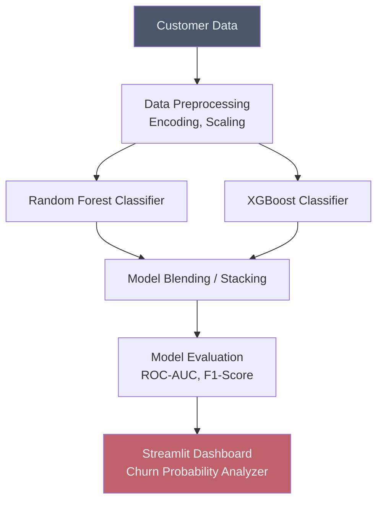

# 🏃 Customer Churn Prediction (Ensemble)

## Overview
This project uses powerful Ensemble Learning algorithms (like Random Forest, AdaBoost, and XGBoost) to predict customer churn. Ensembles handle the complex, non-linear relationships in customer behavioral data far better than single baseline models.

## Architecture

## Project Structure
*   `data/`: Contains the customer datasets.
*   `notebooks/`: Jupyter notebooks with EDA, SMOTE balancing, and Ensemble training.
*   `src/`: Python scripts for data processing and model evaluation.
*   `app.py`: Streamlit dashboard for interactive churn analysis.

## How to Run
1. Install dependencies: `pip install streamlit scikit-learn xgboost pandas matplotlib seaborn`
2. Navigate to the project directory.
3. Run the dashboard: `streamlit run app.py`
