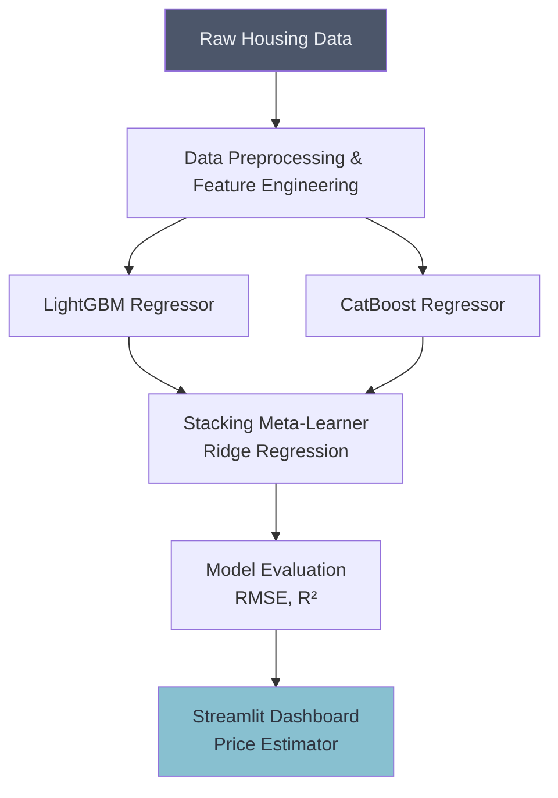

# 🏠 House Price Prediction (Advanced Ensembles)

## Overview
This project tackles House Price Prediction using advanced ensemble techniques such as Gradient Boosting, LightGBM, and Stacking. These models excel at handling the heterogeneous tabular data typical in real estate.

## Architecture

## Project Structure
*   `data/`: Contains the housing datasets.
*   `notebooks/`: Jupyter notebooks detailing EDA, EFB (Exclusive Feature Bundling), and model tuning.
*   `src/`: Python scripts for pipelines and inference.
*   `app.py`: Streamlit dashboard for interactive predictions.

## How to Run
1. Install dependencies: `pip install streamlit scikit-learn lightgbm catboost pandas numpy`
2. Navigate to the project directory.
3. Run the dashboard: `streamlit run app.py`
