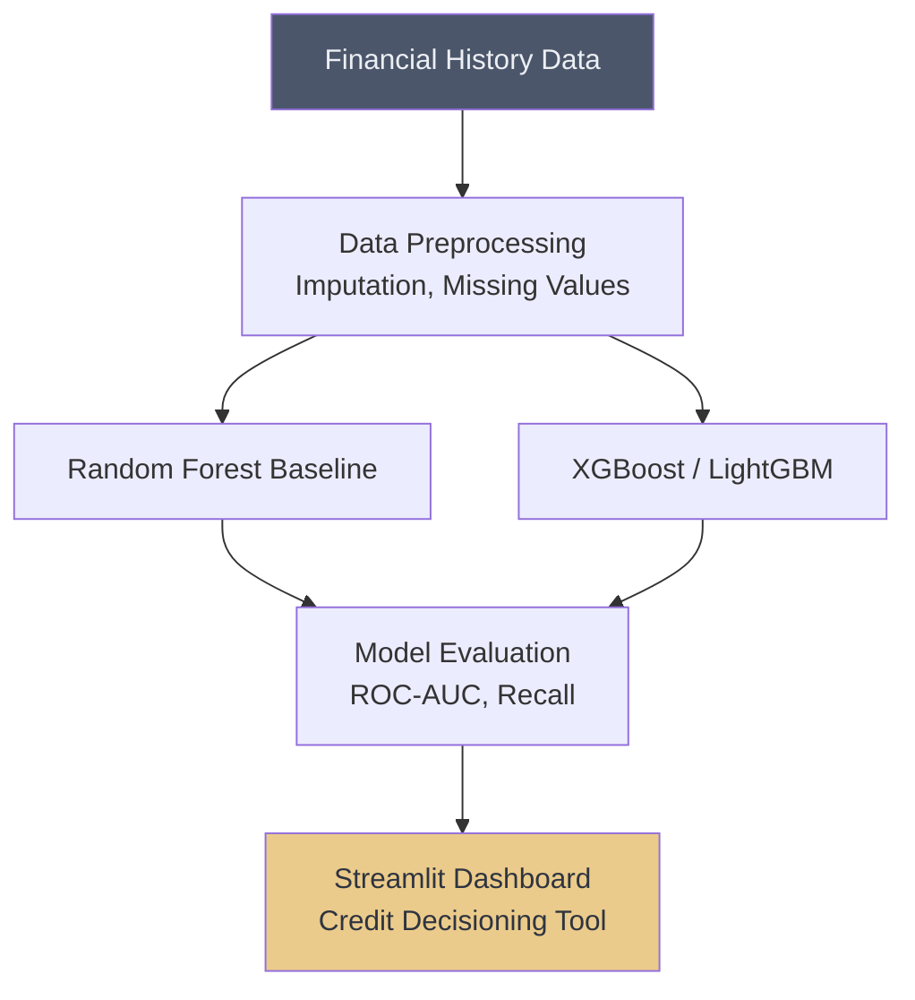

# 💳 Credit Risk Prediction (Ensemble)

## Overview
This project focuses on identifying high-risk borrowers using Bagging and Boosting algorithms. It emphasizes robustness to noise and reducing False Positives (approving a bad loan), a critical metric for financial institutions.

## Architecture

## Project Structure
*   `data/`: Contains credit risk datasets.
*   `notebooks/`: Jupyter notebooks with EDA, handling class imbalance, and model comparison.
*   `src/`: Python scripts for feature engineering and evaluation.
*   `app.py`: Streamlit dashboard for interactive risk evaluation.

## How to Run
1. Install dependencies: `pip install streamlit scikit-learn xgboost pandas matplotlib seaborn`
2. Navigate to the project directory.
3. Run the dashboard: `streamlit run app.py`
