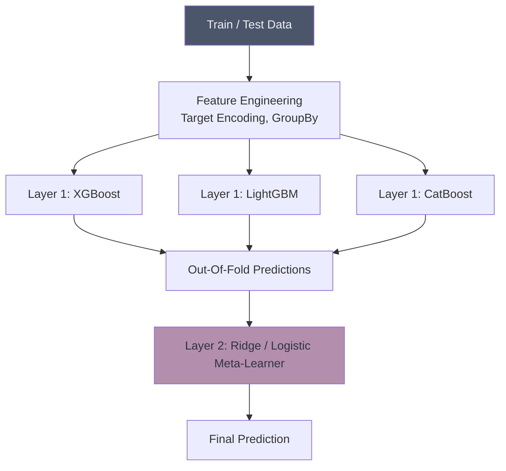

# 🏆 Kaggle-Style Ensemble Competition

## Overview
This project simulates a high-stakes Kaggle tabular data competition. It utilizes advanced Stacking and Blending architectures, combining LightGBM, XGBoost, and CatBoost into a massive meta-ensemble to squeeze every drop of accuracy out of the data.

## Architecture

## Project Structure
*   `data/`: Contains competition datasets.
*   `notebooks/`: Extensive notebooks showing OOF prediction generation and hyperparameter tuning (Optuna).
*   `src/`: Python scripts for robust cross-validation frameworks.
*   `app.py`: Streamlit dashboard visualizing the ensemble weightings.

## How to Run
1. Install dependencies: `pip install streamlit scikit-learn lightgbm xgboost catboost optuna`
2. Navigate to the project directory.
3. Run the dashboard: `streamlit run app.py`
