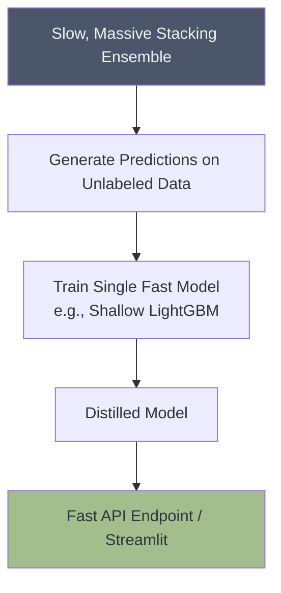

# 🏭 Production Ensemble Pipeline

## Overview
This project demonstrates how to take a complex ensemble model out of the Jupyter notebook and deploy it into a production environment. It covers Model Distillation (training a fast model to mimic a slow ensemble) and creating inference APIs.

## Architecture

## Project Structure
*   `data/`: Contains datasets.
*   `notebooks/`: Notebooks demonstrating the Model Distillation process.
*   `src/`: Production inference scripts.
*   `app.py`: Streamlit dashboard demonstrating sub-millisecond inference.

## How to Run
1. Install dependencies: `pip install streamlit scikit-learn lightgbm pandas`
2. Navigate to the project directory.
3. Run the dashboard: `streamlit run app.py`
