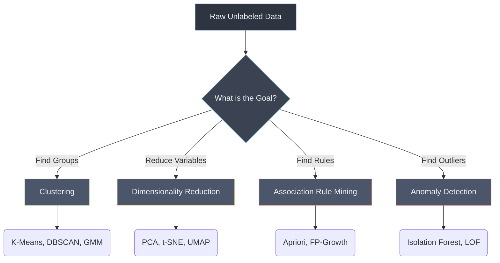

# 🔍 Introduction To Unsupervised Learning

> **Difficulty**: ⭐☆☆☆☆ Beginner | **Prerequisites**: Linear Algebra, Probability Theory | **Estimated Reading Time**: 20 Minutes

---

## 📋 Table of Contents
1. [What Problem Does This Solve?](#1-what-problem-does-this-solve)
2. [Intuition](#2-intuition)
3. [Core Mathematics](#3-core-mathematics)
4. [Visual Explanation](#4-visual-explanation)
5. [Algorithm Workflow](#5-algorithm-workflow)
6. [From Scratch Implementation](#6-from-scratch-implementation)
7. [NumPy Implementation](#7-numpy-implementation)
8. [Scikit-Learn Implementation](#8-scikit-learn-implementation)
9. [Hyperparameter Deep Dive](#9-hyperparameter-deep-dive)
10. [Visualization Lab](#10-visualization-lab)
11. [Failure Cases](#11-failure-cases)
12. [Industry Applications](#12-industry-applications)
13. [Hands-On Exercises](#13-hands-on-exercises)
14. [Further Reading](#14-further-reading)
15. [What's Next?](#15-whats-next)

---

## 1. What Problem Does This Solve?

In Supervised Learning, we rely on labeled data ($X, y$) to teach a model how to map inputs to outputs. However, in the real world, labeled data is expensive, rare, and time-consuming to obtain. Unsupervised Learning operates purely on unlabeled data ($X$).

**The core problem**: How can we discover hidden structures, inherent groupings, or underlying probability distributions in raw, unstructured data without a "teacher" or ground truth labels?

Unsupervised learning solves:
*   **Information Overload**: Reducing millions of features down to the most critical components (Dimensionality Reduction).
*   **Chaos**: Grouping similar entities together to form actionable segments (Clustering).
*   **Anomaly**: Identifying rare events that deviate significantly from the norm (Anomaly Detection).
*   **Pattern Discovery**: Finding rules that govern co-occurring items (Association Rule Mining).

---

## 2. Intuition

### 🟢 Beginner
Imagine you are an explorer who lands on an alien planet with millions of undiscovered lifeforms. You have no names or labels for these creatures. How do you classify them?
You might start grouping them by visual similarities:
1. Creatures with wings vs. creatures with fins.
2. Creatures that are large and slow vs. small and fast.
You are evaluating similarities implicitly and forming groupings entirely without labels.

### 🟡 Intermediate
At its heart, unsupervised learning is often about **Representation Learning**—finding a better way to represent the data so that downstream tasks (like supervised learning or human analysis) become easier. It uses mathematical distances to map out a space where similar items are physically closer together.

### 🔴 Advanced
Let the dataset be $X = \{x_1, x_2, \dots, x_N\}$. Unsupervised learning seeks to learn the underlying probability distribution $p(x)$ of the data, or to find a mapping $f(x)$ that transforms the data into a more compact or interpretable representation (manifold learning). The challenge is defining an objective function to minimize without having a target label $y$ to compute a standard loss against.

---

## 3. Core Mathematics

To group or separate data, we must mathematically define what it means for two data points to be "similar" or "different." This is achieved through **Distance Metrics**.

Let two vectors be $\mathbf{u} = (u_1, u_2, \dots, u_n)$ and $\mathbf{v} = (v_1, v_2, \dots, v_n)$.

### Minkowski Distance
The generalized metric for $L_p$ norm:
$$ D(\mathbf{u}, \mathbf{v}) = \left( \sum_{i=1}^n |u_i - v_i|^p \right)^{\frac{1}{p}} $$

*   **$p=1$ (Manhattan Distance / $L_1$ Norm)**: Measures distance along axes (grid-like). Robust to outliers.
*   **$p=2$ (Euclidean Distance / $L_2$ Norm)**: Shortest straight-line distance. Sensitive to outliers.

### Cosine Similarity
Measures the angle between two vectors, ignoring magnitude. Excellent for high-dimensional sparse data like text.
$$ \text{Cosine Similarity}(\mathbf{u}, \mathbf{v}) = \frac{\mathbf{u} \cdot \mathbf{v}}{||\mathbf{u}|| \times ||\mathbf{v}||} $$

### The Curse of Dimensionality
As the number of dimensions $n$ increases, the volume of the space increases exponentially. In high-dimensional space:
1.  **Sparsity**: Data points become increasingly sparse.
2.  **Distance Concentration**: The ratio of the distance to the nearest neighbor over the distance to the farthest neighbor approaches 1. Euclidean distance becomes meaningless because all points appear almost equidistant from each other.

$$ \lim_{n \to \infty} \frac{\text{dist}_{max} - \text{dist}_{min}}{\text{dist}_{min}} \to 0 $$

---

## 4. Visual Explanation



*Taxonomy of Unsupervised Learning algorithms depending on the target goal.*

---

## 5. Algorithm Workflow

The general lifecycle of an Unsupervised Learning pipeline:

1.  **Data Collection**: Gather raw, unannotated data ($X$).
2.  **Preprocessing & Scaling**: Crucial step. Since unsupervised learning relies heavily on distance metrics, unscaled data will severely distort results.
3.  **Metric Selection**: Choose the appropriate distance/similarity metric.
4.  **Model Selection**: Decide between Clustering, Dimensionality Reduction, etc.
5.  **Hyperparameter Tuning**: Select parameters like $K$ (clusters) or $\epsilon$ (radius).
6.  **Evaluation**: Use internal metrics (Silhouette score, Explained Variance) since ground truth labels are absent.

---

## 6. From Scratch Implementation

While there's no single "Unsupervised Learning" algorithm, we can implement the foundational block: **Distance Metrics from scratch**.

```python
import numpy as np

def euclidean_distance_scratch(x1, x2):
    """Calculates L2 distance between two vectors."""
    return np.sqrt(sum((a - b) ** 2 for a, b in zip(x1, x2)))

def manhattan_distance_scratch(x1, x2):
    """Calculates L1 distance between two vectors."""
    return sum(abs(a - b) for a, b in zip(x1, x2))

# Example
pt1 = [1, 2, 3]
pt2 = [4, 5, 6]
print(f"Euclidean: {euclidean_distance_scratch(pt1, pt2):.4f}")
print(f"Manhattan: {manhattan_distance_scratch(pt1, pt2):.4f}")
```

---

## 7. NumPy Implementation

NumPy utilizes highly optimized C-backends to compute distances efficiently across matrices.

```python
import numpy as np

X1 = np.array([1, 2, 3])
X2 = np.array([4, 5, 6])

# L2 Norm (Euclidean)
euclidean = np.linalg.norm(X1 - X2)

# L1 Norm (Manhattan)
manhattan = np.linalg.norm(X1 - X2, ord=1)

print(f"NumPy Euclidean: {euclidean:.4f}")
```

---

## 8. Scikit-Learn Implementation

Scikit-Learn provides `pairwise` metrics for computing distance matrices across large datasets.

```python
from sklearn.metrics.pairwise import euclidean_distances, cosine_similarity
import numpy as np

# A dataset of 3 samples, 2 features each
X = np.array([[0, 0], 
              [1, 1], 
              [9, 9]])

# Compute distance from every point to every other point
dist_matrix = euclidean_distances(X, X)
print("Distance Matrix:\n", dist_matrix)

# Compute similarity
sim_matrix = cosine_similarity(X, X)
print("Similarity Matrix:\n", sim_matrix)
```

---

## 9. Hyperparameter Deep Dive

In unsupervised learning, hyperparameters often control the interpretation of the mathematical space rather than regularizing a loss function:

*   **Distance Metric ($p$)**: Changing $p$ in Minkowski distance drastically alters the shape of the neighborhood. In high-dimensional spaces, fractional norms ($p < 1$) are sometimes used to counter the curse of dimensionality.
*   **Scaling Factor**: Whether to use Standard Scaling (Z-score) or Min-Max scaling. Z-score is generally preferred for PCA and K-Means, while Min-Max preserves 0-1 bounds for certain neural network applications.

---

## 10. Visualization Lab

> **Note**: For interactive plots and deep dataset exploration, please refer to the corresponding Jupyter Notebook in the `notebooks/` directory.

### The Impact of Scaling
Imagine clustering based on Age (0-100) and Income ($0-$1,000,000). The Euclidean distance will be almost entirely dominated by Income. 

```python
import matplotlib.pyplot as plt
import seaborn as sns
from sklearn.preprocessing import StandardScaler
import pandas as pd

# Pseudo-code for visualization
# fig, axes = plt.subplots(1, 2, figsize=(12, 5))
# sns.scatterplot(x='Income', y='Age', data=df, ax=axes[0])
# axes[0].set_title("Unscaled Data (Distorted Distance)")

# df_scaled = pd.DataFrame(StandardScaler().fit_transform(df), columns=df.columns)
# sns.scatterplot(x='Income', y='Age', data=df_scaled, ax=axes[1])
# axes[1].set_title("Standard Scaled Data (True Distance)")
# plt.show()
```

---

## 11. Failure Cases

When does Unsupervised Learning fail?

1.  **The Curse of Dimensionality**: When dimensions $n \gg 1000$ and data is sparse, distance-based algorithms (like K-Means) break down.
2.  **No Ground Truth for Validation**: It is notoriously difficult to objectively evaluate if a clustering result is "correct." It is highly subjective and business-dependent.
3.  **Computational Complexity**: Calculating $N \times N$ pairwise distance matrices requires $O(N^2)$ memory and time, which scales poorly for big data.

---

## 12. Industry Applications

1.  **Marketing & Retail**: Customer segmentation (grouping users with similar purchase behaviors).
2.  **Finance & Security**: Anomaly detection to flag fraudulent credit card transactions.
3.  **Genomics & Biology**: Clustering gene expression data to discover unknown disease sub-types.
4.  **Computer Vision**: Image compression via PCA and representation learning via Autoencoders.

---

## 13. Hands-On Exercises

**Easy**: Prove mathematically that Euclidean distance is a special case of Minkowski distance where $p=2$.
**Medium**: Write a Python function using only NumPy that computes the pairwise Cosine Similarity matrix for an $(N \times M)$ matrix $X$.
**Hard**: Create a 2D synthetic dataset. Plot the $L_1$ and $L_2$ unit circles around the origin to visualize how the choice of distance metric changes the "shape" of space.

---

## 14. Further Reading

- *Pattern Recognition and Machine Learning* by Christopher Bishop (Chapter 9: Mixture Models and EM)
- *The Elements of Statistical Learning* by Hastie, Tibshirani, and Friedman (Chapter 14: Unsupervised Learning)
- [Scikit-Learn Documentation on Unsupervised Learning](https://scikit-learn.org/stable/unsupervised_learning.html)

---

## 15. What's Next?

### Summary
We established the foundational problem of unsupervised learning: finding structure without labels. We explored how distance metrics form the backbone of these algorithms and introduced the primary taxonomy: Clustering, Dimensionality Reduction, Anomaly Detection, and Association Rules.

### Why it matters
Before we can run powerful algorithms like K-Means or PCA, we must fundamentally understand how our data exists in vector space and how distance defines similarity. The choice of metric and scaling entirely dictates the success of unsupervised algorithms.

### Next Topic
We will dive into our first clustering algorithm, **K-Means**, understanding how it iteratively optimizes centroids to partition data into distinct groups based on distance.

[← Supervised Learning Index](../02-Supervised-Learning/README.md) | [Return to Unsupervised Index](../README.md) | [Next: K-Means Clustering →](02-K-Means-Clustering.md)
