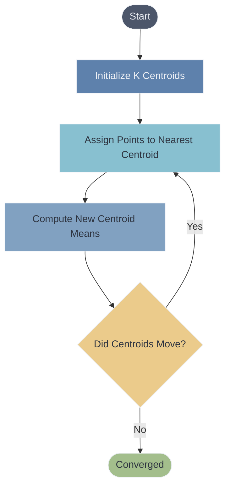

# 🎯 K-Means Clustering

> **Difficulty**: ⭐⭐☆☆☆ Intermediate | **Prerequisites**: Distance Metrics, Unsupervised Intro | **Estimated Reading Time**: 30 Minutes

---

## 📋 Table of Contents
1. [What Problem Does This Solve?](#1-what-problem-does-this-solve)
2. [Intuition](#2-intuition)
3. [Core Mathematics](#3-core-mathematics)
4. [Visual Explanation](#4-visual-explanation)
5. [Algorithm Workflow](#5-algorithm-workflow)
6. [From Scratch Implementation](#6-from-scratch-implementation)
7. [NumPy Implementation](#7-numpy-implementation)
8. [Scikit-Learn Implementation](#8-scikit-learn-implementation)
9. [Hyperparameter Deep Dive](#9-hyperparameter-deep-dive)
10. [Visualization Lab](#10-visualization-lab)
11. [Failure Cases](#11-failure-cases)
12. [Industry Applications](#12-industry-applications)
13. [Hands-On Exercises](#13-hands-on-exercises)
14. [Further Reading](#14-further-reading)
15. [What's Next?](#15-whats-next)

---

## 1. What Problem Does This Solve?

Imagine having a massive database of customers with their age, income, and spending score. You want to group them into distinct segments so the marketing team can target them effectively. 

K-Means clustering solves the problem of **partitioning** a dataset into $K$ distinct, non-overlapping groups (clusters), where each data point belongs to the cluster with the nearest mean (centroid). It minimizes the variance within each cluster.

---

## 2. Intuition

### 🟢 Beginner
Think of K-Means like organizing a party into distinct friend groups based on interests. You randomly pick $K$ people to be the "center" of each group. Everyone else joins the group of the center person they are most similar to. Then, the groups find their *actual* average center, and a new center person is chosen. The process repeats until the groups stop shifting.

### 🟡 Intermediate
K-Means operates by attempting to minimize the Within-Cluster Sum of Squares (WCSS). It does this iteratively through the **Lloyd Algorithm**: an expectation-maximization (EM) style approach where it alternates between assigning points to the nearest centroid (Expectation) and updating the centroids to be the mean of the assigned points (Maximization).

### 🔴 Advanced
The K-Means objective function is non-convex, meaning it is highly sensitive to initialization and only guarantees convergence to a *local* minimum, not the global minimum. To mitigate this, **K-Means++** initialization is used, which spreads out the initial centroids probabilistically based on squared distances from existing centroids, dramatically improving convergence speed and the quality of the final local minimum.

---

## 3. Core Mathematics

### The Objective Function (Inertia / WCSS)
K-Means aims to minimize the Within-Cluster Sum of Squares (WCSS), also known as Inertia.

$$ \min_{C, \mu} \sum_{i=1}^K \sum_{x \in C_i} ||x - \mu_i||^2 $$

Where:
*   $K$ is the number of clusters.
*   $C_i$ is the set of points in the $i$-th cluster.
*   $\mu_i$ is the centroid (mean) of the $i$-th cluster.
*   $||x - \mu_i||^2$ is the squared Euclidean distance from a point $x$ to its assigned centroid.

### Lloyd's Algorithm Updates
1.  **Assignment Step**: Assign each observation $x_j$ to the cluster with the nearest mean:
    $$ S_i^{(t)} = \{ x_j : ||x_j - \mu_i^{(t)}||^2 \le ||x_j - \mu_k^{(t)}||^2 \ \forall k \} $$
2.  **Update Step**: Calculate the new means to be the centroids of the observations in the new clusters:
    $$ \mu_i^{(t+1)} = \frac{1}{|S_i^{(t)}|} \sum_{x_j \in S_i^{(t)}} x_j $$

---

## 4. Visual Explanation



*The iterative expectation-maximization loop of K-Means.*

---

## 5. Algorithm Workflow

1.  **Scale Data**: K-Means is isotropic (assumes spherical clusters) and uses Euclidean distance. Standardization (Z-score) is absolutely required.
2.  **Choose $K$**: Determine the number of clusters using the Elbow Method or Silhouette Score.
3.  **Initialize**: Use K-Means++ to strategically place initial centroids.
4.  **Iterate**: Alternate between distance calculation/assignment and centroid updating.
5.  **Stop**: Halt when centroids no longer move (convergence) or a maximum number of iterations is reached.

---

## 6. From Scratch Implementation

```python
import numpy as np

class KMeansScratch:
    def __init__(self, k=3, max_iters=100):
        self.k = k
        self.max_iters = max_iters
        
    def fit(self, X):
        # 1. Initialize centroids randomly from data points
        random_idx = np.random.choice(X.shape[0], self.k, replace=False)
        self.centroids = X[random_idx]
        
        for _ in range(self.max_iters):
            # 2. Assign points to nearest centroid
            # (Distances: shape [N, K])
            distances = np.linalg.norm(X[:, np.newaxis] - self.centroids, axis=2)
            labels = np.argmin(distances, axis=1)
            
            # 3. Update centroids
            new_centroids = np.array([X[labels == i].mean(axis=0) for i in range(self.k)])
            
            # 4. Check convergence
            if np.all(self.centroids == new_centroids):
                break
            self.centroids = new_centroids
            
        self.labels_ = labels
```

---

## 7. NumPy Implementation

Vectorization over Euclidean distance is the key to fast K-Means:

```python
# Assuming X is shape (N, d) and centroids is shape (K, d)
# Broadcasting trick to compute pairwise distances
distances = np.sqrt(((X[:, np.newaxis, :] - centroids[np.newaxis, :, :]) ** 2).sum(axis=2))
labels = np.argmin(distances, axis=1)
```

---

## 8. Scikit-Learn Implementation

```python
from sklearn.cluster import KMeans
from sklearn.preprocessing import StandardScaler

# 1. Always scale first!
scaler = StandardScaler()
X_scaled = scaler.fit_transform(X)

# 2. Initialize and Fit
kmeans = KMeans(
    n_clusters=3, 
    init='k-means++', # Default, ensures better initialization
    n_init=10,        # Run 10 times with different initializations
    max_iter=300, 
    random_state=42
)
kmeans.fit(X_scaled)

# 3. Extract results
cluster_assignments = kmeans.labels_
final_centroids = kmeans.cluster_centers_
inertia = kmeans.inertia_ # The final WCSS
```

---

## 9. Hyperparameter Deep Dive

*   **`n_clusters` ($K$)**: The most critical parameter. Set via domain knowledge or algorithmic tuning (Elbow method).
*   **`init`**: Always use `k-means++`. It selects initial cluster centers for k-mean clustering in a smart way to speed up convergence.
*   **`n_init`**: Number of times the algorithm will be run with different centroid seeds. The final results will be the best output of `n_init` consecutive runs in terms of inertia.

---

## 10. Visualization Lab

> **Note**: For interactive Elbow Method, Silhouette Score heatmaps, and animated Centroid movements, see `notebooks/01-K-Means-Lab.ipynb`.

### The Elbow Method
To find optimal $K$, plot $K$ against WCSS (Inertia). The point where the reduction in variance starts to diminish sharply (the elbow) is the optimal $K$.

```python
inertias = []
K_range = range(1, 10)
for k in K_range:
    model = KMeans(n_clusters=k)
    model.fit(X_scaled)
    inertias.append(model.inertia_)

# plt.plot(K_range, inertias, marker='o')
# plt.title("The Elbow Method")
# plt.xlabel("Number of Clusters (K)")
# plt.ylabel("WCSS (Inertia)")
```

### The Silhouette Score
Measures how similar an object is to its own cluster compared to other clusters. Values range from -1 to 1. Higher is better.
$$ s = \frac{b - a}{\max(a, b)} $$
Where $a$ is mean intra-cluster distance and $b$ is mean nearest-cluster distance.

---

## 11. Failure Cases

K-Means fails dramatically under specific geometrical conditions because it assumes **spherical, equally-sized** clusters.

1.  **Varying Density**: K-Means fails if clusters have widely different densities.
2.  **Non-Spherical Shapes**: If data forms crescents or nested circles (like the moons dataset), K-Means will slice straight through them.
3.  **Anisotropic Data**: If clusters are elongated (elliptical), K-Means will still try to draw spherical boundaries.
4.  **Outliers**: Since it minimizes *squared* Euclidean distance, extreme outliers pull centroids massively away from the true cluster center.

---

## 12. Industry Applications

*   **Customer Segmentation**: Grouping users by purchasing behavior and frequency.
*   **Document Clustering**: Grouping news articles by topic based on word embeddings.
*   **Image Compression**: Vector Quantization. Reducing the colors in an image down to $K$ colors (where the $K$ colors are the centroids in RGB space).
*   **Sensor Data**: Grouping acoustic emissions to find failure states in machinery.

---

## 13. Hands-On Exercises

**Easy**: Use Scikit-Learn to apply K-Means to the Iris dataset with $K=3$. Plot a scatter plot of Petal Length vs Petal Width, coloring the points by their cluster label.
**Medium**: Implement the "Elbow Method" from scratch by writing a loop that records the WCSS for $K=1$ to $10$, and plot the result using matplotlib.
**Hard**: Implement the `K-Means++` initialization logic from scratch in NumPy, calculating the probability distribution for selecting subsequent centroids based on squared distances.

---

## 14. Further Reading

*   *Pattern Recognition and Machine Learning* by Christopher Bishop (Chapter 9: Mixture Models and EM)
*   *Scikit-Learn Documentation*: [K-Means](https://scikit-learn.org/stable/modules/clustering.html#k-means)
*   *Paper*: "k-means++: The Advantages of Careful Seeding" by Arthur and Vassilvitskii (2007).

---

## 15. What's Next?

### Summary
We have mastered K-Means Clustering, the most famous partitioning algorithm. We learned how it leverages Euclidean distance and an Expectation-Maximization loop to minimize intra-cluster variance, and we explored how to find $K$ using the Elbow Method and Silhouette scores.

### Why it matters
K-Means is incredibly fast and scales well to millions of records, making it the default first-choice clustering algorithm in the industry. However, its assumption of spherical clusters is a severe limitation.

### Next Topic
What if our data doesn't have a specific $K$, or what if we want to see the hierarchy of how clusters merge? We will explore **Hierarchical Clustering**, which builds a beautiful tree (dendrogram) of cluster relationships.

[← Introduction To Unsupervised Learning](01-Introduction-To-Unsupervised-Learning.md) | [Return to Unsupervised Index](../README.md) | [Next: Hierarchical Clustering →](03-Hierarchical-Clustering.md)
