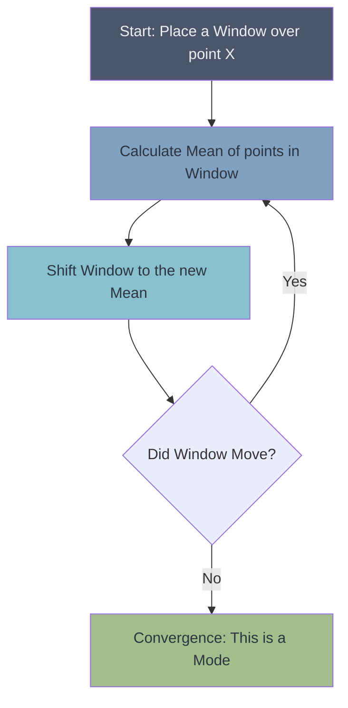

# 🏔️ Mean Shift Clustering

> **Difficulty**: ⭐⭐⭐☆☆ Intermediate | **Prerequisites**: KDE, Distance Metrics | **Estimated Reading Time**: 20 Minutes

---

## 📋 Table of Contents
1. [What Problem Does This Solve?](#1-what-problem-does-this-solve)
2. [Intuition](#2-intuition)
3. [Core Mathematics](#3-core-mathematics)
4. [Visual Explanation](#4-visual-explanation)
5. [Algorithm Workflow](#5-algorithm-workflow)
6. [From Scratch Implementation](#6-from-scratch-implementation)
7. [Scikit-Learn Implementation](#7-scikit-learn-implementation)
8. [Hyperparameter Deep Dive](#8-hyperparameter-deep-dive)
9. [Visualization Lab](#9-visualization-lab)
10. [Failure Cases](#10-failure-cases)
11. [Industry Applications](#11-industry-applications)
12. [What's Next?](#12-whats-next)

---

## 1. What Problem Does This Solve?

K-Means requires you to specify $K$. DBSCAN requires you to specify density thresholds ($\epsilon$ and `min_pts`), which fail when density varies. 

What if you just want an algorithm to autonomously find the "peaks" (modes) of your data, organically discovering the number of clusters without forcing geometric shapes? **Mean Shift** is a non-parametric, density-based algorithm that essentially acts like a flock of birds seeking the highest peaks in a mountain range of data.

---

## 2. Intuition

### 🟢 Beginner
Imagine you are blindfolded in a hilly terrain, and your goal is to reach the top of the nearest hill. You take a step in the direction where the ground slopes upwards the most. You repeat this until you reach the peak, where the ground is flat. 
Mean Shift does exactly this for every single data point. It looks at the points immediately surrounding it, calculates the "center of gravity" of those points, and shifts towards it. Points that climb the same "hill" (mode) are grouped into the same cluster.

### 🟡 Intermediate
Mean Shift is based on **Kernel Density Estimation (KDE)**. Imagine placing a small Gaussian bell curve over every single data point in your dataset. If you sum all these bell curves together, you get a continuous topographical map of your data's density. The peaks of this map are the modes. Mean Shift is a gradient ascent algorithm that pushes points up the steepest slope of this KDE surface until they converge at a mode.

### 🔴 Advanced
Unlike K-Means, which minimizes variance, Mean Shift seeks the stationary points of the estimated density function. By setting the gradient of the KDE to zero, the math naturally produces an update rule: the new position is the weighted mean of the neighbors, where the weights are determined by the Kernel. The only assumption made is the *bandwidth* of the kernel (how wide the local window is).

---

## 3. Core Mathematics

### Kernel Density Estimation (KDE)
Given $n$ data points $x_i$, the multivariate kernel density estimate with kernel $K(x)$ and bandwidth $h$ is:
$$ f(x) = \frac{1}{n h^d} \sum_{i=1}^n K \left( \frac{x - x_i}{h} \right) $$

The most common kernel is the **Gaussian (RBF) Kernel** or the **Epanechnikov (Flat) Kernel**.
*   **Flat Kernel**: $K(x) = 1$ if $||x|| \le 1$, else $0$. This creates a strict circle of radius $h$.

### The Mean Shift Vector
To find the peaks (modes), we want to follow the gradient $\nabla f(x) = 0$. 
The math yields the **Mean Shift vector**, $m(x)$, which points in the direction of the maximum increase in density:
$$ m(x) = \frac{\sum_{x_i \in N(x)} K(x_i - x) x_i}{\sum_{x_i \in N(x)} K(x_i - x)} - x $$

Where $N(x)$ is the neighborhood of points within distance $h$.
The algorithm simply updates the point $x$:
$$ x \leftarrow x + m(x) $$

---

## 4. Visual Explanation



*The shifting window logic. Points that converge to the same mode belong to the same cluster.*

---

## 5. Algorithm Workflow

1.  **Initialize**: Every data point is initially considered a "cluster center" (a window).
2.  **Calculate Shift**: For each window, compute the mean of all points residing within its bandwidth $h$.
3.  **Update**: Move the window to this newly calculated mean.
4.  **Repeat**: Keep calculating the mean and shifting the window until it stops moving (converges at a peak).
5.  **Merge**: Windows that converge to the exact same peak (or within a tiny tolerance) are merged into a single cluster.

---

## 6. From Scratch Implementation

```python
import numpy as np

def mean_shift_scratch(X, bandwidth=2.0, max_iters=100):
    # Initialize all points as moving centroids
    centroids = np.copy(X)
    
    for _ in range(max_iters):
        new_centroids = []
        for i, c in enumerate(centroids):
            # 1. Find all points within the bandwidth (Flat Kernel)
            distances = np.linalg.norm(X - c, axis=1)
            in_bandwidth = X[distances < bandwidth]
            
            # 2. Calculate new mean
            new_c = np.mean(in_bandwidth, axis=0)
            new_centroids.append(new_c)
            
        new_centroids = np.array(new_centroids)
        
        # 3. Check convergence
        if np.allclose(centroids, new_centroids, atol=1e-3):
            break
        centroids = new_centroids
        
    # 4. Merge identical centroids to find unique clusters
    unique_centroids = np.unique(np.round(centroids, decimals=2), axis=0)
    
    # Optional: Assign points to nearest unique centroid
    distances = np.linalg.norm(X[:, np.newaxis] - unique_centroids, axis=2)
    labels = np.argmin(distances, axis=1)
    
    return unique_centroids, labels
```

---

## 7. Scikit-Learn Implementation

Scikit-Learn makes Mean Shift highly efficient by utilizing `estimate_bandwidth` to automatically guess the best window size based on pairwise distances.

```python
from sklearn.cluster import MeanShift, estimate_bandwidth
from sklearn.preprocessing import StandardScaler

# 1. Scale
scaler = StandardScaler()
X_scaled = scaler.fit_transform(X)

# 2. Automatically estimate bandwidth
# quantile=0.2 means it uses the median of pairwise distances of 20% of data
bandwidth = estimate_bandwidth(X_scaled, quantile=0.2, n_samples=500)
print(f"Estimated Bandwidth: {bandwidth:.2f}")

# 3. Fit Model
ms = MeanShift(bandwidth=bandwidth, bin_seeding=True)
ms.fit(X_scaled)

# 4. Extract
labels = ms.labels_
cluster_centers = ms.cluster_centers_
n_clusters_ = len(np.unique(labels))
print(f"Number of discovered clusters: {n_clusters_}")
```

---

## 8. Hyperparameter Deep Dive

*   **`bandwidth`**: The most critical parameter. 
    *   *Too small*: Every data point becomes its own cluster (overfitting).
    *   *Too large*: All points merge into a single massive cluster (underfitting).
    *   `estimate_bandwidth()` uses a K-Nearest Neighbors approach to find a reasonable default.
*   **`bin_seeding=True`**: Highly recommended. Instead of shifting *every single point*, it grids the space and only shifts the populated grid bins. This drops the computational complexity significantly.

---

## 9. Visualization Lab

> **Note**: For KDE topography visualizations and shifting animations, see `notebooks/04-GMM-Lab.ipynb` (Combined with Mean Shift).

### Visualizing KDE Contours
In 2D space, the Kernel Density Estimate looks like a topographical map. Mean shift draws orthogonal vectors intersecting the contour lines, pointing straight to the peaks.

```python
import seaborn as sns
import matplotlib.pyplot as plt

# The KDE Plot is the exact surface Mean Shift climbs
# sns.kdeplot(x=X[:, 0], y=X[:, 1], cmap="Blues", fill=True, thresh=0.05)
# plt.scatter(cluster_centers[:, 0], cluster_centers[:, 1], color='red', marker='x', s=100)
# plt.title("Mean Shift Peaks on KDE Surface")
```

---

## 10. Failure Cases

1.  **Computationally Expensive**: Standard Mean Shift is $O(N^2)$ per iteration because it calculates distances between the shifting window and *every other point*. It scales terribly for massive datasets unless `bin_seeding` is used.
2.  **High Dimensions**: KDE degrades severely in high dimensions (Curse of Dimensionality). The concept of density becomes mathematically unstable.
3.  **Outliers**: While more robust than K-Means, extreme outliers can cause minor "spurious" clusters to form.

---

## 11. Industry Applications

*   **Computer Vision (Object Tracking)**: The CAMShift (Continuously Adaptive Mean Shift) algorithm is famous in video tracking. It uses Mean Shift to track a color histogram bounding box frame-by-frame.
*   **Image Segmentation**: Smoothing images by clustering pixels in RGB space, famously used in early image filtering algorithms to create "cartoon-like" effects.

---

## 12. What's Next?

### Summary
Mean Shift is an elegant gradient-ascent algorithm that autonomously discovers clusters by climbing the topographical hills generated by Kernel Density Estimation. It does not require $K$ and does not force geometric shapes.

### Why it matters
For tracking moving objects in video or finding unknown modes in relatively low-dimensional space, Mean Shift is mathematically brilliant.

### Next Topic
Mean Shift utilizes density, but what if we want strict mathematical probability models? What if we want to know that a point has a 70% chance of belonging to Cluster A and a 30% chance for Cluster B? We will explore **Gaussian Mixture Models (GMM)**, which bring soft clustering and covariance matrices into play.

[← DBSCAN](04-DBSCAN.md) | [Return to Unsupervised Index](../README.md) | [Next: Gaussian Mixture Models →](06-Gaussian-Mixture-Models.md)
