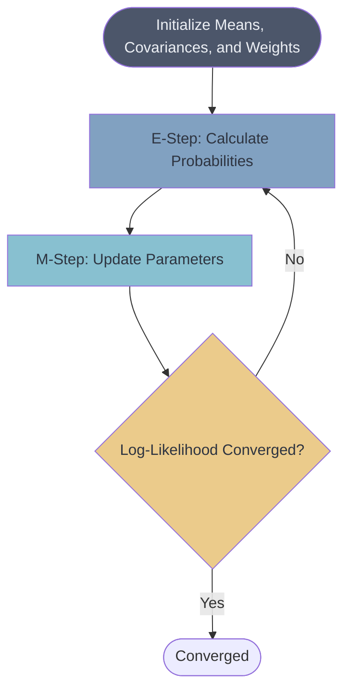

# 📊 Gaussian Mixture Models (GMM)

> **Difficulty**: ⭐⭐⭐⭐☆ Advanced | **Prerequisites**: K-Means, Probability Distributions | **Estimated Reading Time**: 35 Minutes

---

## 📋 Table of Contents
1. [What Problem Does This Solve?](#1-what-problem-does-this-solve)
2. [Intuition](#2-intuition)
3. [Core Mathematics](#3-core-mathematics)
4. [Visual Explanation](#4-visual-explanation)
5. [Scikit-Learn Implementation](#5-scikit-learn-implementation)
6. [Hyperparameter Deep Dive](#6-hyperparameter-deep-dive)
7. [Failure Cases](#7-failure-cases)
8. [Industry Applications](#8-industry-applications)
9. [What's Next?](#9-whats-next)

---

## 1. What Problem Does This Solve?

K-Means is a "hard" clustering algorithm. A point either belongs to Cluster A or Cluster B. There is no middle ground, and K-Means assumes all clusters are perfectly spherical and have the same variance.

But what if a data point sits right on the boundary between two clusters? Or what if one cluster is shaped like a long ellipse, and another is a tiny, dense circle? 

**Gaussian Mixture Models (GMM)** solve this by introducing **Soft Clustering**. Instead of drawing hard lines, GMM calculates the *probability* that a data point belongs to a cluster. It allows clusters to take on elliptical shapes (covariance) and handles uncertainty elegantly.

---

## 2. Intuition

### 🟢 Beginner
Imagine you are listening to a recording of two people talking over each other in a crowded room. K-Means would try to draw a hard line: "This sound is Person A, this sound is Person B." GMM says: "This specific sound wave has a 90% chance of being Person A, but a 10% chance of being Person B because they sound similar here." GMM models each person's voice as a probability bell curve (Gaussian) and mixes them together.

### 🟡 Intermediate
GMM assumes that the dataset was generated by a mixture of several Gaussian distributions. Each cluster is a distinct Gaussian with its own Mean (center), Covariance (shape/width), and Weight (how big the cluster is relative to the others). The algorithm uses the Expectation-Maximization (EM) technique to iteratively tweak these bell curves until they perfectly blanket the data.

### 🔴 Advanced
GMM is fundamentally a **generative model**. Once the model is fit, you can actually sample from the learned probability distribution $p(x)$ to generate brand new, synthetic data points that look like the original dataset. It maximizes the log-likelihood of the data given the parameters (means $\mu$, covariances $\Sigma$, and mixing coefficients $\pi$).

---

## 3. Core Mathematics

A Gaussian Mixture Model is a weighted sum of $K$ component Gaussian densities:
$$ p(x) = \sum_{k=1}^K \pi_k \mathcal{N}(x \mid \mu_k, \Sigma_k) $$

Where:
*   $K$: Number of clusters.
*   $\pi_k$: The mixing coefficient (prior probability) of cluster $k$. ($\sum \pi_k = 1$).
*   $\mathcal{N}(x \mid \mu_k, \Sigma_k)$: The multivariate Gaussian distribution for cluster $k$ with mean vector $\mu_k$ and covariance matrix $\Sigma_k$.

### Expectation-Maximization (EM) Algorithm

**1. E-Step (Expectation)**
Calculate the "responsibility" $\gamma(z_{nk})$ that cluster $k$ takes for data point $x_n$. This is the posterior probability:
$$ \gamma(z_{nk}) = \frac{\pi_k \mathcal{N}(x_n \mid \mu_k, \Sigma_k)}{\sum_{j=1}^K \pi_j \mathcal{N}(x_n \mid \mu_j, \Sigma_j)} $$

**2. M-Step (Maximization)**
Update the parameters using the current responsibilities:
*   **New Means**: $\mu_k^{new} = \frac{1}{N_k} \sum_{n=1}^N \gamma(z_{nk}) x_n$
*   **New Covariance**: $\Sigma_k^{new} = \frac{1}{N_k} \sum_{n=1}^N \gamma(z_{nk}) (x_n - \mu_k^{new})(x_n - \mu_k^{new})^T$
*   **New Weights**: $\pi_k^{new} = \frac{N_k}{N}$

*(Where $N_k = \sum_{n=1}^N \gamma(z_{nk})$, the effective number of points assigned to cluster $k$.)*

---

## 4. Visual Explanation



*The Expectation-Maximization loop. Notice how similar it is to K-Means' Lloyd Algorithm.*

---

## 5. Scikit-Learn Implementation

While writing the EM algorithm from scratch involves complex linear algebra (matrix inversions and determinants), Scikit-Learn handles this elegantly.

```python
from sklearn.mixture import GaussianMixture
from sklearn.preprocessing import StandardScaler

# 1. Scale Data (Always recommended, though GMM can technically handle unscaled via covariance)
scaler = StandardScaler()
X_scaled = scaler.fit_transform(X)

# 2. Initialize and Fit
gmm = GaussianMixture(
    n_components=3, 
    covariance_type='full', # Allows elliptical shapes
    random_state=42
)
gmm.fit(X_scaled)

# 3. Soft Clustering (Probabilities)
# Predicts a matrix of shape (N_samples, K_clusters)
probabilities = gmm.predict_proba(X_scaled)

# 4. Hard Clustering (Highest Probability)
labels = gmm.predict(X_scaled)

print(f"Probabilities for first point: {probabilities[0]}")
# Example output: [0.01, 0.98, 0.01] -> 98% chance it's in cluster 2
```

---

## 6. Hyperparameter Deep Dive

The most crucial parameter in GMM besides `n_components` ($K$) is `covariance_type`. This dictates the geometric shape the clusters are allowed to take.

*   **`covariance_type='full'`**: Every cluster has its own general covariance matrix. Clusters can be any elliptical shape and oriented in any direction. (Most computationally expensive, prone to overfitting).
*   **`covariance_type='tied'`**: All clusters share the exact same general covariance matrix. They can be elliptical, but they must all have the same shape and orientation.
*   **`covariance_type='diag'`**: Clusters have their own diagonal covariance matrix. They can be ellipses, but the axes of the ellipse must be strictly parallel to the coordinate axes (no slanted ellipses).
*   **`covariance_type='spherical'`**: Each cluster has its own single variance. Clusters must be perfectly spherical (like K-Means), but they can have different radii/sizes.

---

## 7. Failure Cases

1.  **Overfitting (Singularities)**: If `covariance_type='full'` is used on a dataset with very few points per cluster, a cluster might "collapse" onto a single data point, causing the variance to approach zero and the likelihood to shoot to infinity. (Fixed by adding a small value to the diagonal, `reg_covar`).
2.  **Local Minima**: Like K-Means, EM is not guaranteed to find the global maximum likelihood. It depends entirely on initialization. (Scikit-learn initializes GMM using K-Means under the hood to prevent this).
3.  **Non-Gaussian Data**: If the data genuinely resembles a donut or a crescent moon, GMM will fail, attempting to cover the moon with several overlapping elliptical blobs.

---

## 8. Industry Applications

*   **Speech Recognition**: Historically, GMMs were combined with Hidden Markov Models (HMMs) to recognize human speech, as vocal phonemes follow complex probability distributions.
*   **Anomaly Detection**: Since GMM estimates the exact probability density $p(x)$ of the data, any new point with a log-likelihood lower than a specific threshold is instantly flagged as an anomaly.
*   **Image Background Subtraction**: In video surveillance, GMMs are used to model the background pixels probabilistically, allowing the system to subtract the background and isolate moving humans or cars.

---

## 9. What's Next?

### Summary
Gaussian Mixture Models upgrade the hard boundaries of K-Means into soft, probabilistic assignments. By utilizing Covariance matrices, GMMs allow clusters to take on dynamic elliptical shapes. The Expectation-Maximization loop iteratively finds the maximum likelihood for these overlapping bell curves.

### Why it matters
GMM serves a dual purpose. It is a powerful soft-clustering algorithm, but more importantly, it is a **Generative Model** and an **Anomaly Detector**, allowing us to mathematically query the exact probability of any data point existing in our space.

### Next Topic
We have spent all our time finding *groups* in data. But what happens when our data has 10,000 features? The curse of dimensionality will destroy K-Means, DBSCAN, and GMM. We must learn how to compress the universe. Next, we dive into the king of Dimensionality Reduction: **Principal Component Analysis (PCA)**.

[← Mean Shift](05-Mean-Shift.md) | [Return to Unsupervised Index](../README.md) | [Next: Principal Component Analysis →](07-Principal-Component-Analysis.md)
