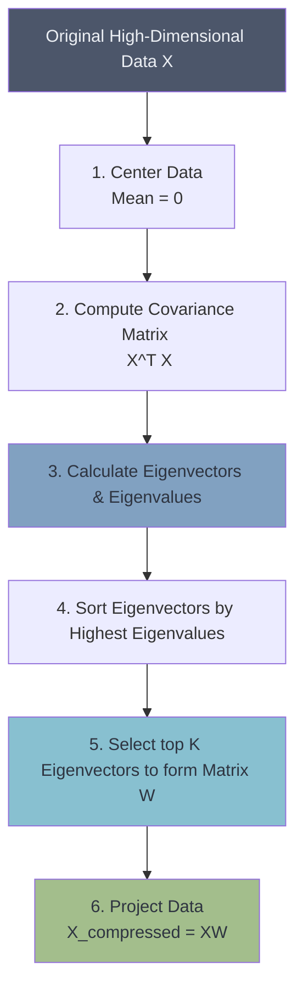

# 📉 Principal Component Analysis (PCA)

> **Difficulty**: ⭐⭐⭐⭐☆ Advanced | **Prerequisites**: Linear Algebra (Eigenvalues/Vectors), Variance | **Estimated Reading Time**: 40 Minutes

---

## 📋 Table of Contents
1. [What Problem Does This Solve?](#1-what-problem-does-this-solve)
2. [Intuition](#2-intuition)
3. [Core Mathematics](#3-core-mathematics)
4. [Visual Explanation](#4-visual-explanation)
5. [Algorithm Workflow](#5-algorithm-workflow)
6. [From Scratch Implementation](#6-from-scratch-implementation)
7. [Scikit-Learn Implementation](#7-scikit-learn-implementation)
8. [Hyperparameter Deep Dive](#8-hyperparameter-deep-dive)
9. [Visualization Lab](#9-visualization-lab)
10. [Failure Cases](#10-failure-cases)
11. [Industry Applications](#11-industry-applications)
12. [Hands-On Exercises](#12-hands-on-exercises)
13. [Further Reading](#13-further-reading)
14. [What's Next?](#14-whats-next)

---

## 1. What Problem Does This Solve?

Modern datasets have hundreds, thousands, or even millions of features (e.g., an HD image has 2,073,600 pixels). 
This creates three massive problems:
1.  **The Curse of Dimensionality**: Distance metrics break down, destroying algorithms like K-Means and KNN.
2.  **Computational Collapse**: Training models on 2 million features requires supercomputers.
3.  **Visualization Impossible**: Humans cannot visualize data beyond 3 dimensions.

**Principal Component Analysis (PCA)** solves this through **Dimensionality Reduction**. It mathematically compresses the dataset down to its most crucial components while preserving as much variance (information) as possible. It removes correlated features and reveals the true, underlying "latent" dimensions of the data.

---

## 2. Intuition

### 🟢 Beginner
Imagine you have a 3D model of a teapot. You want to take a 2D photograph of it that captures the most "teapot-ness" possible. If you take a picture from the front, you see the spout and the handle perfectly. If you take a picture straight down from the top, it just looks like a circle. 
PCA is an algorithm that automatically rotates the teapot to find the absolute best angle to take the photograph, ensuring the maximum amount of information is captured in a lower dimension.

### 🟡 Intermediate
PCA is a linear transformation. It searches the dataset for the axis of maximum variance (the direction where the data is most spread out). This is called the 1st Principal Component (PC1). It then finds a second axis, completely perpendicular (orthogonal) to PC1, that captures the second most variance. It continues this process until it has created $N$ new axes. These new axes are linear combinations of the original features. We can then throw away the axes with the least variance, compressing the data.

### 🔴 Advanced
Mathematically, PCA is seeking an orthogonal projection of the data onto a lower-dimensional linear subspace such that the variance of the projected data is maximized. This is mathematically equivalent to minimizing the mean squared projection error. The Principal Components are the **Eigenvectors** of the data's Covariance matrix, and the variance explained by each component is given by its corresponding **Eigenvalue**.

---

## 3. Core Mathematics

Given a dataset $X$ with shape $(n \times d)$, centered so its mean is zero:

### 1. The Covariance Matrix
We compute the covariance matrix $C$ of shape $(d \times d)$:
$$ C = \frac{1}{n-1} X^T X $$
This matrix describes how every feature varies with every other feature.

### 2. Eigen Decomposition
We solve for the eigenvectors $v$ and eigenvalues $\lambda$ of $C$:
$$ C v = \lambda v $$
*   **Eigenvectors ($v$)**: The directions (Principal Components). They are orthogonal to each other.
*   **Eigenvalues ($\lambda$)**: The magnitude of variance captured along that direction.

We sort the eigenvectors in descending order of their eigenvalues.

### 3. Projection
To reduce the data from $d$ dimensions to $k$ dimensions, we take the top $k$ eigenvectors to form a projection matrix $W$ of shape $(d \times k)$.
The newly compressed dataset $X_{pca}$ is:
$$ X_{pca} = X W $$

### 4. Explained Variance Ratio
How much information did we keep?
$$ \text{Explained Variance of } PC_i = \frac{\lambda_i}{\sum_{j=1}^d \lambda_j} $$

---

## 4. Visual Explanation



*The mathematical pipeline of PCA.*

---

## 5. Algorithm Workflow

1.  **Standardization**: YOU MUST SCALE YOUR DATA. PCA is highly sensitive to the scale of the features. If Feature A is measured in kilometers and Feature B in millimeters, PCA will mistakenly think Feature B has more variance. Use `StandardScaler`.
2.  **Covariance / SVD**: Compute the covariance matrix and its eigenvectors. (In practice, Truncated Singular Value Decomposition (SVD) is used because it is numerically more stable than computing the covariance matrix directly).
3.  **Select Components**: Choose $k$ by looking at a Scree Plot and deciding how much cumulative variance you want to retain (usually 90-95%).
4.  **Transform**: Project the data into the new latent space.

---

## 6. From Scratch Implementation

```python
import numpy as np

def pca_scratch(X, n_components):
    # 1. Center the data
    X_centered = X - np.mean(X, axis=0)
    
    # 2. Compute Covariance Matrix
    cov_matrix = np.cov(X_centered, rowvar=False)
    
    # 3. Compute Eigenvalues and Eigenvectors
    eigenvalues, eigenvectors = np.linalg.eigh(cov_matrix)
    
    # 4. Sort in descending order
    sorted_index = np.argsort(eigenvalues)[::-1]
    sorted_eigenvectors = eigenvectors[:, sorted_index]
    sorted_eigenvalues = eigenvalues[sorted_index]
    
    # 5. Select top k components
    eigenvector_subset = sorted_eigenvectors[:, 0:n_components]
    
    # 6. Project Data
    X_reduced = np.dot(X_centered, eigenvector_subset)
    
    return X_reduced, sorted_eigenvalues
```

---

## 7. Scikit-Learn Implementation

```python
from sklearn.decomposition import PCA
from sklearn.preprocessing import StandardScaler

# 1. SCALE DATA (Mandatory)
scaler = StandardScaler()
X_scaled = scaler.fit_transform(X)

# 2. Initialize PCA
# You can pass an integer for number of components
# Or a float between 0.0 and 1.0 to select the number of components 
# that explain that percentage of variance (e.g., 0.95 = 95%)
pca = PCA(n_components=0.95) 

# 3. Fit and Transform
X_pca = pca.fit_transform(X_scaled)

print(f"Original shape: {X.shape}")
print(f"Reduced shape: {X_pca.shape}")
print(f"Number of components kept: {pca.n_components_}")
print(f"Cumulative Variance Explained: {np.sum(pca.explained_variance_ratio_):.4f}")
```

---

## 8. Hyperparameter Deep Dive

*   **`n_components`**:
    *   `int`: Keep exactly $K$ dimensions (e.g., 2 or 3 for visualization).
    *   `float` (e.g., 0.95): Keep however many dimensions are required to retain 95% of the variance. This is the **best practice** for machine learning pipelines.
*   **`svd_solver`**:
    *   `auto`: Scikit-Learn chooses based on data size.
    *   `full`: Exact full SVD.
    *   `randomized`: Randomized SVD (much faster for massive datasets where you only need a few components).

---

## 9. Visualization Lab

> **Note**: For interactive Scree Plots and MNIST Image Compression visualizations, see `notebooks/05-PCA-Lab.ipynb`.

### The Scree Plot & Cumulative Variance
A Scree Plot shows the fraction of total variance explained by each principal component.

```python
import matplotlib.pyplot as plt

# Assume pca is fitted with n_components=None (all components)
exp_var = pca.explained_variance_ratio_
cum_var = np.cumsum(exp_var)

# plt.bar(range(1, len(exp_var)+1), exp_var, alpha=0.5, align='center', label='Individual variance')
# plt.step(range(1, len(cum_var)+1), cum_var, where='mid', label='Cumulative variance')
# plt.axhline(y=0.95, color='r', linestyle='--')
# plt.ylabel('Explained variance ratio')
# plt.xlabel('Principal component index')
# plt.legend(loc='best')
```

---

## 10. Failure Cases

1.  **Non-Linear Relationships**: PCA only captures *linear* correlations. If your data lies on a non-linear manifold (like a Swiss Roll), PCA will completely crush and destroy the structure. You must use Kernel PCA, t-SNE, or UMAP instead.
2.  **Outliers**: Because PCA maximizes variance (squared distances), it is heavily influenced by extreme outliers.
3.  **Loss of Interpretability**: PC1 and PC2 are linear combinations of *all* original features. You can no longer look at an axis and say "This is the Age feature." It is now a blended abstraction.

---

## 11. Industry Applications

*   **Image Compression**: Reducing high-res images down to a fraction of their size while retaining structural integrity (Eigenfaces in facial recognition).
*   **Genomics**: Visualizing genetic distance. PCA on DNA sequences often perfectly clusters individuals by their geographical continent of origin.
*   **Feature Extraction pipeline**: Passing a 10,000-dimensional dataset through PCA before feeding it into a complex model (like an SVM or Neural Network) to drastically cut training time and prevent overfitting.

---

## 12. Hands-On Exercises

**Easy**: Take the breast cancer dataset. Scale it. Run PCA with `n_components=2`. Scatter plot the two components, colored by malignant vs benign. See how well they separate linearly!
**Medium**: Take the MNIST digits dataset (784 features). How many PCA components are required to explain 95% of the variance? How many to explain 99%?
**Hard**: Use `pca.inverse_transform()` on the compressed MNIST images to project them back to 784 dimensions. Plot the original image side-by-side with the reconstructed image. Notice the blurriness (the 5% variance that was lost).

---

## 13. Further Reading

*   *Pattern Recognition and Machine Learning* by Christopher Bishop (Chapter 12: Continuous Latent Variables)
*   *Linear Algebra and Its Applications* by Gilbert Strang (For SVD intuition)
*   [Scikit-Learn Documentation on PCA](https://scikit-learn.org/stable/modules/generated/sklearn.decomposition.PCA.html)

---

## 14. What's Next?

### Summary
PCA is a linear transformation that finds the axes of maximum variance via Eigen Decomposition. It allows us to compress thousands of features into a handful of Principal Components, destroying noise and capturing the true essence of the dataset.

### Why it matters
PCA is arguably the most important unsupervised algorithm in existence. It is the gold standard for exploratory data analysis, visualization of high-dimensional data, and preprocessing pipelines.

### Next Topic
PCA is amazing, but it has a fatal flaw: it is strictly **linear**. If our data lies on a complex, twisted, non-linear manifold, PCA fails completely. To visualize high-dimensional, non-linear data, we must turn to the magical world of **t-SNE** and **UMAP**.

[← Gaussian Mixture Models](06-Gaussian-Mixture-Models.md) | [Return to Unsupervised Index](../README.md) | [Next: t-SNE →](08-tSNE.md)
